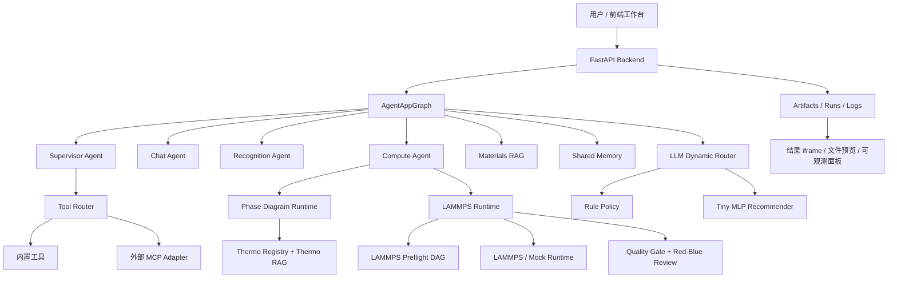

# 研材体 MatterLab：材料计算 Agent

研材体是一个面向材料计算与材料研究工作流的 Agent 项目。它不是单纯的聊天界面，也不只是 LAMMPS 或相图脚本的包装器，而是把自然语言需求、RAG 检索、工具调用、MCP 协议、共享记忆、动态 LLM 路由、评测基准和可视化前端组合在一起的材料计算工作台。

当前代码目录和部分历史命名仍保留 `phase_diagram_agent`、`Phase Diagram Agent`、`MatterPilot` 等痕迹。README 中统一用“研材体 / MatterLab”描述这个项目的产品化定位。

## 1. 项目一句话

用户可以用自然语言提出材料计算任务，例如生成二元/三元相图、配置并运行 LAMMPS 模拟、查询材料知识、诊断模拟失败、读取项目文件、调用外部 MCP 工具。系统会根据任务难度和风险动态选择 RAG、工具、LLM、运行时和评测链路，并把运行过程、产物和可观测信息展示到前端。

## 2. 当前能力总览

| 能力域 | 当前状态 | 说明 |
| --- | --- | --- |
| LAMMPS Agent | 已实现，重点能力 | 支持自然语言解析、结构化请求、势函数/材料注册表、preflight DAG、真实 LAMMPS 或 mock fallback、质量门、Red-Blue 修复、结果后处理和轨迹产物。 |
| CALPHAD 相图 | 已实现 | 基于 `pycalphad` 和本地 TDB 库，支持二元/三元相图生成、TDB 自动选择、相图结果 HTML 展示。 |
| Materials RAG | 已实现 | 包含材料知识语料、Wikipedia 材料语料、BM25 + 向量召回 + reranker、query rewrite、blind eval 数据集。 |
| Thermo RAG | 已实现 | 面向热力学数据库和相图任务的文档检索，辅助 TDB 选择和相图请求解析。 |
| 工具调用层 | 已实现 | 有轻量 Tool Router，只在任务需要时触发 function-calling 风格工具，而不是每轮对话强行调用。 |
| MCP 协议 | 已实现 | 既能把本项目暴露为 MCP stdio server，也能通过外部 MCP adapter 接入可信的第三方 MCP 工具。 |
| 动态 LLM 路由 | 已实现 | 基于规则路由选择 `fast / balanced / strong / vision`，并支持本地小型 MLP 推荐器做 shadow 或 guarded 决策。 |
| 按需 RAG 门控 | 已实现 | 普通对话和简单概念直接回答；只有专业查证、复杂材料问题或用户明确要求依据时才触发检索。 |
| 共享记忆 | 已实现 | SQLite 存储、去重、冲突检测、证据引用、上下文压缩、跨 Agent 可复用记忆。 |
| DAG 并发与恢复 | 已实现 | LAMMPS preflight 和通用 orchestration 使用 DAG、状态机、checkpoint、replan 和降级策略。 |
| PRM 搜索式规划 | 已实现 | 为 baseline/robust/efficient 候选 DAG 计算步骤级 reward，并输出运行时 process reward trace。 |
| 神经—符号 LAMMPS 编译 | 已实现 | 请求先转换为带单位和 provenance 的 Simulation IR，经约束验证后确定性生成脚本。 |
| GraphRAG 与风险控制 | 已实现 | 融合 Material/Method/Tool/Phase/Potential 图传播，输出 answer/expand/escalate/abstain。 |
| 多保真仿真调度 | 已实现，可选 | 以短程 pilot 的稳定性和 Value of Information 决定继续、修复或终止完整运行。 |
| 可观测面板 | 已实现 | 前端结果面板展示 route、tool、RAG、shared memory、LLM routing、MLP 推荐和状态节点。 |
| 评测体系 | 已实现 | MaterialsAgentBench 当前 22 个源数据集、390 个 case、13 个领域，包含规则指标、LLM-as-Judge、bootstrap CI、effect size。 |
| 前端工作台 | 已实现 | React + Vite 页面，支持聊天、异步 job、设置、运行结果、artifact 预览、trace 和诊断面板。 |

## 3. 系统架构



这张图的核心意思是：前端只负责交互和展示；真正的任务拆解、工具决策、RAG、运行时和评测都在后端。LAMMPS、相图、RAG、工具和 MCP 是可组合能力，不是彼此孤立的脚本。

## 4. 代码目录说明

| 路径 | 作用 |
| --- | --- |
| `backend/app/api.py` | FastAPI 接口入口，暴露聊天、job、run、artifact、RAG、配置、诊断、工具目录等接口。 |
| `backend/app/graph.py` | Agent 主流程，把 supervisor、chat、compute、recognition、memory、tool、RAG 和 observability 串起来。 |
| `backend/app/agents/` | Agent 层，包括聊天、计算、图像识别和 supervisor。 |
| `backend/app/runtimes/` | 运行时抽象，包括 LAMMPS runtime、phase diagram runtime 和 runtime manager。 |
| `backend/app/lammps/` | LAMMPS 主能力：请求模板、注册表、验证、runner、postprocess、preflight、quality、review。 |
| `backend/app/thermo/` | CALPHAD 相图能力：解析、代码生成、pycalphad 引擎、TDB registry、Thermo RAG。 |
| `backend/app/materials_rag/` | 材料知识 RAG，包括文档存储、normalizer、retriever、vector、context builder。 |
| `backend/app/rag/` | 通用 RAG 组件，包括 query rewrite、reranker、sqlite vector store 和数据管理。 |
| `backend/app/core/llm_route_learning.py` | 本地 MLP 特征、模型加载、推理和安全推荐；只提取当前任务正文，避免上下文模板噪声。 |
| `backend/app/lammps/ir.py` | 类型化 LAMMPS Simulation IR 与神经—符号约束编译。 |
| `backend/app/lammps/multifidelity.py` | Pilot/full 多保真策略和 Value-of-Information 决策。 |
| `backend/app/materials_rag/graph.py` | 材料异构图、关系传播和 community summary。 |
| `backend/app/rag/uncertainty.py` | 检索置信度、校准、升级与拒答策略。 |
| `backend/app/shared_memory/` | 共享记忆系统，包括 SQLite store、检索、去重、冲突检测和 Agent 集成。 |
| `backend/app/orchestration/` | DAG、生命周期状态机、并发 executor、replan 策略和 fingerprint。 |
| `backend/app/orchestration/reward.py` | Process Reward Model、候选计划生成和 Best-of-N 搜索。 |
| `backend/app/tools/` | Function-calling 工具层，包括 registry、router、executor、policy、MCP adapter、内置工具。 |
| `backend/app/skills/` | 本地 skills 注册与路由，用来给 Agent 补充可选的专业流程。 |
| `backend/app/mcp_server.py` | 把研材体暴露为 MCP stdio server 的实现。 |
| `backend/benchmarks/` | 评测体系、数据集构建、judge、统计显著性、MLP 路由训练和 benchmark gate。 |
| `backend/configs/` | 非敏感配置、TDB 文件、RAG 文档、示例 MCP 配置、LLM 配置。真实 API key 不应该放这里提交。 |
| `backend/requirements/` | 后端依赖拆分：base、visualization、dev、all、conda environment。 |
| `frontend/src/` | React 前端，包含聊天、设置、结果展示、trace 和可观测面板。 |
| `docs/` | 设计文档、RAG 生产化说明、架构说明和高级 Agent 迁移路线。 |
| `scripts/` | secret scan、benchmark gate、高级能力审计等仓库级脚本。 |

## 5. 后端核心流程

### 5.1 Agent 主流程

一次普通请求会进入 `/api/agent/chat` 或 `/api/jobs/agent-chat`。同步接口适合短任务，job 接口适合 LAMMPS、RAG、相图这类可能比较久的任务。

| 阶段 | 负责模块 | 发生了什么 |
| --- | --- | --- |
| 接收请求 | `backend/app/api.py` | 建立 request、conversation、job 或 stream。 |
| 任务判断 | `backend/app/agents/supervisor.py`、`backend/app/graph.py` | 判断是聊天、相图、LAMMPS、识别、工具、RAG 或混合任务。 |
| 记忆注入 | `backend/app/memory.py`、`backend/app/shared_memory/` | 加载短期对话和长期共享记忆，并按预算压缩上下文。 |
| RAG 检索 | `backend/app/materials_rag/`、`backend/app/thermo/` | 对材料知识或热力学知识做 query rewrite、召回、rerank 和证据整理。 |
| 工具决策 | `backend/app/tools/router.py` | 当任务需要文件、数据、结构、文献、物理检查、报告或外部 MCP 时才触发工具。 |
| 运行时执行 | `backend/app/runtimes/` | 把任务交给 LAMMPS 或相图 runtime。 |
| 质量检查 | `backend/app/lammps/quality/`、`backend/app/lammps/review/` | 检查物理合理性、log 异常、JSON 修复、Red-Blue 审查。 |
| 产物落盘 | `backend/app/core/artifacts.py` | 保存 HTML、JSON、trace、图片、视频、输入脚本和 summary。 |
| 前端展示 | `frontend/src/features/result/ArtifactResultPanel.tsx` | 展示结果、artifact、route/tool/RAG/LLM 可观测信息。 |

### 5.2 LAMMPS 流程

LAMMPS 是当前项目的主功能之一，代码量多是合理的。它不是一个简单模板生成器，而是一条带安全检查和恢复能力的计算链路。

| 阶段 | 文件 | 说明 |
| --- | --- | --- |
| 请求解析 | `backend/app/lammps/template.py`、`backend/app/runtimes/lammps.py` | 从自然语言或结构化 payload 中得到材料、势函数、温度、步数、边界条件等字段。 |
| 材料和势函数检查 | `backend/app/lammps/registry.py` | 当前 benchmark 明确覆盖 Al、Cu、Ni 等材料，并通过 registry 限制不安全或不支持的组合。 |
| Preflight DAG | `backend/app/lammps/preflight.py`、`backend/app/orchestration/` | 对输入脚本、势函数、盒子、温度、输出路径等节点做拓扑检查。 |
| 真实执行或 mock | `backend/app/lammps/runner.py`、`backend/app/runtimes/lammps.py` | 有 LAMMPS 可执行文件时走真实执行；本地缺少环境时可走 mock fallback 保持前端和 benchmark 可用。 |
| 后处理 | `backend/app/lammps/postprocess.py` | 解析 log、thermo 数据和 trajectory，生成可预览 artifact。 |
| 质量门 | `backend/app/lammps/quality/` | 扫描 lost atoms、温度爆炸、能量异常、物理范围问题。 |
| Red-Blue 修复 | `backend/app/lammps/review/` | Red Agent 从事实性、逻辑一致性、引用质量、物理有效性攻击报告；Blue Agent 执行 verify/modify/add/delete 风格修复。 |
| 恢复与重试 | `backend/app/orchestration/replan.py`、`backend/app/api.py` | 支持 checkpoint 上下文、新 attempt 恢复、失败节点重规划，但不会危险地声称原地续跑真实 timestep。 |

典型请求示例：

```text
请用 LAMMPS 做一个 Cu 的 NVT heating 模拟，300K 到 800K，运行 4000 steps，并给我检查 log 是否有 lost atoms。
```

如果机器上没有 LAMMPS，可以把 `USE_MOCK=true` 或配置里的 `force_mock` 打开，用来验证 Agent 链路和前端展示。真实科研结果仍应该使用真实 LAMMPS 和可信势函数。

### 5.3 相图流程

相图能力基于 `pycalphad` 和本地 TDB 文件。系统会优先使用 registry 和 Thermo RAG 判断用户说的是哪个体系，然后生成可执行的相图任务。

| 组件 | 说明 |
| --- | --- |
| TDB 文件 | 位于 `backend/configs/thermo_databases/`，当前包含 Al-Mg、Al-Zn、Pb-Sn、Al-Ni、Fe-Ni、Al-Cu-Y、Fe-Co-Cr-Nb-Ti 等多个体系。 |
| Registry | `backend/configs/thermo_registry.json` 记录体系、元素、相、文件路径、适用范围和说明。 |
| Thermo RAG | `backend/configs/materials_rag_documents.jsonl`、`backend/configs/thermo_rag_documents.example.jsonl` 等为检索提供语义上下文。 |
| 运行结果 | 输出 HTML、trace、summary 和必要的图表文件，前端通过 iframe 或 artifact 面板展示。 |

典型请求示例：

```text
帮我生成 Pb-Sn 二元相图，温度范围 300K 到 800K，并解释共晶点附近的相区。
```

## 6. RAG、query rewrite 与共享记忆

当前系统里有两类 RAG：Thermo RAG 偏相图和热力学数据库选择，Materials RAG 偏材料知识问答、LAMMPS 背景知识和多跳问题。

### 6.1 Materials RAG

| 能力 | 实现位置 | 说明 |
| --- | --- | --- |
| 文档语料 | `backend/configs/materials_rag_documents.jsonl`、`backend/configs/materials_rag_wikipedia.jsonl` | 当前包含本地材料文档和 Wikipedia 材料主题语料。 |
| Query rewrite | `backend/app/rag/query_rewrite.py` | 对用户问题做材料名、同义词、任务意图和检索关键词扩展。 |
| BM25 召回 | `backend/app/core/bm25.py`、`backend/app/materials_rag/retriever.py` | 适合精确关键词、材料牌号、势函数名和错误信息。 |
| 向量召回 | `backend/app/rag/sqlite_vector_store.py`、`backend/app/materials_rag/vector.py` | 支持真实 embedding backend；默认配置可走 OpenRouter compatible embedding。 |
| Reranker | `backend/app/rag/reranker.py` | 可选 rerank，提高 top-k 结果顺序。 |
| Blind Eval | `backend/benchmarks/datasets/rag_blind_cases.jsonl` | 用大量盲测问题评估 RAG 召回和最终回答。 |

### 6.2 上下文压缩

项目已经把“长链路任务不丢信息”作为一个核心问题处理。共享记忆和 RAG 的上下文会按层级压缩，而不是粗暴截断。

| 层级 | 作用 | 典型实现 |
| --- | --- | --- |
| L1 粗过滤 | 用 embedding/BM25 从大候选集合里筛出相关片段 | `backend/app/shared_memory/retrieval.py`、`backend/app/materials_rag/retriever.py` |
| L2 细筛选 | 用 MMR、TextRank 风格排序和多样性约束避免重复上下文 | `backend/app/shared_memory/retrieval.py` |
| L3 原文保留 | 对关键证据保留 raw evidence、source refs 和可回溯引用 | `backend/app/shared_memory/store.py` |

### 6.3 共享记忆

共享记忆不是简单的聊天历史，而是面向跨 Agent 复用的事实存储。

| 能力 | 说明 |
| --- | --- |
| SQLite 持久化 | 记忆、证据、source refs、embedding cache、版本信息都存储在本地 SQLite。 |
| 写前去重 | 写入前做 canonicalization 和相似度判断，减少重复事实。 |
| 冲突检测 | 用启发式反义词、数值矛盾、语义对立和来源差异检测潜在冲突。 |
| 多策略消解 | 支持保留新旧证据、标记冲突、按来源可信度处理，避免直接覆盖。 |
| 预算控制 | 控制注入给 LLM 的 token 规模，降低长任务漂移。 |

相关测试包括 `backend/tests/test_memory_retrieval_pipeline.py`、`backend/tests/test_memory_contradiction.py`、`backend/tests/test_shared_memory_store.py`、`backend/tests/test_raw_evidence_expansion.py`。

## 7. 工具调用层与 MCP

研材体现在有一层比较薄的 Tool Agent / Tool Router。它的目标不是替代普通 Agent，而是把“什么时候应该用工具、用哪个工具、工具风险多大、结果如何进入上下文”这件事收束到统一层。

### 7.1 内置 function-calling 工具

| 工具名 | 文件 | 用途 |
| --- | --- | --- |
| `workspace.search` | `backend/app/tools/builtin/workspace_tools.py` | 搜索工作区文件或片段。 |
| `file.read` | `backend/app/tools/builtin/file_tools.py` | 安全读取项目内文件内容。 |
| `data.profile` | `backend/app/tools/builtin/data_tools.py` | 对 CSV/JSON 等数据做基本画像。 |
| `structure.convert` | `backend/app/tools/builtin/structure_tools.py` | 结构数据格式转换和摘要。 |
| `physics.check` | `backend/app/tools/builtin/physics_tools.py` | 做基础物理量、单位和材料模拟合理性检查。 |
| `report.generate` | `backend/app/tools/builtin/report_tools.py` | 生成结构化报告草稿。 |
| `literature.search` | `backend/app/tools/builtin/literature_tools.py` | 文献检索入口，当前偏轻量封装。 |

### 7.2 为什么不用普通 Agent 自己随便调工具

普通 Agent 可以决定任务目标，但工具调用有额外的工程约束：风险分级、输入 schema、读写权限、超时、fallback、审计日志、MCP 兼容、测试覆盖。把这些规则放进 Tool Router 后，LLM 只需要表达“我需要什么能力”，实际调用由稳定代码执行。

### 7.3 MCP server

项目可以作为 MCP stdio server 被外部客户端调用。入口是：

```bash
cd backend
conda run -n lammps_agent python -m app.mcp_server
```

当前 MCP 暴露的核心工具包括：

| MCP 工具 | 作用 |
| --- | --- |
| `phase_diagram.run` | 用自然语言请求运行相图 runtime。 |
| `phase_diagram.run_structured` | 用结构化请求直接运行相图 runtime。 |
| `phase_diagram.registry_search` | 查询 TDB registry。 |
| `phase_diagram.rag_search` | 查询 Thermo RAG。 |
| `lammps.run` | 用自然语言请求运行 LAMMPS runtime。 |
| `lammps.run_structured` | 用结构化请求直接运行 LAMMPS runtime。 |
| `lammps.registry_get` | 获取 LAMMPS 材料和势函数注册信息。 |
| `system.diagnostics` | 获取系统诊断信息。 |

### 7.4 接入外部 MCP 工具

复制示例配置：

```bash
cp backend/configs/external_mcp_tools.example.json backend/configs/external_mcp_tools.json
```

然后把可信 MCP server 写进 `backend/configs/external_mcp_tools.json`。该文件已被 `.gitignore` 忽略，不应该提交。外部 MCP adapter 当前支持 stdio transport，支持 newline 或 Content-Length framing。

## 8. 动态 LLM 路由与 MLP 推荐器

LLM 调用不是固定走同一个模型。系统会根据任务类型、难度、是否需要视觉、是否涉及代码生成、是否需要工具、上下文长度和失败风险，在不同 tier 之间选择。

| Tier | 适合任务 | 说明 |
| --- | --- | --- |
| `fast` | 简单问答、低风险摘要、轻量 memory 查询 | 直连 DeepSeek `deepseek-v4-flash`，成本低、速度快。 |
| `balanced` | 一般 RAG、query rewrite、普通 supervisor 决策 | 平衡速度和质量。 |
| `strong` | LAMMPS、相图、修复、judge、复杂推理、代码生成 | 质量优先。 |
| `vision` | 图像识别、相图重构、多模态输入 | 需要视觉能力。 |

配置示例位于 `backend/configs/llm_routing.example.json`。启用本地覆盖时复制为：

```bash
cp backend/configs/llm_routing.example.json backend/configs/llm_routing.json
```

真实 API key 不写进 JSON，而是写进 `backend/.env` 或系统环境变量。`fast` tier 在示例配置中直连 DeepSeek API；`balanced`、`strong`、`vision` 如果没有单独覆盖，会继承中央 LLM 配置。路由器仍兼容其他 OpenAI-compatible endpoint。

MLP 推荐器用于学习“什么任务该走哪个 tier”。它不是盲目替代规则路由，而是有两种安全模式：

| 模式 | 行为 |
| --- | --- |
| `shadow` | 记录 MLP 推荐和置信度，但实际仍采用规则路由。适合积累遥测和验证模型。 |
| `guarded` | MLP 只有在置信度达到阈值且不违反能力下限时才覆盖规则路由。 |

训练命令：

```bash
conda run -n lammps_agent python backend/benchmarks/train_llm_route_mlp.py
```

如果要加入本地遥测数据：

```bash
conda run -n lammps_agent python backend/benchmarks/train_llm_route_mlp.py --include-telemetry
```

训练输出默认保存到 `backend/models/llm_route_mlp/`，其中 `model.json` 是运行时加载的可移植模型，`metrics.json` 和 `report.md` 记录冻结训练结果。路由遥测只记录隐私安全的特征、prompt hash、决策和指标，不记录原始 prompt 和 API key。

当前采用“规则安全基线 + 小型 MLP”的两层结构，没有继续叠加在线老虎机。原因是项目尚未形成稳定的线上 reward、成本标签和探索流量；此时在线策略会增加状态、延迟和不可复现性。MLP 训练集包含 clean、mixed、adversarial、long-noise 和真实 ChatAgent prompt wrapper 五类样本，部署时把“当前用户任务”与 memory/tool/RAG/history 包装区分开，再由 capability floor 保护 LAMMPS、repair、judge 和 vision 等高风险能力。

RAG 同样改为按需触发。简单定义、寒暄、项目说明和上一轮 follow-up 不检索；LAMMPS 命令/报错、材料数据库、复杂专业问题，以及明确要求“知识库依据/引用/来源”的请求才进入 query rewrite、召回和 rerank。响应元数据会记录 `requested`、`used` 和 `gate_reason`，便于前端观察是否真的调用了 RAG。

性能优化没有删掉高级链路。Supervisor 完成路由、置信度和 DAG 审计后，无 Tool/RAG/Skill/上一轮运行依赖的普通对话才使用 `lean_direct` 提示；锁定记忆、工具结果和专业 Skill 仍进入完整上下文。对 `lost atoms` 等唯一、结构化的 LAMMPS 错误标识，检索器用高精度 title/keyword/BM25 直达，避免多余的远程 embedding 和 reranker；模糊专业查询仍保留 dense vector + GraphRAG + 不确定性升级。远程 query embedding 同时使用进程 LRU 和 SQLite 持久缓存，SQLite 只保存 query hash 和向量，不保存原始问题文本。

Supervisor 也不是纯规则分支，而是“确定性信号评分 + DAG 安全检查 + 低置信度 LLM 复核”。置信度不采信 LLM 自报分数，完全由程序按下式计算：

```text
confidence = 0.45 * route_evidence
           + 0.25 * candidate_separation
           + 0.20 * critical_check_pass_rate
           + 0.10 * advisory_check_pass_rate
           then apply deterministic penalties
```

`route_evidence` 来自图像、生成/识别/执行意图、材料体系、LAMMPS 必填槽位和历史上下文等可观测信号；`candidate_separation` 衡量第一、第二候选路由的差距；DAG 检查覆盖输入资产、计算前置条件、route contract、跨域冲突和拓扑合法性。存在关键节点失败、候选差距过小或置信度低于 `0.78` 时才请 LLM 复核；即使 LLM 给出高置信度，也不会改变程序计算分数。DAG 关键检查不通过时，系统会降级为补参/补图澄清，不盲目执行。

LAMMPS preflight 同时增加了 PRM Best-of-N 候选计划选择；脚本生成改为 `LammpsRequest → 类型化 Simulation IR → 符号约束验证 → 确定性模板编译`。Materials RAG 增加图传播和检索不确定性，多保真模式可用短程 pilot 决定是否投入完整模拟。完整方法、配置和简历口径见 [`docs/ADVANCED_LEARNING_METHODS.md`](docs/ADVANCED_LEARNING_METHODS.md)。

## 9. DAG、状态机、replan 与降级策略

项目已经引入 DAG 并发执行和生命周期状态机，主要服务于 LAMMPS preflight、长链路任务恢复和高级 Agent 编排。

| 概念 | 在本项目里的意思 |
| --- | --- |
| DAG | Directed Acyclic Graph，有向无环图。任务节点之间有依赖关系，依赖完成后才能执行下游节点。 |
| Semaphore | 并发限流器。即使 DAG 中多个节点可并行，也不会无限开任务。 |
| 9 状态状态机 | 管理任务从 pending、ready、running、succeeded、failed、skipped、cancelled、degraded、synthesized 等生命周期。 |
| 单任务超时 | 某个节点失败或超时时，局部标记失败并尝试替代路径。 |
| 批量失败重规划 | 多个节点失败时，收集失败 batch，决定哪些节点复用、哪些节点重跑。 |
| 全局超时强制合成 | 长任务超过总预算时，保留已完成证据，生成 partial report，不装作完整成功。 |

这部分代码集中在 `backend/app/orchestration/` 和 `backend/app/lammps/preflight.py`，相关测试在 `backend/tests/test_dag_executor.py`、`backend/tests/test_lifecycle_state_machine.py`、`backend/tests/test_replan_policy.py`、`backend/tests/test_checkpoint_resume.py`。

## 10. 评测体系

项目现在不是只靠主观试跑判断质量，而是有一套 MaterialsAgentBench 和 benchmark gate。

| 项 | 当前规模 |
| --- | --- |
| Benchmark version | `2026-06-23-v5` 和 `materials-agent-bench/v1` |
| 源数据集数量 | 22 |
| 总 case 数 | 390 |
| 领域数量 | 13 |
| development split | 140 |
| frozen_test split | 250 |
| deterministic case | 386 |
| live case | 4 |

当前 13 个领域包括 evaluation judge、final response、LAMMPS execution、LAMMPS request parsing、materials RAG、MCP tooling、orchestration recovery、phase diagram execution、physical quality、recognition、red-blue repair、routing clarification、shared memory。

### 10.1 规则指标

| 指标 | 目的 |
| --- | --- |
| factual accuracy | 检查回答和证据是否匹配。 |
| hallucination rate | 检查是否编造材料参数、相区、势函数或运行结果。 |
| citation coverage | 检查关键结论是否有来源或 artifact 支撑。 |
| tool-chain correctness | 检查是否调用了正确工具、是否遵守工具输入输出 contract。 |
| artifact completeness | 检查 HTML、JSON、trace、log、图表等产物是否完整。 |
| physical validity | 检查模拟参数和结果是否违反基础物理约束。 |

### 10.2 LLM-as-Judge

Judge 体系支持 mock/offline contract，也支持 live backend。五个核心评分维度是 factuality、logical consistency、citation quality、physical validity、actionable clarity。

Judge provider 代码在 `backend/benchmarks/evaluators/judge_provider.py` 和 `backend/benchmarks/evaluators/judge_evaluator.py`。Live judge 默认需要显式打开，避免普通测试偷偷消耗 API。

### 10.3 统计评估

统计工具位于 `backend/benchmarks/statistics/`。当前包含 paired bootstrap 置信区间、效果量 Cohen’s dz、版本比较和 benchmark gate。它的用途是判断改进是否真的稳定，而不是只看一次样例输出。

Benchmark 的总入口清单位于 `backend/benchmarks/datasets/manifest.json`，MaterialsAgentBench 的冻结集清单位于 `backend/benchmarks/datasets/materials_agent_bench/manifest.json`。

## 11. 前端说明

前端是 React + Vite 工作台，默认连接 `http://127.0.0.1:8000` 的后端。

| 页面能力 | 文件 |
| --- | --- |
| 主工作台 | `frontend/src/app/AgentWorkbench.tsx` |
| 对话和 job 状态 | `frontend/src/features/chat/` |
| 结果和 artifact 展示 | `frontend/src/features/result/` |
| Route / Tool / RAG / LLM 可观测面板 | `frontend/src/features/result/ArtifactResultPanel.tsx` |
| 系统设置 | `frontend/src/features/settings/` |
| Trace 面板 | `frontend/src/features/trace/TracePanel.tsx` |
| API client | `frontend/src/services/api.ts` |

前端不会自己做材料计算，它负责让用户能看到任务状态、运行结果、文件产物、错误信息、恢复按钮和内部路由证据。

## 12. 安装与启动

下面命令默认在仓库根目录执行，也就是 `phase_diagram_agent` 这一层。

### 12.1 准备 Python 环境

推荐使用项目已经约定的 conda 环境名 `lammps_agent`：

```bash
conda env create -f backend/requirements/environment.yml
conda run -n lammps_agent python -m pip install -r backend/requirements/all.txt
```

如果环境已经存在：

```bash
conda run -n lammps_agent python -m pip install -r backend/requirements/all.txt
```

如果要移植到没有 conda 的平台，也可以用根目录的 portable requirements：

```bash
python -m venv .venv
source .venv/bin/activate
python -m pip install -r requirements-portable.txt
```

`.venv/`、`backend/outputs/`、`frontend/node_modules/` 和本地 `.env` 都已经在 `.gitignore` 中，正常情况下不会被提交。

### 12.2 配置 API key

复制示例 env：

```bash
cp backend/.env.example backend/.env
```

然后把真实 key 写入 `backend/.env`：

```env
PHASE_DIAGRAM_LLM_API_KEY=你的 OpenRouter 或 OpenAI-compatible API key
PHASE_DIAGRAM_MATERIALS_RAG_EMBEDDING_API_KEY=你的 embedding key
PHASE_DIAGRAM_THERMO_RAG_EMBEDDING_API_KEY=你的 embedding key
PHASE_DIAGRAM_RAG_RERANKER_API_KEY=你的 reranker key
```

`backend/.env` 被 git 忽略，不要提交。非敏感配置可以放在 `backend/configs/llm_config.json`；敏感字段优先放环境变量或 `.env`。

### 12.3 配置 LAMMPS

本机安装 LAMMPS 后，可以设置：

```env
LAMMPS_CMD=/opt/homebrew/bin/lmp_serial
POTENTIALS_DIR=/opt/homebrew/share/lammps/potentials
ALLOW_MOCK_FALLBACK=true
USE_MOCK=false
```

如果暂时没有 LAMMPS，可以设置：

```env
USE_MOCK=true
ALLOW_MOCK_FALLBACK=true
```

这样可以测试前端、Agent、RAG、工具和 artifact 链路，但不能把 mock 结果当作真实科研结论。

### 12.4 启动后端

```bash
cd backend
conda run -n lammps_agent uvicorn app.main:app --reload --host 127.0.0.1 --port 8000
```

健康检查：

```bash
curl http://127.0.0.1:8000/api/health
curl http://127.0.0.1:8000/api/system/diagnostics
```

### 12.5 启动前端

```bash
cd frontend
npm ci
npm run dev -- --host 127.0.0.1 --port 5174
```

打开浏览器访问：

```text
http://127.0.0.1:5174
```

如果后端地址不是默认值，可以在前端设置面板里修改 API Base URL。

## 13. 常用 API

| 方法 | 路径 | 用途 |
| --- | --- | --- |
| `GET` | `/api/health` | 后端健康检查。 |
| `POST` | `/api/agent/chat` | 同步运行一次 Agent 请求。 |
| `POST` | `/api/jobs/agent-chat` | 提交异步 Agent job。 |
| `GET` | `/api/jobs/{job_id}` | 查询 job 状态。 |
| `GET` | `/api/jobs/{job_id}/events` | SSE 订阅 job 事件。 |
| `GET` | `/api/jobs/{job_id}/result` | 获取 job 结果。 |
| `POST` | `/api/jobs/{job_id}/resume` | 基于 checkpoint 上下文创建新的恢复 attempt。 |
| `GET` | `/api/runs` | 查看 run 列表。 |
| `GET` | `/api/runs/{run_id}` | 查看 run summary。 |
| `GET` | `/api/runs/{run_id}/result` | 获取 HTML 结果。 |
| `GET` | `/api/runs/{run_id}/artifacts/{artifact_name}` | 下载或预览 artifact。 |
| `GET` | `/api/tools/catalog` | 查看可用工具目录。 |
| `GET` | `/api/skills/catalog` | 查看可用 skills 目录。 |
| `GET` | `/api/thermo/registry` | 查看相图 TDB registry。 |
| `POST` | `/api/thermo/rag/search` | 查询 Thermo RAG。 |
| `GET` | `/api/materials-rag/search` | 查询 Materials RAG。 |
| `GET` | `/api/lammps/registry` | 查看 LAMMPS registry。 |
| `GET` | `/api/runtimes/manager` | 查看 runtime manager 诊断。 |

同步请求示例：

```bash
curl -X POST http://127.0.0.1:8000/api/agent/chat \
  -H "Content-Type: application/json" \
  -d '{
    "conversation_id": "demo-readme",
    "message": "请解释 Cu 用 EAM 势做 NVT 模拟时需要注意什么，并给出一个 LAMMPS 任务建议。",
    "uploaded_assets": [],
    "conversation_history": []
  }'
```

## 14. 测试与 benchmark

Makefile 默认使用 conda 环境 `lammps_agent`，并假设 conda 在 `/opt/anaconda3/bin/conda`。如果你的 conda 路径不同，可以在命令前覆盖 `CONDA`。

```bash
make help
make test-secret-scan
make test-backend-quick
make test-dataset-validate
make test-quick
```

如果 conda 路径不同：

```bash
make CONDA="$(which conda)" test-quick
```

完整测试和 benchmark：

```bash
make test-full
make test-benchmark-gate
make test-orchestration
```

真实 LAMMPS 验证：

```bash
make test-lammps-real
```

Live backend 验证会使用真实 API、embedding、reranker 或 judge，需要本地 key：

```bash
make test-live-backends
make test-live
```

MaterialsAgentBench 冻结集校验：

```bash
make test-materials-bench-freeze
```

当你有意更新 frozen benchmark 时再运行：

```bash
make freeze-materials-agent-bench
```

## 15. 清理本地产物

项目会生成很多运行产物，包括 LAMMPS log、HTML、trace、summary、benchmark report、MLP 模型、前端 dist 和 Python cache。先预览：

```bash
make clean-outputs-dry-run
```

确认后清理：

```bash
make clean-local
```

如果连 `frontend/node_modules` 也要删：

```bash
make clean-local-with-node-modules
```

清理命令不会删除源码、配置示例、TDB 数据库、benchmark 数据集和 README。

## 16. 配置优先级与安全约定

配置加载大致遵循这个顺序：显式环境变量优先，其次是 `backend/.env`、`backend/configs/.env`，然后是 `backend/configs/llm_config.json` 的非敏感默认值。

| 类型 | 推荐位置 | 是否提交 |
| --- | --- | --- |
| API key | `backend/.env` 或系统环境变量 | 不提交 |
| OpenRouter / DashScope endpoint | `backend/configs/llm_config.json` 或环境变量 | 可提交，前提是不含 key |
| LAMMPS 本机路径 | `backend/.env` 或前端设置面板 | 通常不提交 |
| RAG embedding/reranker 模型名 | `backend/configs/llm_config.json` | 可提交 |
| 外部 MCP server 私有配置 | `backend/configs/external_mcp_tools.json` | 不提交 |
| 动态路由本地覆盖 | `backend/configs/llm_routing.json` | 不提交 |
| 运行产物 | `backend/outputs/` | 不提交 |

仓库提供 `scripts/secret_scan.py`，Makefile 的 `test-secret-scan` 会扫描 trackable 文件中的 API key、token 和私有路径。

## 17. 开发约定

| 场景 | 建议 |
| --- | --- |
| 新增普通工具 | 在 `backend/app/tools/builtin/` 增加 handler 和 `ToolSpec`，再注册到 `build_default_tool_registry()`。 |
| 新增外部 MCP | 先写到 ignored 的 `backend/configs/external_mcp_tools.json`，确认安全后再决定是否抽象成内置工具。 |
| 新增 LAMMPS 材料 | 更新 `backend/app/lammps/registry.py` 和相应 benchmark case，不要绕过 registry 直接生成不受控脚本。 |
| 新增 TDB | 放入 `backend/configs/thermo_databases/`，更新 `backend/configs/thermo_registry.json`，补充 Thermo RAG 文档和测试。 |
| 新增 RAG 语料 | 优先写成 jsonl 文档，包含稳定 id、title、domain、source、text 和必要 metadata。 |
| 修改 LLM 路由 | 先用 `shadow` 观察，再考虑 `guarded`，并保留 capability min tier。 |
| 改 benchmark | 更新 manifest、freeze lock 和对应 evaluator，避免只改数据不改评测解释。 |
| 提交前 | 运行 secret scan 和相关单测，确认 `.env`、outputs、node_modules、.venv 没被 staged。 |

## 18. 项目现在“有没有完整”

从工程骨架看，研材体已经具备一个材料计算 Agent 的主要组成：前端、后端、LAMMPS、相图、RAG、工具调用、MCP、动态路由、共享记忆、可观测、benchmark 和安全清理。它已经不是 demo 级单脚本。

从科研生产级角度看，还可以继续增强三类东西：

| 方向 | 为什么值得做 |
| --- | --- |
| 更多真实 LAMMPS 体系和势函数验证 | 当前支持链路完整，但真实材料覆盖越多，越接近可发表/可复现实验助手。 |
| 更大规模高质量材料语料 | RAG 已有框架，后续收益主要来自更干净、更可引用、更领域化的数据。 |
| 更严格的 live benchmark | 当前有 deterministic 和少量 live case；如果要证明模型路由和 RAG 的真实效果，需要更多真实 API、真实 LAMMPS、真实文献证据的回归测试。 |

## 19. 快速排错

| 问题 | 处理 |
| --- | --- |
| 前端显示后端离线 | 确认 `uvicorn app.main:app --port 8000` 已启动，浏览器能访问 `/api/health`。 |
| `ModuleNotFoundError: app` | 后端命令需要在 `backend/` 目录运行，或设置 `PYTHONPATH=backend`。 |
| LLM 请求失败 | 检查 `backend/.env` 中的 key、base URL、model id 和网络。 |
| RAG embedding 失败 | 检查 embedding API key、模型名、batch size 和 provider 是否支持 embedding endpoint。 |
| Reranker 失败 | 可临时设置 `PHASE_DIAGRAM_RAG_RERANKER_ENABLED=false`，先验证召回链路。 |
| LAMMPS 找不到 | 设置 `LAMMPS_CMD`，或临时打开 `USE_MOCK=true`。 |
| 势函数找不到 | 设置 `POTENTIALS_DIR`，并确认 registry 中允许该材料/势函数组合。 |
| `make test-frontend-build` 找不到 `tsc` | 在 `frontend/` 下先运行 `npm ci`。 |
| Git 想提交 `.env` 或 outputs | 检查 `.gitignore`，运行 `git status --short` 和 `make test-secret-scan`。 |

## 20. 相关文档

| 文档 | 内容 |
| --- | --- |
| `docs/ARCHITECTURE.md` | 架构说明。 |
| `docs/RAG_PRODUCTION.md` | RAG 生产化说明。 |
| `docs/THERMO_RAG_SCHEMA.md` | Thermo RAG 文档结构。 |
| `docs/ADVANCED_AGENT_MIGRATION_ROADMAP.md` | 高级 Agent 能力迁移规划，包括 DAG、Red-Blue、共享记忆、评测体系等。 |
| `backend/benchmarks/README.md` | Benchmark 和数据集说明。 |
| `backend/requirements/README.md` | 后端依赖拆分说明。 |

## 21. 许可证与使用提醒

这个项目会生成和执行材料计算脚本。对于真实科研、论文、生产决策或昂贵计算任务，建议把 Agent 输出视为“可审计的自动化助手建议”，而不是无需复核的最终结论。关键模拟应检查输入脚本、势函数来源、边界条件、热力学数据库、运行 log、质量门结果和引用证据。
