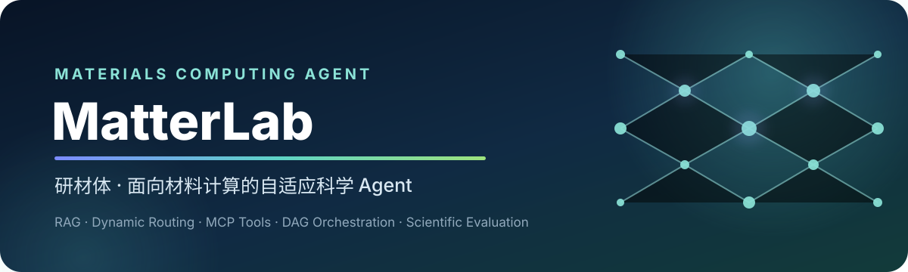
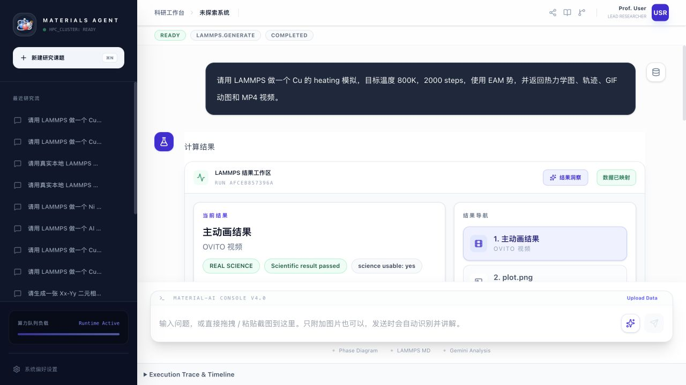
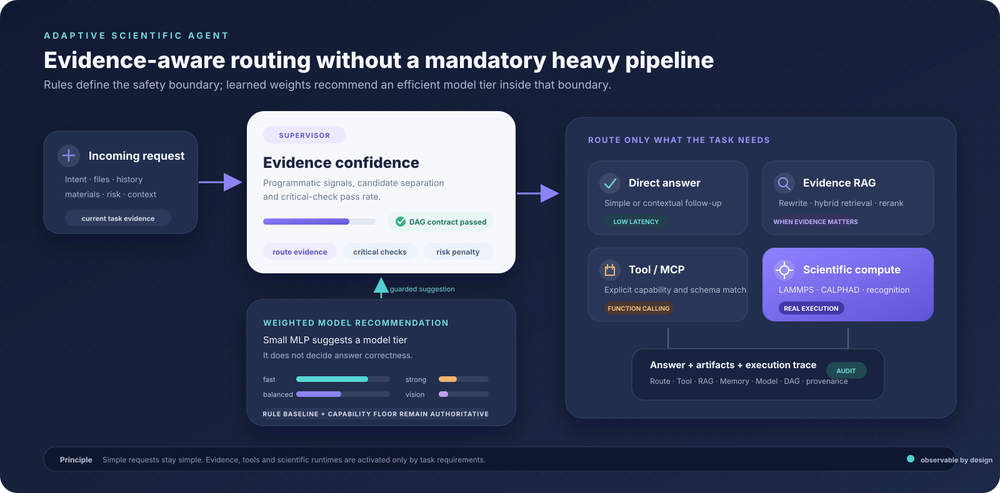
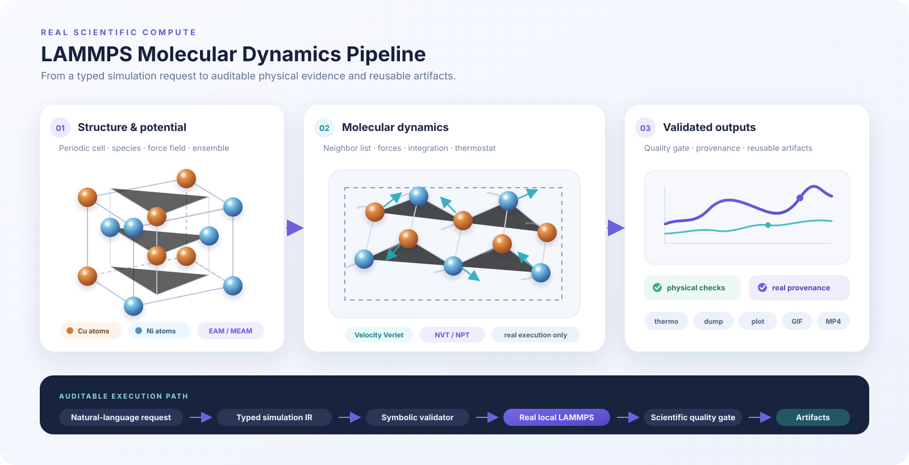

  

  <a href="./技术文档.md"><strong>完整技术文档</strong></a>
  ·
  <a href="docs/ARCHITECTURE.md">架构设计</a>
  ·
  <a href="docs/RAG_PRODUCTION.md">RAG 评测</a>
  ·
  <a href="docs/MATTERLAB_BENCHMARK_500.md">Benchmark</a>

  
  
  
  
  
  
  

## 项目简介

**研材体 MatterLab** 是一个面向材料计算工作流的自适应科学 Agent。系统把自然语言需求转换为可审计的 LAMMPS/CALPHAD 任务，并统一编排动态模型路由、按需 RAG、Function Calling、MCP、共享记忆、DAG 恢复、科学质量门和端到端评测。

项目希望解决的不是“让模型生成一段看起来合理的脚本”，而是如何把材料研究任务变成一条可执行、可恢复、可验证、可追溯的工程链路。LLM 负责语义理解、候选规划和自然语言合成；确定性代码负责路由校准、权限边界、科学约束、真实执行和结果验收。

系统同时服务两类场景：一类是 LAMMPS、CALPHAD、相图识别等计算任务，另一类是材料知识检索、模拟诊断、项目文件分析和外部工具协作。不同请求不会机械地经过同一条重链路，而是由 Supervisor 根据任务证据、复杂度与风险按需组合模型、RAG、工具、记忆和运行时。

| **520 cases** | **4 个模型层级** | **real_required** | **可回归评测** |
| :---: | :---: | :---: | :---: |
| 覆盖 Agent 全链路 | 加权推荐 fast / balanced / strong / vision | 普通 LAMMPS 默认真实执行 | development / frozen 分离管理 |

## 运行效果

  

真实 LAMMPS 结果工作台：计算状态、科学 provenance、轨迹动画与产物导航集中呈现。

## 系统架构

  

规则给出安全边界，MLP 仅提供模型层级的加权建议；RAG、Tool/MCP 与科学计算运行时均按需启用。

一次请求不会默认经过所有高级模块。Supervisor 先判断任务的领域、难度与风险；简单问题走低延迟直答，专业查证才触发 RAG，需要外部能力才调用 Tool/MCP，计算任务才进入受约束的科学运行时。

## 核心技术实现

### 1. Supervisor：可计算置信度，而非相信 LLM 自报

路由候选来自可观测信号，包括生成/识别/执行意图、材料体系、上传资产、LAMMPS 必填槽位和历史上下文。最终置信度由程序计算：

~~~text
confidence = 0.45 × route_evidence
           + 0.25 × candidate_separation
           + 0.20 × critical_check_pass_rate
           + 0.10 × advisory_check_pass_rate
           − deterministic_penalties
~~~

Supervisor 同时校验 route contract、计算前置条件、跨域冲突和 DAG 拓扑。关键检查失败时先澄清；置信度低于阈值或候选差距过小时才调用 LLM 复核，LLM 不能绕过关键安全门。

### 2. 动态 LLM 路由：规则基线 + 加权推荐

模型路由将请求分配到 <code>fast / balanced / strong / vision</code>。本地 MLP 不负责判断回答是否正确，它只是根据任务正文、上下文负载、多模态标记和代码/材料/审查特征，对四个模型层级生成一组推荐权重；<code>routing_focus_text</code> 会剥离 memory、tool、RAG wrapper 噪声。

| 机制 | 作用 |
| --- | --- |
| <code>shadow</code> | 只记录 MLP 推荐和概率，不改变线上决策 |
| <code>guarded</code> | 校准置信度、Top-1/Top-2 间隔、预测熵和 OOD 检查同时通过后，才允许调整默认层级 |
| capability registry | 集中声明每类调用的最低 tier、风险级别和所需模型能力 |
| model profile | 为各层级声明 structured output、code、reasoning、vision、上下文窗口、延迟和成本等级 |
| capability floor | LAMMPS、repair、judge、vision 不得降到不安全或能力不兼容的模型 |
| telemetry | 仅保存 prompt hash、特征与决策，不保存原始问题或 API Key |

离线样例用于观察三个效果：简单任务是否倾向低成本层级、复杂任务是否升级、加入长上下文或 deployment wrapper 后推荐是否仍保持稳定。训练数据把构造样本、明确标注的仿真生产遥测和隐私安全真实路由遥测分开统计；仿真数据不会被包装成真实用户流量。最终选择始终受规则基线、模型能力检查和 capability floor 约束，因此评估只讨论推荐行为、能力下限与稳定性，不把它包装成线上回答质量。

### 3. 风险感知 RAG：只有需要证据时才检索

~~~mermaid
flowchart LR
    Q["User Query"] --> GATE{"RAG Gate"}
    GATE -->|simple / follow-up| DIRECT["Direct Answer"]
    GATE -->|knowledge / evidence| RW["Query Rewrite"]
    RW --> BM["BM25 / Structured Lexical"]
    RW --> VE["Dense Embedding"]
    BM --> POOL["Candidate Pool"]
    VE --> POOL
    POOL --> RR["Remote Reranker"]
    RR --> GR["GraphRAG Propagation"]
    GR --> UQ{"Uncertainty"}
    UQ -->|high confidence| ANSWER["Answer + Citation"]
    UQ -->|uncertain| EXPAND["Expand / Escalate / Abstain"]
~~~

Materials RAG 与 Thermo RAG 采用多阶段召回：本地 Query Rewrite、BM25/结构化词法、远程 Embedding、候选池 Rerank 和轻量异构 GraphRAG。冻结盲测主要用于比较改写、扩大候选池和重排前后的检索变化；当前结果表明重排改善了相关证据的前排位置，扩大候选池减少了“正确文档根本没被召回”的情况。它用于验证检索链路改动，不等价于真实用户问答质量。[查看评测设计与边界](docs/RAG_PRODUCTION.md)

### 4. 真实 LAMMPS：神经—符号编译与科学质量门

  

从晶体结构、势函数和系综约束，到真实分子动力学执行、物理质量门与可追溯产物。

~~~text
Natural Language
  → LammpsRequest
  → Typed Simulation IR + Provenance
  → Symbolic Validator / Registry Guard
  → Deterministic in.lammps Compiler
  → Real Local LAMMPS
  → Physical Quality Gate
  → Red-Blue Review
  → thermo.csv / dump.atom / plot / GIF / MP4 / trace
~~~

普通 LAMMPS 请求默认 <code>real_required</code>：执行环境异常时返回诊断，禁止用 synthetic 结果冒充科学计算。类型化 IR 锁定材料、势函数、系综、温压、时间步长和输出契约；质量门检查 lost atoms、温度/能量异常、步数覆盖和 real/mock provenance；Red Agent 发现问题后，Blue Agent 只能执行白名单结构化 patch，并在修复后重新验证。

### 5. Red–Blue 对抗审查：把“自我纠错”变成受控协议

Red–Blue 不是让两个 LLM 无限互相讨论。Red 负责提出带证据的攻击，Blue 只能生成结构化修复提案，是否允许修改、是否继续重试以及何时终止都由确定性代码决定。它被放在 LAMMPS preflight DAG、真实执行后的质量门和九状态生命周期中，而不是作为回答末尾的一次语言润色。

~~~mermaid
flowchart TD
    P1["约束提取"] --> MERGE["Preflight Merge"]
    P2["Materials RAG"] --> MERGE
    P3["Registry Lookup"] --> MERGE
    P4["附件检查"] --> MERGE
    P5["运行环境诊断"] --> MERGE
    MERGE --> RED0["Red：执行前攻击"]
    RED0 -->|pass| RUN["IR 编译 + 真实 LAMMPS"]
    RED0 -->|blocking| STOP0["补参 / 修环境 / 终止"]
    RUN --> QG["物理质量门"]
    QG --> RED1["Red：执行后证据审查"]
    RED1 -->|pass| PUBLISH["发布结果与审计产物"]
    RED1 -->|repairable| BLUE["Blue：ADD / DELETE / MODIFY / VERIFY"]
    BLUE --> PARSE["JSON 恢复 + Patch Policy"]
    PARSE --> CONV{"预算、增益与震荡检查"}
    CONV -->|accepted| RETRY["重新校验、生成、执行"]
    RETRY --> RED1
    CONV -->|rejected| STOP1["澄清或安全终止"]
~~~

Red 的执行后报告不是一个裸分数，而是由 <code>Finding + EvidenceRef + ReviewScore</code> 组成的审计对象。确定性 Red 是硬门，LLM Red 只能补充 advisory，不能把规则判定的失败改成成功。

| 攻击维度 | Red 实际核查内容 |
| --- | --- |
| 参数与约束 | 材料、任务类型、目标温度、步数、timestep、系综和势函数是否与用户请求及 registry 一致 |
| 脚本安全 | <code>thermo</code>、<code>thermo_style</code>、dump、run steps、目标温度和输出文件是否正确写入脚本 |
| 逻辑一致性 | <code>LammpsRequest → Simulation IR → in.lammps → metrics</code> 是否出现温度、步数、时间步或文件名漂移 |
| 物理有效性 | lost atoms、温度爆炸、能量异常、步数覆盖、fatal log、real/mock provenance 与 synthetic thermo |
| 产物完整性 | <code>in.lammps</code>、<code>thermo.csv</code>、<code>plot.png</code>、<code>report.md</code> 及轨迹媒体是否按契约产生 |
| 证据质量 | blocking finding 必须引用 primary evidence；RAG 是 secondary，LLM inference 只能是 advisory |

Blue 使用 <code>lammps-blue-patch/v1</code>，并不直接重写脚本。补丁先作用于类型化请求，再重新经过 Pydantic schema、锁定约束、patch policy、LAMMPS validator、代码生成和下一轮 Red review。

| Blue 动作 | 策略边界 |
| --- | --- |
| <code>ADD / MODIFY</code> | 仅允许 time_step、box_size、dump_file、potential_family、ensemble、initial_temp、notes 等白名单字段 |
| <code>DELETE</code> | 只允许删除 initial_temp、notes 这类可恢复默认值的可选字段 |
| <code>VERIFY</code> | 可要求重新检查 request、validation、codegen、Red review 或 physical quality，不产生越权写入 |
| locked constraints | material、task_type、temperature、steps 和用户提供的势/结构路径禁止自动修改，涉及它们时要求用户确认 |

模型返回不稳定 JSON 时采用可审计的恢复链：先做严格 schema 解析；失败后去除 Markdown fence、提取首个平衡 JSON 对象、清理尾逗号并归一化操作名；Red 仍失败时回退到确定性报告，Blue 则尝试把兼容的 request-delta 转换成受控 patch，否则拒绝。系统记录 parse mode、内容 hash、normalization 和错误，而不是用“解析成功”掩盖无效输出。

修复循环有三道停止条件：repair budget 防止无限重试；Red score 的最小增益检查识别停滞；请求状态 hash 检测回到历史状态的 A→B→A 震荡。最终会产出 <code>red_review_post.json</code>、<code>repair_history.json</code> 和 LLM parse audit，前端可以逐项展开 finding、evidence、patch 与终止原因。

| 实现索引 | 代码位置 |
| --- | --- |
| 执行前 Red DAG 节点 | [`backend/app/lammps/preflight.py`](backend/app/lammps/preflight.py) |
| 确定性 Red、证据与评分 | [`backend/app/lammps/review/deterministic.py`](backend/app/lammps/review/deterministic.py)、[`evidence.py`](backend/app/lammps/review/evidence.py) |
| Blue patch schema 与白名单策略 | [`backend/app/lammps/review/models.py`](backend/app/lammps/review/models.py)、[`policy.py`](backend/app/lammps/review/policy.py) |
| JSON fallback 与循环收敛 | [`backend/app/lammps/review/json_parser.py`](backend/app/lammps/review/json_parser.py)、[`convergence.py`](backend/app/lammps/review/convergence.py) |
| 真实执行中的 review/repair loop | [`backend/app/runtimes/lammps.py`](backend/app/runtimes/lammps.py) |

### 6. DAG 并发、九状态生命周期与三级降级

LAMMPS preflight 使用 <code>asyncio</code> 按拓扑依赖调度节点。无依赖的约束提取、RAG、registry、附件和环境诊断可并发执行；<code>Semaphore</code> 按资源类型分别限流，默认 network=3、cpu=2、simulation=1，避免网络调用或科学进程无限并发。任何节点仍有独立 timeout，整张图还有 global timeout。

任务生命周期固定为九个合法状态：<code>queued → planning → preflight → ready → running → reviewing → repairing → completed / terminated</code>。状态机拒绝非法跳转；每次 transition、DAG event、plan version 和 termination reason 都会持久化。checkpoint 保存完成、失败、超时、跳过和待执行节点，并以 input/content/result fingerprint 判断旧结果能否安全复用，而不是仅凭节点名称复用缓存。

| 降级层级 | 触发与处理 |
| --- | --- |
| Level 1 · local fallback | 只有非关键节点失败且声明了 fallback 时继续，例如 RAG 不可用后仅依赖用户输入与 registry；结果标记 <code>completed_with_fallback</code> 并降低信任度 |
| Level 2 · batch replan | 合并同一批失败，失效失败节点及其下游；内容指纹一致的安全节点复用 checkpoint，其余节点生成新 plan version 重跑 |
| Level 3 · partial report | 全局超时后取消未完成任务，保留已完成证据、artifact 和 checkpoint，生成 <code>partial_result.json</code>，明确 <code>scientific_result_available=false</code> |

Replan 也有 repair/replan budget 和 failure-signature 震荡检测；缺少用户输入时转入澄清，基础设施缺失时返回诊断。PRM 规划层会为 baseline、robust、efficient 三个语义等价 DAG 计算关键节点覆盖、依赖合法性、重试安全、证据输出、延迟成本等步骤级 reward，再做 Best-of-N 选择。它目前是可验证的确定性 process reward 接口，不冒充已经训练好的在线价值模型。

### 7. 长上下文压缩与跨 Agent 共享记忆

聊天历史和共享记忆分开管理。历史记录保证会话连续性；共享记忆把可复用内容拆成 constraint、fact、evidence、result、preference、finding、repair，并按 run、conversation、user、global scope 隔离，避免其他会话的材料参数污染当前任务。

~~~text
Query Rewrite
  → L1：BM25 / metadata / dense 粗召回与锁定事实强制保留
  → L2：MMR + TextRank 风格相关性/多样性压缩，生成 bounded digest
  → L3：保存 raw evidence、source ref、content hash 和回溯指针
  → Working State：在 prompt budget 内注入当前 Agent
~~~

SQLite 同时保存 memory item、版本、来源、原始证据、embedding cache、冲突和消解记录；向量索引可用 SQLite vector store，真实 embedding 不可用时保留确定性 dense fallback。关键原文不会被摘要覆盖，L2 digest 必须持有 L3 evidence id。

写入前先 canonicalize 单位、数值、subject/predicate 和自由文本，再做 exact/normalized 去重。冲突检测覆盖数值差异、单位不一致、否定翻转、领域反义词、上下文条件差异和并行版本；相似键只标记为 semantic candidate，不自动当作已证实冲突。用户或 locked memory 参与冲突时进入 <code>needs_user</code>；其他情况只给出 authority、recency、confidence 或 manual review 建议，不静默覆盖高权威事实。

### 8. Function Tools、MCP、Skills 与统一沙箱

普通 Agent 当然可以提出“需要某种能力”，但真实调用经过一层很薄的 Tool Router。只有显式文件读取、数据画像、结构转换、物理校验、报告、工作区搜索或文献检索意图才产生 function call；普通解释和计算主链不会因为关键词碰撞被工具劫持。

| 层 | 作用 |
| --- | --- |
| Tool Registry | 统一 tool name、JSON input schema、read-only 属性、输出类型与 handler |
| Policy Router | 决定 need_tool、arguments、confidence、auto_execute 与 confirmation；支持从本地 JSON 加载训练/RL 得到的可插拔规则 |
| Tool Executor | 执行超时、错误收敛、artifact 归档和 trace，不把失败工具结果伪装成正常上下文 |
| MCP Adapter | 本项目可作为 stdio MCP Server 暴露 LAMMPS、相图、registry、RAG 和 diagnostics，也能接入可信外部 stdio MCP Server |
| Skills | 从 <code>SKILL.md</code> front matter 加载 trigger、说明和 preferred tools；每轮最多按需选择少量 Skill 并限制注入字符数 |

Python、pycalphad、LAMMPS、OVITO、FFmpeg、系统探测和外部 MCP 子进程统一进入 <code>SandboxRunner</code>。它禁止 <code>shell=True</code>，校验工作目录和可执行文件，使用清洁环境且默认不向计算进程继承 LLM/RAG API Key；同时限制超时、CPU、内存、进程数、打开文件数和单文件大小，并在取消或超时时回收整个进程组。macOS 可用时叠加 <code>sandbox-exec</code>，其他宿主仍保留跨平台的目录、环境、资源和生命周期隔离。

### 9. 搜索式规划、GraphRAG 与多保真科学执行

项目中的学习方法都被放在可验证边界内：MLP 只能推荐模型层级，PRM 只能选择满足同一科学约束的 DAG，GraphRAG 不能覆盖 registry/执行证据，多保真 pilot 不能绕过真实质量门。

| 方法 | 当前实现与安全边界 |
| --- | --- |
| 神经—符号 IR | LLM/heuristic 先生成 <code>LammpsRequest</code>，再转换为带单位、locked fields 和 provenance 的 <code>LammpsSimulationIR</code>；符号 validator 检查材料/势函数、系综、阻尼、温度、timestep、steps 与 dump 后确定性编译 |
| Process Reward | 对候选 DAG 做静态步骤评分，并按真实节点 completed/fallback/failed/timed_out 生成 <code>process-reward-trace/v1</code>，接口以后可替换为学习型 value model |
| Materials GraphRAG | 以 Document–Material–Method–Tool–Phase–Potential–Community 构建轻量异构图，从 BM25/dense/rerank seed 沿共享实体传播，并保留传播路径 |
| 检索风险控制 | 综合 top score、top-1/top-2 margin、多通道一致性和 evidence diversity，输出 <code>answer / expand / escalate / abstain</code>，支持用冻结校准集拟合 selective threshold |
| 多保真调度 | 可选地先运行约 5% 的短程 pilot，根据稳定性、失败概率、质量门和 Value of Information 决定 <code>continue_full / repair / stop</code>；默认关闭，避免无意增加普通请求延迟 |

### 10. CALPHAD、图像识别与端到端可观测性

除 LAMMPS 外，Compute Agent 还包含 CALPHAD runtime：由 Thermo Registry 与 Thermo RAG 选择本地 TDB，生成薄执行 wrapper，在沙箱内调用 pycalphad 完成二元/三元相图计算，并输出 HTML、图表、summary、trace 和数据库 provenance。未命中 registry 时不会伪装成已完成计算。

Recognition Agent 面向上传的相图截图，提取坐标轴、标签、相区和关键点并构造 structured scene；识别结果既可以直接解释，也可以作为“识别后计算”的上游输入。当前定位是结构化重构与交互展示，不能替代人工校核原始实验数据。

后端把 route、Supervisor 置信度、RAG gate/rewrite/hits/uncertainty、Tool/Skill/MCP 决策、LLM tier/MLP shadow、shared-memory 写入与冲突、DAG/lifecycle、Red–Blue finding/patch、sandbox profile 和 artifact provenance 汇总为 <code>agent_observability.v1</code>。异步 job 通过 SSE 发送 lifecycle 与 DAG 状态；前端优先展示科学结果、GIF/MP4 和下载产物，再按需展开内部证据链。

## 能力矩阵

| 能力域 | 代表能力 | 关键产物 |
| --- | --- | --- |
| LAMMPS Agent | 解析、IR、势函数注册、真实执行、质量审查、轨迹可视化 | <code>in.lammps</code>、log、thermo、dump、GIF、MP4 |
| CALPHAD Agent | TDB 自动选择、二元/三元相图、相区计算 | HTML、相图、trace、数据库 provenance |
| Materials RAG | 材料知识、LAMMPS 文档、多跳证据、引用 | ranked evidence、source refs、uncertainty |
| Recognition | 相图截图结构化识别与交互重构 | labels、axes、structured scene |
| Red–Blue Review | 执行前/后证据攻击、受控 patch、收敛与震荡检测 | Red report、Blue patch、repair history、parse audit |
| DAG & Safety | 并发限流、九状态生命周期、checkpoint/replan、统一沙箱 | lifecycle、DAG events、partial report、sandbox profile |
| Agent Platform | Tool/MCP、Skills、记忆、动态模型路由 | tool trace、memory refs、route telemetry |
| Observability | Route、Tool、RAG、Memory、LLM、DAG、Red-Blue | 前端状态节点与可展开证据链 |

## 评测体系与观察效果

**MatterLabAgentBench-500+Trajectory** 包含 520 条 case、14 个能力域，其中 333 条 frozen test。新增样例覆盖 LAMMPS planning、轨迹一致性、RAG 多跳、Tool/MCP、共享记忆、恢复策略、相图 registry 和最终回答。

| 评测层 | 指标与约束 |
| --- | --- |
| Layer 1 · Deterministic | route、tool chain、artifact completeness、物理约束、real/mock provenance、引用覆盖 |
| Layer 2 · LLM-as-Judge | factuality、logical consistency、citation quality、physical validity、actionable clarity |
| Layer 3 · Statistics | paired bootstrap 95% CI、Cohen's dz、McNemar、risk difference、版本回归 gate |
| Trajectory Eval | timestep 单调性、帧/原子数一致性、NaN、unwrapped coordinates、OVITO 产物 |

Benchmark 采用 development/frozen 分离、case-level hash、防数据泄漏扫描和 provider 显式开关。Deterministic、真实 LAMMPS 与 live API 评测分开报告，避免把 mock contract 结果包装成真实科学效果。[查看 Benchmark 设计](docs/MATTERLAB_BENCHMARK_500.md)

| 被评估模块 | 目前重点观察的效果 |
| --- | --- |
| 动态路由 | 简单请求避免进入重模型，复杂计算和审查任务不低于能力下限；长上下文噪声不应改变当前任务方向 |
| RAG | Query Rewrite 扩展中英文和材料别名，Reranker 改善证据顺序，低证据场景进入 expand/escalate/abstain |
| Tool / MCP | 只有明确工具意图才调用；schema、权限、超时和失败结果都进入 trace |
| LAMMPS | 普通请求保持真实执行 provenance；失败时给出诊断，质量门拦截 synthetic 或明显异常结果 |
| DAG / Recovery | 节点依赖、并发上限、checkpoint 和降级行为可以通过故障注入重复验证 |
| Shared Memory | 重复事实减少，矛盾信息不被静默覆盖，关键原文证据在压缩后仍可追溯 |

## 技术栈与代码结构

| 层 | 技术 |
| --- | --- |
| Frontend | React、TypeScript、Vite、SSE、Artifact/Trace Dashboard |
| Agent Backend | Python、FastAPI、LangGraph、Pydantic、异步 Job Worker |
| Scientific Runtime | LAMMPS、OVITO、pycalphad、TDB Registry |
| Retrieval & Memory | BM25、OpenRouter Embedding、Cohere Rerank、sqlite-vec、NumPy |
| Learning & Evaluation | Local MLP、PRM-style reward、Bootstrap、LLM-as-Judge |
| Integration | Function Calling、MCP stdio、OpenAI-compatible API |
| Desktop | Electron、Conda Pack、DMG、Windows NSIS EXE |

~~~text
backend/app/
├── agents/          # Supervisor / Chat / Compute / Recognition
├── runtimes/        # LAMMPS 与相图运行时
├── lammps/          # IR、preflight、runner、quality、review、postprocess
├── materials_rag/   # hybrid retrieval、GraphRAG、context builder
├── shared_memory/   # SQLite、检索、去重、冲突检测
├── orchestration/   # DAG、状态机、replan、reward
└── tools/           # Function Tools、policy、MCP adapter
~~~

完整目录、API、配置优先级、排错和开发约定请阅读 [技术文档](./技术文档.md)。

## 启动方式

### 安装版软件：普通用户

安装版把 React 工作台、本地 FastAPI 服务、Python 科学计算环境、LAMMPS、FFmpeg 与 OVITO 放进同一个应用交付，不要求用户预先安装 Node.js、Python 或 Conda。API Key 不会被打进安装包，首次打开后在“设置”页面填写即可。

| 系统 | 安装文件 | 启动方式 |
| --- | --- | --- |
| macOS | <code>MatterLab-版本-架构.dmg</code> | 打开 DMG，把 MatterLab 拖入“应用程序”，之后从“应用程序”启动。 |
| Windows 10/11 x64 | <code>MatterLab-Setup-版本-x64.exe</code> | 双击 EXE，安装完成后从桌面或开始菜单启动。 |

首次启动会把随软件携带的计算运行时展开到用户数据目录，耗时会比后续启动长；历史对话、运行产物和本地配置也保存在该目录，升级应用时不会被覆盖。未配置代码签名证书的开发构建可能触发 macOS Gatekeeper 或 Windows SmartScreen 提示，正式分发时应完成 Apple Developer ID、公证与 Windows Authenticode 签名。

安装包由 [Desktop installers](.github/workflows/desktop-build.yml) 工作流在 macOS 和 Windows 原生 Runner 上分别构建。完整的本机构建与发布说明见 [桌面打包文档](desktop/README.md)。

### 传统前后端：开发者

桌面版没有替换原有开发入口。修改 Agent、API 或前端页面时，仍然建议分别启动 FastAPI 和 Vite，以获得热更新、终端日志与完整调试能力。

~~~bash
# 第一次准备 Python 环境
conda env create -f backend/requirements/environment.yml
conda run -n lammps_agent python -m pip install -r backend/requirements/all.txt
cp backend/.env.example backend/.env

# 终端 1：Backend
(cd backend && conda run -n lammps_agent uvicorn app.main:app --host 127.0.0.1 --port 8000)

# 第一次准备前端依赖
(cd frontend && npm ci)

# 终端 2：Frontend
(cd frontend && npm run dev -- --host 127.0.0.1 --port 5174)
~~~

浏览器访问 <http://127.0.0.1:5174>。前端默认连接 <code>http://127.0.0.1:8000</code>，两者的地址也可以在环境变量和设置面板中调整。

API Key 只应写入 <code>backend/.env</code> 或系统 Secret Manager；<code>.env</code>、运行产物、依赖环境和外部 MCP 私有配置均被 Git 忽略。

## 文档导航

| 文档 | 内容 |
| --- | --- |
| [技术文档](./技术文档.md) | 完整能力、模块说明、安装、API、测试与排错 |
| [Architecture](docs/ARCHITECTURE.md) | Agent 图、运行时和数据流 |
| [Advanced Learning Methods](docs/ADVANCED_LEARNING_METHODS.md) | MLP、PRM、神经—符号 IR、GraphRAG、多保真 |
| [RAG Production](docs/RAG_PRODUCTION.md) | Embedding/Reranker 配置与冻结盲测 |
| [Benchmark 500+Trajectory](docs/MATTERLAB_BENCHMARK_500.md) | 数据构建、领域分布、指标与统计策略 |

---

> MatterLab 输出的是可审计的计算建议与运行产物。用于论文、生产决策或昂贵计算前，仍应复核势函数来源、边界条件、热力学数据库、运行日志、质量门和引用证据。
