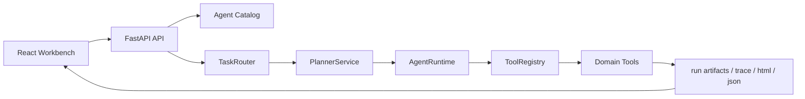
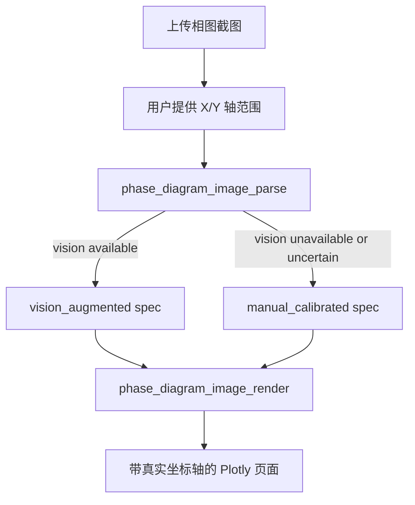

# Phase Diagram Agent

一个面向科研组内成员的材料领域 Agent 项目。它的核心不是“固定 workflow”，而是让 LLM 先判断用户到底要做相图生成、相图识别还是讲解重绘，再决定调用哪条 tool chain；其中涉及计算和出图的路径由本地 Python 真实执行。

这个项目适合面试展示，不是因为它宣称“万能智能体”，而是因为它把一个真实、易失效的 LLM agent 过程收敛成了可追踪、可恢复、可扩展的工程系统。

## 项目定位

这不是一个单纯的“输入参数 -> 返回图”的接口集合，而是一个受约束的 domain agent runtime：

- 前端是单页工作台，把输入、运行状态、结果、trace、日志、生成代码放在同一页。
- 主入口已经收成对话式 agent workbench：用户用自然语言提要求，agent 负责判定任务类型、选择 tool chain、出图或识别，并在结束前自检。
- 后端有 workspace、route、plan、tool、artifact、trace 这些明确的 Agent 运行时概念。
- 后端额外暴露 `catalog + manifest`，让前端和文档都能读取同一份系统蓝图。
- LLM 不是唯一真相来源，关键链路都带 deterministic fallback。
- 多模态能力采用“先结构化、后渲染”的策略，不让模型直接生成页面代码。

如果只看代码现状，这个项目当前最准确的定位是：

- `phase_diagram.generate`：已完成，可运行；LLM 写 Python，本地 Python 执行并 review
- `phase_diagram.recognize`：已完成，可运行；多模态识别后返回结构化结果
- `phase_diagram.redraw_html`：已完成，可运行；LLM 生成讲解/重绘 HTML，并在收尾前 review
- `lammps.generate`：已接入 workspace 和 stub router，尚未进入真实模拟执行

## 为什么它是 Agent

“是不是 Agent”不取决于有没有让模型自由思考很多轮，而取决于系统是否具备任务路由、工具编排、执行追踪和失败恢复能力。

| 普通生成接口 | 这个项目 |
| --- | --- |
| 固定调用一个函数 | 先路由到 workspace 和 route |
| 结果只有成功/失败 | 保留 plan、step、trace、artifact |
| 模型输出直接暴露给用户 | 模型输出要经过执行、校验、修复或回退 |
| 扩展新能力要改一整条链路 | 新工具可通过 catalog + planner + registry 接入 |
| 前端只拿最终结果 | 前端可看到 route、tool、plan progress、日志和代码 |

这个项目更接近“受治理的 Agent”而不是“放任式 Agent”。

## 当前能力

| 能力 | Route | 当前状态 | 输出 |
| --- | --- | --- | --- |
| 相图生成 | `phase_diagram.generate` | Active | `result.html`、生成 Python、trace、运行日志 |
| 相图识别 | `phase_diagram.recognize` | Active | `image_spec.json`、识别摘要、trace |
| 讲解重绘 | `phase_diagram.redraw_html` | Active | HTML 页面、review 报告、trace |
| LAMMPS 预留 | `lammps.generate` | Stub-ready | 路由结果、下一步工具链说明、文本 artifact |

## 核心架构



代码层的主干对应关系：

- 路由与 workspace 定义：`backend/app/services/agent_catalog.py`
- 系统蓝图与 route manifest：`backend/app/services/agent_manifest.py`
- route 到 plan 的映射：`backend/app/services/planner_service.py`
- 运行时编排：`backend/app/services/agent_runtime.py`
- 工具注册：`backend/app/services/tool_registry.py`
- API 入口：`backend/app/main.py`
- 前端主工作台：`frontend-react/src/app/AgentWorkbench.tsx`

## 关键设计取舍

### 1. 为什么是“LLM 指挥 + Python 执行”

相图生成链路当前走的是：

1. 生成 Python 代码
2. 本地执行
3. 执行失败则 repair
4. repair 仍失败则回退 deterministic placeholder
5. 最终统一交付结构稳定的 HTML

这样设计的原因不是保守，而是为了把“模型偶发失误”限制在可恢复边界内。对科研组内使用者来说，LLM 负责理解任务和写代码，本地 Python 负责真实执行，这样比“模型直接吐一张图或一页 HTML 然后没人知道怎么来的”更可信、更容易复现。

### 2. 为什么图片识别模块要先出 JSON，再渲染

图片模块没有让多模态模型直接写 HTML，而是拆成两步：

1. `phase_diagram_image_parse`：把截图解析成 `ImageDiagramSpec`
2. `phase_diagram_image_render`：基于 spec 确定性生成 Plotly 页面

这样做的好处是：

- 输出结构可校验
- 轴范围可以由用户显式给定
- 模型不需要直接负责页面工程质量
- 即便视觉模型不可用，也能回退到 `manual_calibrated` 模式

当前图片模块最重要的工程原则是“宁可少识别，也不乱猜”。

### 3. 为什么要保留 deterministic fallback

这个项目的核心经验之一是：在科研场景里，用户更需要“稳态交付”而不是“完全依赖模型的一次命中”。

当前有两类 deterministic fallback：

- 相图生成 fallback：生成固定风格的 placeholder Plotly 页面，确保页面结构、坐标轴和报告布局稳定。
- 图片识别 fallback：即使没有视觉模型，也能基于用户提供的坐标轴把原图作为背景，生成一个带真实坐标系的可交互页面。

这使项目具备一个很适合面试解释的特性：

- LLM 提升上限
- deterministic 机制守住下限

### 4. 为什么要先把 LAMMPS 做成 workspace stub

`lammps.generate` 现在还没有真实模拟执行，但已经有：

- 独立 workspace
- 独立 route
- 独立 tool slot
- 前端 catalog 感知
- runtime trace 与 artifact 契约

这样做的价值在于，后面接入 LAMMPS 时不是“另起一个项目”，而是在现有 Agent runtime 上继续补工具链。

## 图片识别模块怎么设计

当前图片工作流的设计是偏工程化的，而不是偏“AI 魔法”的：



当前实现特点：

- 用户显式提供轴范围，避免 OCR 自行猜轴导致整张图漂移
- 视觉模型只负责保守补全标题、标签、边界，不直接输出页面代码
- 只有在识别到足够可信的信息时，才进入 `vision_augmented`
- 否则稳定回退到 `manual_calibrated`

这条链路非常适合在面试里讲“如何把多模态能力做得可控”。

## 前端为什么适合 Agent 展示

当前 React 工作台的目标不是做一个普通表单页，而是做一个“Agent 控制台”：

- 左侧集中展示 workspace、参数输入、图片上传、环境设置
- 中间主舞台展示结果页，并支持原图与重建结果对照
- 右侧展示 trace、日志、生成代码和状态快照
- catalog 来自后端 `/api/agent/catalog`，前后端对 workspace 和 tool 的认知一致

这让演示时能自然回答两个问题：

- Agent 现在在做什么
- 它是如何一步步做出来的

当前默认前端交互已经改成：

- 左侧：自然语言要求 + 图片拖拽入口 + tool 调用时间线
- 右侧：相图结果页 + 原图对照 + agent 自检 + 生成代码
- LAMMPS 仍然保留在同一张界面里，作为未来第二条工具链的扩展位

## 快速启动

### Backend

```bash
cd backend
python3 -m venv .venv
source .venv/bin/activate
pip install -r requirements.txt
uvicorn app.main:app --reload --port 8000
```

### Frontend React

```bash
cd frontend-react
npm install
npm run dev
```

默认开发端口：

- React：`5174`
- Backend：`8000`

关键接口补充：

- `/api/agent/catalog`：给前端列出 workspace 与 tool 可用性
- `/api/agent/manifest`：给前端和面试演示读取 route 蓝图、step 设计和失败恢复策略
- `/api/agent/chat`：自然语言对话入口，后端会先整理请求，再进入 runtime
- `/api/agent/chat/stream`：对话入口的流式版本，适合前端实时显示 tool 调用过程

可选环境变量：

- 后端启动时会自动读取 [backend/.env.example](/Users/harry/Desktop/相图计算/phase_diagram_agent/backend/.env.example) 对应的 [backend/.env](/Users/harry/Desktop/相图计算/phase_diagram_agent/backend/.env)。
- 进程环境变量优先级高于 `backend/.env`，适合 CI 或临时覆盖。
- `PHASE_DIAGRAM_LLM_API_BASE_URL`
- `PHASE_DIAGRAM_LLM_API_KEY`
- `PHASE_DIAGRAM_LLM_MODEL`

不配置 LLM 也能跑通主链路，只是会更多依赖 deterministic fallback。

## 推荐演示路径

### 演示 1：相图生成

输入一个二元体系，例如 `Fe-Cu`，重点展示：

- route 是如何被识别为 `phase_diagram.generate`
- plan 如何包含 codegen / execute / repair / fallback
- 最终页面、trace 和生成代码如何一起展示

### 演示 2：截图重建

上传一张相图截图并手动给出轴范围，重点展示：

- route 切到 `phase_diagram.from_image`
- 前后端如何保留图片原始上下文
- 结果区如何并排显示原图与生成页面
- 即便视觉模型不可用，页面也能稳定生成

### 演示 3：未来 LAMMPS 接入

展示 catalog 中的 `lammps` workspace，重点讲：

- 为什么先做 stub 而不是伪造功能
- 当前已经打通的 runtime 契约有哪些
- 下一步会把 `lammps_command_router -> lammps_codegen -> lammps_execute -> lammps_repair` 补齐

## 面试里可以讲的亮点

- 这是一个“LLM 被 runtime 约束”的项目，而不是“runtime 围着 LLM 转”的项目。
- 多模态模块采用结构化 spec + deterministic render，避免直接生成不可控页面代码。
- 系统从第一天就把扩展位设计成 workspace / route / tool / artifact，而不是把未来需求写进 TODO。

更完整的面试讲法见：

- `docs/ARCHITECTURE.md`
- `docs/INTERVIEW_PLAYBOOK.md`

## 当前边界

为了和代码现状保持一致，当前边界需要明确讲清：

- 这不是一个经过严格热力学验证的真实相图求解器。
- planner 目前是规则化、固定 plan 的，不是开放式自主规划。
- LAMMPS 目前还是 stub workspace，还没有真实运行模拟。
- 图片识别模块优先保证稳健和可解释，不保证自动重建所有相界细节。
- 自动化测试当前主要覆盖后端契约、路由、fallback 和图像链路，前端更偏集成验证。

## 仓库结构

```text
phase_diagram_agent/
├── README.md
├── MAINTENANCE.md
├── docs/
│   ├── ARCHITECTURE.md
│   └── INTERVIEW_PLAYBOOK.md
├── backend/
│   ├── README.md
│   ├── app/
│   ├── tests/
│   └── tmp/
├── frontend/
└── frontend-react/
```

## 文档导航

- 根 README：项目定位、设计取舍、演示路径
- `backend/README.md`：后端架构、API、工具扩展方式
- `docs/ARCHITECTURE.md`：更细的系统图与模块说明
- `docs/INTERVIEW_PLAYBOOK.md`：面试叙事、演示脚本、边界表达
- `MAINTENANCE.md`：仓库清理和文档同步约束
