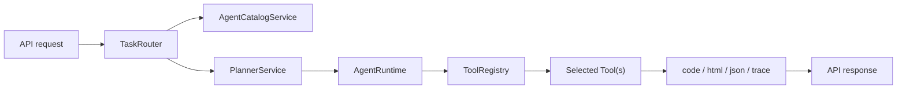
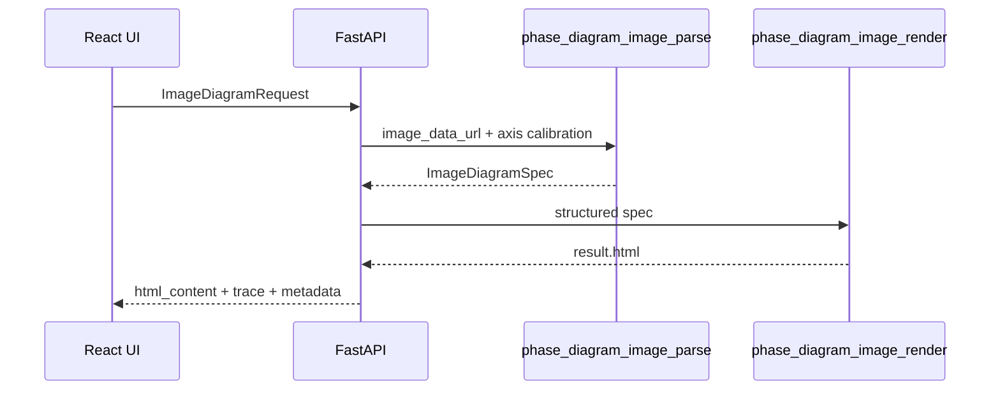

# Backend README

这个后端不是一个单纯的“生成并执行 Python”服务，而是一个面向领域任务的轻量 Agent runtime。它目前已经支持：

- `phase_diagram.generate`
- `phase_diagram.from_image`
- `lammps.generate` 的 stub 路由

## 后端职责

后端当前负责四类事情：

1. 对请求做 workspace 和 route 识别
2. 对自然语言 chat 请求补全结构化参数
3. 把 route 编排成 plan steps
4. 按 plan 调用工具并记录 trace / artifact
5. 向前端暴露 catalog、结果页和运行元数据

## 运行时主链路



## 核心模块

| 模块 | 作用 |
| --- | --- |
| `app/main.py` | FastAPI 入口，组装服务、工具和 API |
| `app/services/agent_chat_service.py` | 把自然语言对话请求整理成可执行的 `AgentRunRequest` |
| `app/services/agent_catalog.py` | workspace、supported routes、tool catalog、route 决策 |
| `app/services/task_router.py` | 将请求委托给 catalog，返回 `TaskRoute` |
| `app/services/planner_service.py` | 根据 route 生成固定 plan |
| `app/services/agent_runtime.py` | 逐步执行工具，记录 observation、artifact、trace |
| `app/services/phase_diagram_agent_service.py` | 负责 chat 文本解析和结果自检逻辑 |
| `app/services/tool_registry.py` | 工具注册和查找 |
| `app/services/codegen_service.py` | 代码生成、质量校验、repair、placeholder fallback |
| `app/services/phase_diagram_image_service.py` | 多模态图片解析、spec 合并、确定性渲染 |
| `app/services/executor_service.py` | 本地 Python 执行，要求产出 `result.html` |
| `app/services/artifact_service.py` | run 目录、结果页、trace 文件的读写 |

## 当前工具集

| Tool | 作用 | 状态 |
| --- | --- | --- |
| `phase_diagram_codegen` | 生成或回退相图 Python 代码 | Active |
| `phase_diagram_result_review` | 对生成代码和 HTML 做结果自检 | Active |
| `phase_diagram_repair` | 基于报错修复生成代码 | Active |
| `python_execute` | 本地执行 Python 并抓取 HTML 结果 | Active |
| `phase_diagram_image_parse` | 将截图解析成结构化 spec | Active |
| `phase_diagram_image_render` | 从 spec 确定性渲染结果页 | Active |
| `load_latest_html_artifact` | 读取最近一次成功结果 | Active |
| `lammps_command_router` | 接收 LAMMPS 指令并返回预留工具链说明 | Stub-ready |

预留但尚未实现的 LAMMPS tool slot：

- `lammps_codegen`
- `lammps_execute`
- `lammps_repair`

## Route 与 Plan

### `phase_diagram.generate`

固定 plan：

1. `phase_diagram_codegen`
2. `python_execute`
3. `phase_diagram_result_review`
4. `phase_diagram_repair`
5. `python_execute`
6. `phase_diagram_result_review`
7. `phase_diagram_codegen(force_placeholder=True)`
8. `python_execute`
9. `phase_diagram_result_review`

这条链路体现了后端的核心设计：

- 允许 LLM 先尝试提升上限
- 允许 repair 吃掉一次执行错误
- 允许结果页在交付前再过一轮 agent 自检
- 最终用 deterministic placeholder 守住交付下限

### `phase_diagram.from_image`

固定 plan：

1. `phase_diagram_image_parse`
2. `phase_diagram_image_render`

设计要点：

- 先生成 `ImageDiagramSpec`
- 再确定性渲染 HTML
- 视觉模型不可用时回退到 `manual_calibrated`

### `lammps.generate`

当前 plan：

1. `lammps_command_router`

它的作用不是“假装做完 LAMMPS”，而是把 workspace、route、artifact 和 trace 契约先铺好，后续可以无缝补真正的模拟工具链。

## API 概览

| Method | Path | 说明 |
| --- | --- | --- |
| `GET` | `/api/health` | 服务健康检查 |
| `GET` | `/api/agent/catalog` | 返回 workspace、tool、route catalog |
| `GET` | `/api/agent/manifest` | 返回 route 蓝图、step 设计、失败恢复策略和 tool contract |
| `GET` | `/api/latest-result` | 最近一次成功 HTML |
| `GET` | `/api/runs/{run_id}/result` | 指定 run 的 HTML |
| `POST` | `/api/agent/chat` | 自然语言对话入口 |
| `POST` | `/api/agent/chat/stream` | 自然语言对话入口的流式版本 |
| `POST` | `/api/generate` | 仅生成代码 |
| `POST` | `/api/run` | 仅执行代码 |
| `POST` | `/api/agent/run` | Agent 原生运行入口 |
| `POST` | `/api/generate-and-run` | 相图同步链路 |
| `POST` | `/api/generate-and-run/stream` | 相图流式链路 |
| `POST` | `/api/phase-diagram/from-image` | 截图重建链路 |

## Artifact 契约

每次运行都会有独立 run 目录，位于：

```text
backend/tmp/runs/{run_id}/
```

常见产物：

- `code.py`
- `result.html`
- `trace.json`
- `image_spec.json` 或其他 text/json artifact

这个契约很重要，因为它使前端、调试和测试都能基于同一套 run 语义工作。

## 为什么 deterministic fallback 很关键

这个项目在工程上最重要的决策之一，是不把“模型输出正确”当成唯一成功条件。

### 对相图生成链路

如果：

- LLM 不可用
- LLM 返回了错误代码
- repair 也失败

系统仍然会生成一个结构稳定、可展示的 placeholder 页面。这样前端不会因为一次模型波动而完全失去结果面板。

### 对图片识别链路

如果：

- 视觉模型不可用
- 视觉模型输出不可靠
- 没有足够可信的标签或边界

系统会退回 `manual_calibrated`，只做“校准背景图 + 真实坐标轴 + 稳定页面壳层”，不去幻想不存在的相区。

这类 fallback 机制让系统更像一个可托付的工程产品，而不是一次性的 prompt demo。

## 图片识别模块说明

`phase_diagram.from_image` 当前遵循“先结构化、后渲染”的路线：



实现原则：

- 轴范围由调用方显式提供
- 模型只尝试保守提取标题、标签和边界
- 输出必须能落在用户提供的坐标轴范围内
- 没把握就返回空边界，而不是编故事

## 如何扩展新工具

推荐按下面顺序扩展：

1. 在 `app/tools/` 下实现一个新 tool
2. 在 `app/services/tool_registry.py` 注册它
3. 在 `app/services/agent_catalog.py` 把它加入对应 workspace 的 catalog
4. 在 `app/services/planner_service.py` 把 route 映射到 plan
5. 如有新请求结构，补 `app/schemas.py`
6. 补充 `backend/tests/test_backend_contracts.py`

如果是新增 workspace，例如未来完整的 LAMMPS agent，建议同时补：

- workspace summary
- supported routes
- reserved tool slots
- 前端 catalog 展示文案

## 为什么前端 catalog 驱动很重要

前端会拉取 `/api/agent/catalog`，然后展示：

- 当前有哪些 workspace
- 各 workspace 哪些 tool active
- 哪些 tool 还只是 reserved

这让前端不需要把 Agent 能力硬编码死，也让面试时更容易讲“扩展一个新工作区的工程路径”。

现在前端还会读取 `/api/agent/manifest`，把 route blueprint、step stage 和 failure strategy 显式展示出来。这样系统设计不只是写在文档里，而是变成真实 API 的一部分。

## 启动方式

```bash
python3 -m venv .venv
source .venv/bin/activate
pip install -r requirements.txt
uvicorn app.main:app --reload --port 8000
```

常用环境变量：

- 后端启动时会自动读取 [backend/.env.example](/Users/harry/Desktop/相图计算/phase_diagram_agent/backend/.env.example) 对应的 `backend/.env`。
- 如果系统环境里也设置了同名变量，系统环境优先。
- `PHASE_DIAGRAM_LLM_API_BASE_URL`
- `PHASE_DIAGRAM_LLM_API_KEY`
- `PHASE_DIAGRAM_LLM_MODEL`
- `PHASE_DIAGRAM_AGENT_MAX_STEPS`
- `PHASE_DIAGRAM_AGENT_MAX_REPAIR_ATTEMPTS`

## 测试与验证

当前仓库带有后端契约测试，重点覆盖：

- health endpoint
- catalog 暴露
- route / planner 行为
- `generate-and-run` 响应契约
- 图片链路响应契约
- runtime 的成功 / repair / fallback 场景

运行方式：

```bash
source .venv/bin/activate
python -m unittest tests.test_backend_contracts
```

## 当前边界

保持和代码现状一致，后端当前边界如下：

- planner 还是固定 plan，不是开放式自主多轮规划
- 执行器当前是本地 Python，不是隔离容器
- `pycalphad` 在依赖里，但主链路还没有进入真实热力学求解
- LAMMPS 只有 stub router，没有真实执行
- 视觉识别更强调稳健和可解释，不追求“自动还原整张图”的幻觉能力
