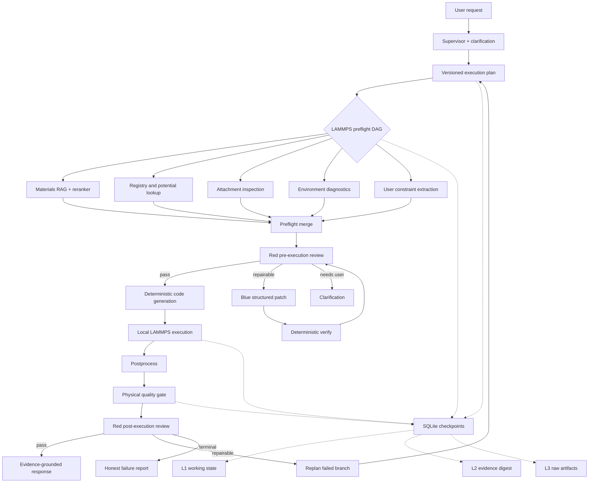
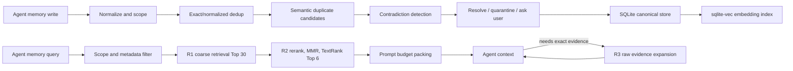
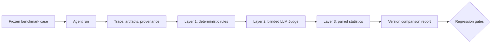

# Advanced Agent Migration Roadmap

> 状态：Proposed / 后续实施的单一执行路线图
> 建立日期：2026-06-22
> 适用项目：`phase_diagram_agent`
> 当前重点：LAMMPS 科学计算链路；相图与识别链路保持稳定，不作为第一轮改造对象

## 1. 文档目的

本文档把 DeepResearch Agent 中有价值的高级机制迁移到当前材料科研 Agent，形成可逐阶段实施、可测试、可回滚的工程计划。后续改进应优先按本文档的阶段、接口和验收条件执行；若实现方案发生变化，应先更新本文档，再修改代码。

迁移目标不是复制一个“写研究报告的多 Agent 系统”，而是把其中可复用的工程思想改造成适合科学计算的能力：

- 用受控 DAG 并行化互不依赖的预检任务；
- 用显式生命周期、checkpoint 和 replan 管理长任务；
- 用 Red/Blue 审查与结构化修复提高 LAMMPS 安全性；
- 用分层上下文和共享证据存储降低长链路信息损失；
- 用确定性科学指标、benchmark 和有限的 LLM-as-Judge 建立评测闭环。

## 2. 核心原则

后续实现必须遵守以下原则。

1. **确定性规则优先于 LLM**
   物理正确性、参数范围、产物完整性、数值有限性和执行状态由代码判断；LLM 只能解释、提出候选修复或评价表达质量。

2. **修复结构化请求，不直接任意改脚本**
   Blue Agent 默认修改 `LammpsRequest` 或受白名单约束的 patch，再重新生成 `in.lammps`。禁止让模型自由重写整份脚本后直接执行。

3. **用户约束默认锁定**
   材料、任务类型、目标温度、步数、系综和用户上传的势函数等显式约束不可静默改变。必须改变时先澄清，或在结果中明确标记为未执行。

4. **真实执行与 mock 严格隔离**
   mock 只用于 UI、contract 和故障演示，不能被描述为真实科学结果。真实模式解析不到 thermo 数据时必须失败，不能生成伪造 thermo 行来掩盖解析错误。

5. **并行只用于可并行步骤**
   RAG、registry、附件元数据检查和环境诊断可以并行；输入生成、LAMMPS 执行、后处理和结果审查保持依赖顺序。工作站默认只允许一个真实模拟任务并发执行。

6. **所有高级能力可关闭、可回滚**
   新链路通过 feature flag 灰度开启；旧的稳定 LAMMPS 链路保留到新 benchmark 全部达标。

7. **证据和 provenance 不丢失**
   压缩上下文时保留原始材料、命令、公式、单位、日志和来源引用的可追溯指针。

## 3. 当前基础与差距

### 3.1 已有能力

当前项目已经具备大部分迁移基础：

- `backend/app/graph.py`
  - LangGraph 主图、route、trace、stream event；
- `backend/app/runtimes/lammps.py`
  - RAG preflight、请求解释、registry、validation、codegen、真实执行、postprocess、review、repair loop；
- `backend/app/jobs.py`
  - SQLite job queue、事件、取消和后台 worker；
- `backend/app/memory.py`
  - SQLite 短期/长期记忆与检索；
- `backend/app/core/agent_protocol.py`
  - 稳定 Agent envelope；
- `backend/app/runtimes/telemetry.py`
  - runtime profile、耗时、tool chain 和 trust level；
- `backend/app/materials_rag/`、`backend/app/rag/`
  - query rewrite、BM25、dense embedding、reranker、SQLite vector store；
- `backend/benchmarks/`
  - 12 组数据集、318 条 case，包含 LAMMPS contract 与 E2E。

### 3.2 主要差距

- LAMMPS runtime 仍是一个较长的同步函数，预检步骤没有显式 DAG；
- review 与 repair 已存在，但职责混在 runtime 中，缺少独立 Red/Blue 协议；
- 缺少任务级 checkpoint、plan version 和局部 replan；
- 结果审查更偏 artifact contract，物理有效性指标还不够完整；
- memory 是会话级摘要，尚未形成 run-level L1/L2/L3 证据层；
- 缺少矛盾检测和证据冲突记录；
- benchmark 尚未独立量化 repair safety、物理异常检出和断点恢复；
- 全量测试环境仍有 Python 3.13 `readline/libedit` 原生崩溃风险，需要独立治理。

## 4. 目标架构



## 5. DeepResearch 高级机制的适配规则

| 原始机制 | 本项目中的落点 | 不照搬的部分 |
|---|---|---|
| `asyncio + Semaphore` DAG | LAMMPS preflight 与诊断任务 | 不并行真实 LAMMPS 主执行，不立即重写整个 LangGraph |
| 9 状态生命周期 | job/runtime 内部状态 + `termination_reason` | 不把状态数量当目标，不增加无意义状态 |
| 动态 replan | 只重跑失败且可修复的分支，生成 `plan_version` | 不允许无限循环和整链路盲目重跑 |
| 三级降级 | 单节点 fallback、局部 replan、全局部分结果合成 | 部分结果不能伪装为科学成功 |
| Red Agent 攻击报告 | 参数、脚本、物理、证据、artifact 五维审查 | 不用纯 LLM 判断数值正确性 |
| Blue Agent ADD/DELETE/MODIFY/VERIFY | 对结构化 request/plan 生成白名单 patch | 不让模型直接执行任意文本补丁 |
| L1/L2/L3 上下文压缩 | working state、evidence digest、raw artifact store | 命令、公式、单位和日志不做有损摘要替换 |
| 共享向量记忆 | 复用 SQLite memory/vector store，增加 run evidence 表 | 不新建重复的独立向量数据库 |
| 矛盾检测 | 结构化事实冲突 + 语义冲突候选 | LLM 只标候选，最终冲突由规则或用户确认 |
| LLM-as-Judge | 解释质量、证据覆盖、可读性 | 不用于决定 LAMMPS 是否物理正确 |
| Bootstrap CI / Cohen's d | 样本足够后用于回归置信度与版本比较 | 小于 30 个 case 时不输出伪精确统计结论 |

## 6. 运行生命周期与状态机

### 6.1 内部九状态

保留现有 API `RunStatus`，新增 runtime 内部生命周期，不破坏前端契约。

| 状态 | 含义 | 允许转移 |
|---|---|---|
| `queued` | 已进入 job queue | `planning`、`terminated` |
| `planning` | 生成结构化计划和约束锁 | `preflight`、`terminated` |
| `preflight` | 执行 DAG 预检 | `ready`、`repairing`、`terminated` |
| `ready` | 已通过执行前审查 | `running`、`terminated` |
| `running` | LAMMPS 或后处理执行中 | `reviewing`、`repairing`、`terminated` |
| `reviewing` | 物理 gate 与 Red review | `completed`、`repairing`、`terminated` |
| `repairing` | Blue patch 或局部 replan | `planning`、`preflight`、`ready`、`terminated` |
| `completed` | 所有阻断 gate 通过 | 终态 |
| `terminated` | failed/cancelled/timed_out/needs_user | 终态，可由新 job resume |

`terminated` 必须携带稳定的 `termination_reason`，至少区分：

- `needs_user_clarification`
- `preflight_failed`
- `red_review_blocked`
- `lammps_execution_failed`
- `physical_quality_failed`
- `repair_budget_exhausted`
- `global_timeout`
- `cancelled`

### 6.2 计划版本

每轮执行计划必须包含：

```json
{
  "plan_id": "...",
  "plan_version": 1,
  "run_id": "...",
  "nodes": [],
  "locked_constraints": {},
  "repair_budget": 2,
  "replan_budget": 2,
  "created_from": "initial|repair|resume"
}
```

replan 只创建新版本，不覆盖旧版本；trace 必须能还原“为什么重规划”。

### 6.3 状态控制器实现约束

九状态不能只作为日志文字存在，应由统一状态控制器管理。建议新增：

```text
backend/app/orchestration/lifecycle.py
```

核心接口：

```python
class TaskLifecycleController:
    def transition(
        self,
        *,
        run_id: str,
        from_state: str,
        to_state: str,
        reason: str,
        plan_version: int,
        metadata: dict,
    ) -> LifecycleEvent: ...
```

状态控制器必须执行以下约束：

- 拒绝状态表中未允许的转移；
- `completed` 和 `terminated` 不允许原地恢复，resume 必须建立新 attempt；
- 每次转移写入 SQLite 和 trace event；
- `repairing` 必须携带 finding/patch/replan 原因；
- `terminated` 必须携带 `termination_reason`；
- `completed` 前必须同时满足执行成功、artifact contract、physical gate 和 final review；
- API 层的 `RunStatus` 由内部状态映射产生，不能由任意节点直接赋值。

内部状态到现有 `RunStatus` 的建议映射：

| 内部状态 | API `RunStatus` |
|---|---|
| `queued` | `queued` |
| `planning`、`preflight`、`ready`、`running`、`reviewing`、`repairing` | `running` |
| `completed` | `completed` |
| `terminated` + cancelled | `cancelled` |
| `terminated` + 其他原因 | `failed` |

### 6.4 生命周期事件

每次状态变化统一产生：

```json
{
  "event_type": "lifecycle.transition",
  "run_id": "...",
  "attempt": 1,
  "plan_version": 2,
  "from_state": "reviewing",
  "to_state": "repairing",
  "reason": "lost_atoms_detected",
  "emitted_at": "..."
}
```

前端、job progress、checkpoint 和 telemetry 均消费这类事件，不再分别猜测当前状态。

## 7. DAG 编排迁移

### 7.1 第一阶段只做 LAMMPS preflight DAG

新增建议模块：

```text
backend/app/orchestration/
├── __init__.py
├── dag.py                 # DAGNode、DAGPlan、DAGResult
├── executor.py            # asyncio + Semaphore + timeout
├── checkpoint.py          # checkpoint protocol
└── failure_policy.py      # retry/replan/terminal 分类

backend/app/lammps/
└── preflight.py           # LAMMPS 专用 DAG 定义
```

首批节点：

1. `constraint_extract`
2. `materials_rag_search`
3. `registry_lookup`
4. `attachment_inspection`
5. `runtime_diagnostics`
6. `preflight_merge`
7. `red_pre_execution_review`

其中 1–5 可并行，6–7 串行。

### 7.2 资源信号量

分别限制资源，而不是只设一个全局并发数：

```text
network_sem = 3
cpu_sem = 2
simulation_sem = 1
```

- embedding、reranker、LLM 属于 `network`；
- 附件解析、轻量后处理属于 `cpu`；
- 真实 LAMMPS 属于 `simulation`。

### 7.3 timeout 与三级降级

所有 timeout 通过配置注入，初始默认建议：

- preflight 单节点：45 秒；
- LLM parse/review：120 秒；
- LAMMPS：20 分钟；
- postprocess：10 分钟；
- 全 job：35 分钟。

降级策略：

1. **单任务超时**：使用确定性 fallback；例如 reranker 超时保留 hybrid 顺序；
2. **局部分支失败**：只 replan 受影响分支；例如附件解析失败不重跑 RAG；
3. **全局超时**：输出已有证据和失败报告，但 `success=false`，不得强制合成“成功计算”。

### 7.4 DAG 验收条件

- 相同输入的 plan topology 稳定；
- 任一节点失败都有分类明确的 observation；
- 网络并发不超过配置值；
- 真实 LAMMPS 并发始终不超过 1；
- preflight 在注入延迟的测试中相对串行版至少降低 25% wall time；
- 关闭 feature flag 时仍走当前稳定链路。

### 7.5 DAG 节点契约

每个节点必须是可独立测试的函数，输入和输出均可序列化，不能通过隐式全局变量交换状态。

建议模型：

```python
class DAGNode(BaseModel):
    node_id: str
    node_type: str
    dependencies: list[str]
    resource_class: Literal["network", "cpu", "simulation"]
    timeout_seconds: float
    critical: bool = True
    retryable: bool = False
    max_attempts: int = 1
    input_keys: list[str] = []
    output_keys: list[str] = []


class DAGNodeResult(BaseModel):
    node_id: str
    status: Literal["completed", "failed", "timed_out", "skipped"]
    attempt: int
    started_at: str
    finished_at: str
    output: dict = {}
    error: str = ""
    failure_category: str = ""
    evidence_refs: list[str] = []
    checkpoint_id: str = ""
```

节点执行函数只接收显式上下文：

```python
async def execute_node(
    node: DAGNode,
    context: DAGExecutionContext,
) -> DAGNodeResult:
    ...
```

节点契约约束：

- 同一个 `node_id + input_hash + config_signature` 应产生可复用结果；
- output 中不能放不可序列化的进程、文件句柄或客户端对象；
- 大文件只保存 artifact/evidence 引用；
- exception 在节点边界转换成 `DAGNodeResult`，不能直接吞掉；
- critical 节点失败会阻止依赖节点；non-critical 节点可进入降级路径。

### 7.6 LAMMPS 第一版 DAG 拓扑

第一版只迁移 preflight，保持 codegen 和执行主链稳定：

| 节点 | 依赖 | 资源类 | Critical | 失败策略 |
|---|---|---|---:|---|
| `constraint_extract` | 无 | CPU | 是 | 缺少关键参数则澄清 |
| `materials_rag_search` | 无 | Network | 否 | 使用 registry 与用户输入继续 |
| `registry_lookup` | 无 | CPU | 是 | 进入 repair/clarification |
| `attachment_inspection` | 无 | CPU | 视请求而定 | 无附件可跳过；必需附件失败则终止 |
| `runtime_diagnostics` | 无 | CPU | 是 | 环境缺失则诚实失败 |
| `preflight_merge` | 前五项 | CPU | 是 | 汇总冲突并分类 |
| `red_pre_execution_review` | `preflight_merge` | Network/CPU | 是 | pass、repair 或 clarification |
| `lammps_input_codegen` | Red pass | CPU | 是 | repair 或终止 |
| `lammps_execute` | codegen | Simulation | 是 | error RAG、repair 或终止 |
| `lammps_postprocess` | execute | CPU | 是 | 可从执行 checkpoint 单独重试 |
| `physical_quality_gate` | postprocess | CPU | 是 | review、repair 或终止 |
| `red_post_execution_review` | quality gate | Network/CPU | 是 | completed、repair 或终止 |

第一轮代码只把前七个节点交给新 DAG executor。后五个节点先作为现有 `LammpsRuntime` 的串行 downstream；待 Phase 3 benchmark 稳定后再统一进入完整 DAG。

### 7.7 `asyncio + Semaphore` 调度算法

executor 不按列表顺序盲目启动所有任务，而是维护四个集合：

- `pending`：依赖尚未全部满足；
- `ready`：依赖已成功或已按策略降级；
- `running`：当前 asyncio tasks；
- `finished`：已完成、失败、超时或跳过。

建议执行流程：

```python
async def run_dag(plan, context):
    validate_acyclic(plan)
    deadline = monotonic() + context.global_timeout_seconds

    while not all_nodes_terminal(plan):
        if monotonic() >= deadline:
            return finalize_global_timeout(plan, context)

        ready_nodes = find_ready_nodes(plan)
        for node in ready_nodes:
            task = asyncio.create_task(run_with_resource_sem(node, context))
            running[node.node_id] = task

        if not running:
            return fail_deadlock_or_dependency_cycle(plan)

        done, _ = await asyncio.wait(
            running.values(),
            return_when=asyncio.FIRST_COMPLETED,
        )

        for task in done:
            result = await task
            persist_result_and_checkpoint(result)
            update_dependents(result)
```

单节点执行使用双层 timeout：

```python
async with semaphore_for(node.resource_class):
    result = await asyncio.wait_for(
        handler(node, context),
        timeout=node.timeout_seconds,
    )
```

实现注意事项：

- Semaphore 获取等待时间也计入全局 timeout；
- 取消 job 时取消未开始/运行中的 asyncio task，并终止 LAMMPS subprocess；
- `asyncio.gather(..., return_exceptions=True)` 只用于已知批次，主调度器优先使用 `asyncio.wait(FIRST_COMPLETED)` 动态释放后继节点；
- 每个 task 完成后立即 checkpoint，避免整个批次结束才持久化；
- 网络节点可并发，但同一个 API provider 可再增加 provider-specific rate limit；
- 同步 `run_chat()` 暂时保留 facade，FastAPI/job worker 后续增加 async 入口。

### 7.8 动态 Replan 的失效传播

replan 的关键不是“再生成一次完整计划”，而是精确判断哪些节点结果失效。

每个节点结果记录：

- `input_hash`
- `config_signature`
- `dependency_result_hashes`
- `artifact_hashes`
- `plan_version`

当 Blue patch 修改字段时，根据字段与节点的依赖关系计算失效集合。

示例：`time_step: 0.005 → 0.001`

```text
可以复用：
  constraint_extract
  materials_rag_search
  registry_lookup
  attachment_inspection
  runtime_diagnostics

必须失效：
  preflight_merge
  red_pre_execution_review
  lammps_input_codegen
  lammps_execute
  lammps_postprocess
  physical_quality_gate
  red_post_execution_review
```

示例：仅 reranker 超时，fallback 到 hybrid 排序：

```text
materials_rag_search = completed_with_fallback
其余节点不失效
不创建新 plan version
```

示例：用户补充了新的势函数文件：

```text
失效 attachment_inspection、registry/preflight merge 及全部 downstream
保留与势文件无关的 query rewrite/RAG 结果
创建 Plan v2，created_from=resume
```

replan 规则：

- 只有输入或依赖 hash 改变的节点才失效；
- 失败节点的所有 downstream 默认失效；
- 无关并行分支保持 completed，可从 checkpoint 复用；
- 用户锁定约束变化必须来自新用户输入，不能由 Blue Agent 自行制造；
- 每个 replan 写出 `old_plan_id`、`new_plan_id`、`invalidated_nodes` 和原因。

### 7.9 三级降级决策表

“降级”不等于“伪装成功”。每一级都必须明确能否继续科学执行。

| 级别 | 触发条件 | 系统动作 | 是否可继续 | 最终状态 |
|---|---|---|---:|---|
| Level 1：单任务 timeout/failure | 一个 non-critical 节点超时或 API 失败 | 使用确定性 fallback，标记 `completed_with_fallback` | 是 | 正常流转，但降低 trust |
| Level 2：批量/关键失败 | 多个 preflight 节点失败，或 critical 节点失败但可修复 | 汇总 failure batch，分类后生成 Plan v+1，只重跑失效分支 | 视 repair 结果 | repairing → preflight/terminated |
| Level 3：全局 timeout | job deadline 到达、预算耗尽或无法收敛 | 取消未完成任务，保存 checkpoint，强制生成诚实的部分报告 | 否 | terminated/global_timeout |

#### Level 1：单任务超时

适用示例：

- reranker 超时 → 保留 BM25 + dense hybrid 顺序；
- embedding API 超时 → 若已有有效 persistent embedding 则复用；
- Red LLM review 超时 → 使用 deterministic Red review；
- optional OVITO 媒体失败 → 保留 thermo/plot/report，并标 advisory。

不允许 Level 1 的节点：

- 用户约束解析；
- 势函数/材料匹配；
- LAMMPS executable 检查；
- 真实 thermo 解析；
- physical blocking gate。

#### Level 2：批量失败重规划

`preflight_merge` 生成统一失败批次：

```json
{
  "batch_id": "...",
  "failed_nodes": ["registry_lookup", "attachment_inspection"],
  "findings": [],
  "repairable": true,
  "needs_user": false,
  "restart_from": "attachment_inspection"
}
```

failure policy 决定：

- 可自动修复 → Blue patch + Plan v+1；
- 需要用户信息 → `terminated/needs_user_clarification`；
- 环境或能力不支持 → 诚实终止；
- repair/replan budget 耗尽 → `repair_budget_exhausted`。

批量失败不能直接把所有错误文本交给 LLM。先进行确定性分类、去重、合并同源错误，再生成最小修复请求。

#### Level 3：全局超时强制合成

本项目中的“强制合成”定义为强制生成 **failure/partial report**，不是合成物理数据。

全局 timeout 时按顺序执行：

1. 停止调度新节点；
2. 取消 network/CPU task；
3. 对真实 LAMMPS subprocess 发送 terminate，超时后再 kill；
4. 持久化最后 checkpoint 和 task states；
5. 收集已完成 artifact、RAG evidence、findings 和未完成节点；
6. 生成 `partial_result.json` 与面向用户的失败说明；
7. 返回 `success=false`、`RunStatus=failed`、`termination_reason=global_timeout`；
8. 若存在安全恢复点，提供 resume 建议。

partial report 至少包含：

```json
{
  "success": false,
  "termination_reason": "global_timeout",
  "completed_nodes": [],
  "unfinished_nodes": [],
  "failed_nodes": [],
  "available_artifacts": [],
  "evidence_refs": [],
  "last_checkpoint_id": "...",
  "resume_supported": true,
  "scientific_result_available": false
}
```

### 7.10 Checkpoint 与事件顺序

一次正常 preflight 的事件顺序应稳定为：

```text
lifecycle.transition queued → planning
plan.created v1
checkpoint.saved after_plan
lifecycle.transition planning → preflight
node.started × N
node.completed/failed × N
checkpoint.saved after_each_node
preflight.batch_completed
node.started preflight_merge
node.completed preflight_merge
checkpoint.saved after_preflight_merge
node.started red_pre_execution_review
node.completed red_pre_execution_review
lifecycle.transition preflight → ready
```

发生 replan 时增加：

```text
lifecycle.transition reviewing → repairing
repair.patch_proposed
repair.patch_verified
plan.invalidated
plan.created v2
checkpoint.saved after_replan
lifecycle.transition repairing → preflight
```

### 7.11 具体实施拆分

#### Step A：只建立模型和拓扑验证

- [x] 新建 `orchestration/dag.py`；
- [x] 定义 node/plan/result schema；
- [x] 实现重复 ID、缺失依赖和 cycle 检测；
- [x] 用纯函数生成 LAMMPS preflight plan；
- [x] 暂不接入 runtime。

落地文件：

- `backend/app/orchestration/dag.py`
- `backend/app/lammps/preflight.py`
- `backend/tests/test_dag_models.py`
- `backend/tests/test_lammps_preflight_dag.py`

当前验证：`13 passed, 3 subtests passed`。

验收：拓扑排序稳定，cycle fixture 100% 被拒绝。

#### Step B：实现 async executor

- [x] 新建 `orchestration/executor.py`；
- [x] 实现 ready queue、resource semaphore、node timeout；
- [x] 实现 cancellation；
- [x] 实现逐节点 event 与 result；
- [x] 用 fake handlers 验证并发，不调用真实 API/LAMMPS。

落地文件：

- `backend/app/orchestration/executor.py`
- `backend/tests/test_dag_executor.py`

当前验证：`19 passed, 3 subtests passed`。

验收：并发限制无越界，异常不会导致其他独立节点丢失结果。

#### Step C：接入 LAMMPS preflight

- [x] 封装现有 RAG、registry、附件和 diagnostics 为节点 handler；
- [x] 保持原函数逻辑与输出 schema；
- [x] `LammpsRuntime.run()` 通过 feature flag 选择 legacy/preflight DAG；
- [x] downstream 仍复用现有 validation/codegen/execute/postprocess/review；
- [x] 对比 legacy 与 DAG 的 request、evidence 和 trace。

落地文件：

- `backend/app/runtimes/lammps.py`
- `backend/app/lammps/config.py`
- `backend/app/orchestration/executor.py`
- `backend/tests/test_lammps_preflight_runtime.py`
- `backend/tests/test_infrastructure_modules.py`

本轮实现：

- 新增 `LAMMPS_PREFLIGHT_DAG_ENABLED` / `lammps_preflight_dag_enabled` 开关，默认关闭；
- 开启后先运行 `constraint_extract`、`materials_rag_search`、`registry_lookup`、`attachment_inspection`、`runtime_diagnostics`、`preflight_merge`、`red_pre_execution_review`；
- DAG 结果写入 `metadata.preflight_dag`、`summary.preflight_dag` 和 `trace.json`；
- 解析后的 registry、validation、codegen、execute、postprocess、review 仍复用原主链路，避免第一版改动真实执行语义；
- legacy 与 DAG request / RAG evidence 等价性由 `test_lammps_preflight_runtime.py` 覆盖。

当前验证：`3 passed`（`test_lammps_preflight_runtime.py` + LAMMPS config 持久化单测）。

验收：功能输出等价，preflight wall time 有可测下降。

#### Step D：加入生命周期与 checkpoint

- [x] 新建 lifecycle controller；
- [x] 将 DAG 事件持久化到 job store；
- [x] 每节点完成后保存 checkpoint；
- [x] 支持进程重启后读取状态；
- [x] 暂不自动 resume 真实 LAMMPS。

落地文件：

- `backend/app/orchestration/lifecycle.py`
- `backend/app/orchestration/executor.py`
- `backend/app/runtimes/lammps.py`
- `backend/app/jobs.py`
- `backend/app/state.py`
- `backend/tests/test_lifecycle_state_machine.py`
- `backend/tests/test_lammps_preflight_runtime.py`
- `backend/tests/test_job_queue.py`

本轮实现：

- 新增九状态生命周期控制器，校验 `queued → planning → preflight → ready → running → reviewing → completed/terminated`；
- 新增 stream event 类型：`lifecycle_event`、`dag_event`、`checkpoint_saved`；
- 异步 job 模式下，上述事件进入原 SQLite `agent_job_events`；
- LAMMPS run 目录写入 `lifecycle.json` 和 `checkpoints/*.json`；
- preflight DAG 每个 node 完成后保存 checkpoint，最终 response/trace/summary 暴露 lifecycle；
- 只做 restart-readable 状态，不自动 resume 真实 LAMMPS。

当前验证：`15 passed`（lifecycle、DAG executor callback、LAMMPS preflight runtime、job queue）。

验收：中断后可准确显示已完成/未完成节点。

#### Step E：加入 replan 与三级降级

- [x] 实现 failure taxonomy；
- [x] 实现 Level 1 fallback policy；
- [x] 实现 failure batch merge；
- [x] 实现 node invalidation 和 Plan v+1；
- [x] 实现 global deadline 与 partial report；
- [x] 接入 repair/replan budget 和震荡检测。

本轮实现：

- 新增 `backend/app/orchestration/replan.py`，统一分类 `optional_timeout_or_failure`、`node_timeout`、`global_timeout`、`blocked_dependency`、`critical_failure`、`infrastructure_missing`、`needs_user` 等失败类型；
- Level 1：LAMMPS preflight 的 non-critical RAG 节点失败/超时时自动使用确定性 fallback，节点结果标记为 `completed_with_fallback`，主流程继续但在 degradation metadata 中记录 trust penalty；
- Level 2：关键失败或批量失败会合并为 `FailureBatch`，计算精确 invalidated nodes，生成 Plan v+1，并把未失效节点标记为 `reuse_checkpoint`；
- Level 3：DAG 全局超时会写出 `partial_result.json`，明确 `success:false`、`scientific_result_available:false`、已完成/失败/未完成节点和最后 checkpoint；
- 接入 `ReplanBudgetState` 与重复 failure signature 检测，避免 repair/replan 震荡；
- LAMMPS runtime 已把降级决策写入 `preflight_dag.metadata.degradation`，并在 Level 3 终止为 `global_timeout`，不会把部分结果伪装成科学成功。

当前边界：

- Plan v+1 与失效集合已经生成并写入 lifecycle event；
- DAG executor 已为节点写入 `input_hash`、`dependency_result_hashes`、`output_hash`、`result_hash` 与 `node_fingerprint`；
- `reuse_checkpoint` 节点会在执行前校验 input/config/dependency hash，命中后跳过 handler 并记录 `node_reused` event；
- job SQLite task/checkpoint 表已同步保存节点 hash 与 `reuse_status`，用于后续 resume/recovery benchmark 审计；
- LAMMPS preflight runtime 已接入一轮受控局部分支重跑：Level 2 可继续时进入 `repairing`，创建 Plan v+1，未失效且 hash 匹配的安全节点通过 checkpoint 复用，失效节点重新执行；
- 仍不做真实 LAMMPS timestep 原地续跑，真实执行失败恢复继续采用新 attempt + checkpoint 上下文。

验收：所有 failure fixture 的降级级别、重跑范围和最终状态符合金标。

### 7.12 专项测试计划

建议新增：

```text
backend/tests/test_dag_models.py
backend/tests/test_dag_executor.py
backend/tests/test_lifecycle_state_machine.py
backend/tests/test_lammps_preflight_dag.py
backend/tests/test_replan_policy.py
backend/tests/test_degradation_policy.py
backend/tests/test_checkpoint_resume.py
```

必须覆盖：

- 空 DAG、单节点、菱形依赖、多并行分支；
- cycle、缺失依赖、重复 node ID；
- semaphore 最大并发计数；
- 单节点 timeout 与 fallback；
- critical/non-critical 失败差异；
- 批量失败去重与 replan；
- 修改一个字段后的精确失效集合；
- repair budget 和 replan budget；
- 参数震荡检测；
- global timeout 的 task cancellation；
- partial report 不包含伪造 scientific success；
- legacy flag 下输出不变；
- checkpoint 重放和 schema version 兼容。

## 8. Red-Blue 对抗审查迁移

### 8.1 职责拆分

当前 `_review_result()` 与 `_repair_request()` 迁移为独立模块：

```text
backend/app/lammps/review/
├── __init__.py
├── models.py              # Finding、ReviewReport、RepairPatch
├── evidence.py            # 证据权威层级与 EvidenceRef
├── deterministic.py       # 规则审查
├── red_agent.py           # 生成攻击性审查报告
├── blue_agent.py          # 生成结构化修复 patch
├── json_parser.py         # 三层 JSON parse fallback
├── scoring.py             # 五维评分与 hard gate
├── convergence.py         # 收敛、停滞和震荡检测
├── verifier.py            # patch 后重新验证
└── policy.py              # 锁定字段、白名单和预算
```

### 8.2 Red Agent 五维攻击面

Red review 必须输出结构化 finding，不接受只有自然语言总结。

1. **参数与单位**
   - `units`、`time_step`、温度、步数、系综、box size；
2. **脚本与势函数**
   - pair style、势文件、元素顺序、边界条件、fix/unfix、thermo 输出；
3. **逻辑一致性**
   - 用户请求 → `LammpsRequest` → `in.lammps` → 结果是否一致；
4. **证据质量**
   - RAG 文档是否相关、是否真正支持参数建议、引用能否追溯；
5. **产物与物理结果**
   - thermo、dump、日志、步数、NaN、能量漂移、温度与压力异常。

建议 schema：

```json
{
  "finding_id": "...",
  "dimension": "parameter|script|consistency|evidence|physics|artifact",
  "severity": "info|warning|blocking",
  "message": "...",
  "evidence_refs": [],
  "repairable": true,
  "suggested_action": "modify|clarify|retry|terminate"
}
```

### 8.3 Blue Agent 白名单 patch

Blue Agent 只允许：

- `ADD`：补充未锁定且确定可推导的字段；
- `MODIFY`：修改白名单字段并说明依据；
- `DELETE`：移除不安全的可选配置，不得删除必需安全命令；
- `VERIFY`：要求重新运行确定性 validator/gate。

建议 schema：

```json
{
  "patch_id": "...",
  "operations": [
    {
      "op": "modify",
      "path": "time_step",
      "before": 0.01,
      "after": 0.001,
      "reason": "...",
      "evidence_refs": []
    }
  ],
  "requires_user_confirmation": false,
  "risk": "low|medium|high"
}
```

默认可修复字段：

- `time_step`
- `box_size`
- `dump_file`
- 非用户显式指定的 `potential_family`
- 非用户显式指定的 `ensemble`
- 生成器内部安全参数

默认锁定字段：

- `material`
- `task_type`
- 用户显式温度和步数
- 用户上传势函数/结构文件
- 用户明确指定的 ensemble/potential

### 8.4 收敛与震荡检测

- repair budget 初始为 2；
- replan budget 初始为 2；
- 相同 finding 连续出现两次视为未收敛；
- patch 在两个值之间往返视为震荡；
- 达到预算立即终止并返回完整修复历史；
- 每次 patch 后必须执行 `VERIFY`，不能直接进入真实执行。

### 8.5 Red-Blue 验收条件

- 所有 blocking finding 都有 evidence；
- 锁定字段未经确认的修改率必须为 0；
- fatal fixture 检出率必须为 100%；
- repair 后必须重新 codegen，旧脚本不得复用；
- 同一错误不会无限循环；
- 禁用 LLM 时 deterministic review 仍可工作。

### 8.6 证据权威层级

Red Agent 不能把所有文本视为同等可信。不同问题使用不同的权威来源：

| 问题类型 | 第一权威来源 | 第二来源 | 禁止行为 |
|---|---|---|---|
| 用户想要什么 | 用户原始请求、确认回复 | 结构化 `LammpsRequest` | 用 RAG 或 LLM 覆盖用户约束 |
| 系统支持什么 | registry、runtime config、文件存在性检查 | Materials RAG | 仅凭 RAG 声称本地可执行 |
| 实际执行了什么 | subprocess exit code、stdout/stderr、`run.log` | `in.lammps`、trace | 用计划或 mock 代替执行事实 |
| 数值是否有效 | thermo/dump、physical gate | report/plot | 用 LLM 主观判断替代数值检查 |
| 参数建议依据 | 势函数元数据、可信原始文档 | reranked RAG evidence | 引用与结论无关的高分文档 |
| 修复是否允许 | locked constraints、patch policy | Red finding | Blue 自行解除锁定字段 |

统一 evidence schema：

```json
{
  "evidence_id": "ev-...",
  "source_type": "user|registry|config|artifact|log|rag|llm_inference",
  "source_ref": "run.log:42",
  "content_hash": "...",
  "claim": "...",
  "supports": ["finding-id"],
  "authority": "primary|secondary|advisory"
}
```

约束：

- blocking finding 至少引用一个 primary evidence；
- RAG evidence 必须保留文档 ID、source URL、score 和原文片段；
- LLM inference 不能单独构成 blocking finding；
- evidence 原文放在 L3，Red/Blue prompt 只使用带引用的 L2 digest；
- finding、patch 和最终报告都通过 `evidence_id` 连接同一证据。

### 8.7 Red Review 评分与通过规则

评分用于判断修复是否改善，不替代硬规则。建议五个子分数：

| 维度 | 权重 | 主要检查 |
|---|---:|---|
| factual correctness | 25% | 材料、温度、步数、势函数、执行事实 |
| logical consistency | 20% | 用户请求到脚本、结果、报告的一致性 |
| script safety | 20% | units、time step、pair style、fix、boundary |
| physical validity | 25% | NaN、步数、温度、能量、压力、lost atoms |
| evidence quality | 10% | 引用相关性、来源权威、claim support |

```text
overall_score =
    factual * 0.25
  + consistency * 0.20
  + script_safety * 0.20
  + physical_validity * 0.25
  + evidence_quality * 0.10
```

硬规则优先：

- 任一 blocking finding 存在时，最高只能记为 59 分；
- deterministic validator 未通过时不能 pass；
- post-execution review 中 physical gate 未通过时不能 pass；
- 真实执行缺少 exit code、thermo 或日志时不能 pass；
- mock 模式不能获得 `scientific_result_passed=true`。

建议通过条件：

```text
blocking_findings == 0
validator_passed == true
physical_gate_passed == true  # post-execution
overall_score >= 85
locked_constraint_violations == 0
```

分数来源必须记录：哪些项由规则计算，哪些项来自 LLM advisory。禁止让 LLM 直接返回一个无依据的总分。

### 8.8 Blue Patch Policy 细化

Blue 输出的 `ADD/DELETE/MODIFY/VERIFY` 不是普通文本编辑命令，而是受策略控制的领域操作。

#### ADD

允许：

- 补充缺失的安全默认值；
- 增加必要的 thermo/dump 输出；
- 增加不会改变用户科学目标的诊断配置；
- 增加 finding 所要求的验证步骤。

禁止：

- 添加新的材料或任务目标；
- 未经确认添加用户未提供的自定义势文件；
- 添加任意 shell/Python 命令。

#### DELETE

允许：

- 删除重复或互相冲突的可选配置；
- 删除由生成器引入、被 deterministic reviewer 判定为不安全的非必需设置。

禁止：

- 删除用户锁定约束；
- 删除安全 gate、thermo 输出或 provenance；
- 直接按字符串行号删除未知脚本内容。

#### MODIFY

允许修改的对象优先是 `LammpsRequest`、generator options 或 execution plan。每次 MODIFY 必须提供 `before`、`after`、reason 和 evidence。

高风险 MODIFY 必须转 clarification：

- material；
- task type；
- 用户明确温度/步数；
- 用户上传势函数或结构；
- potential family 的跨物理模型切换；
- 会实质改变科研问题的 ensemble 变化。

#### VERIFY

VERIFY 是强制动作而不是可选建议。每个 patch 至少触发：

1. Pydantic schema validation；
2. locked constraint check；
3. registry validation；
4. LAMMPS deterministic validation；
5. 重新 codegen；
6. 对新脚本重新执行 Red pre-review；
7. 执行后重新 physical gate 和 Red post-review。

任一 VERIFY 步骤失败，patch 不得进入真实执行。

### 8.9 三层 JSON 解析 Fallback

Red/Blue 与 LLM 的协议必须默认假设模型可能返回代码围栏、解释文字、字段别名或轻微 JSON 格式错误。

建议新增：

```text
backend/app/lammps/review/json_parser.py
```

统一入口：

```python
def parse_review_payload(
    raw_text: str,
    *,
    schema: type[BaseModel],
    payload_type: Literal["red_review", "blue_patch"],
) -> ParsedPayload:
    ...
```

#### Layer 1：Strict schema parse

- 优先使用模型的 JSON schema/structured output 能力；
- `json.loads()` 后直接进入 Pydantic；
- 拒绝未知 operation、未知 path、错误类型和缺少 evidence 的 blocking finding；
- 通过则记录 `parse_mode=strict`。

#### Layer 2：Conservative extraction and normalization

只修复格式，不改变语义：

- 去除 Markdown code fence；
- 从前后解释中提取第一个括号平衡的 JSON object；
- 规范有限字段别名，例如 `findings_list → findings`；
- 规范 operation 大小写；
- 删除明确的 trailing comma；
- 再次执行 `json.loads()` 和完整 Pydantic/policy validation。

禁止：

- `eval()`、`ast.literal_eval()` 执行未知结构；
- 猜测缺失的目标值；
- 自动删除无法识别的 operation 后继续；
- 将自然语言建议转换成可执行 patch。

通过则记录 `parse_mode=normalized`、normalization steps 和原文 hash。

#### Layer 3：Deterministic fallback or safe reject

Layer 2 仍失败时：

- Red review：使用 deterministic reviewer 的 findings；
- Blue patch：拒绝执行模型 patch；
- 若 deterministic policy 能给出唯一低风险修复，则生成 `source=deterministic_fallback` patch；
- 否则进入 clarification 或 `review_payload_invalid` 终止；
- 保存原始响应和 parse errors，但不向用户暴露内部 chain-of-thought。

通过则记录 `parse_mode=deterministic_fallback`；拒绝则记录 `parse_mode=rejected`。

`ParsedPayload` 至少包含：

```json
{
  "success": true,
  "parse_mode": "strict|normalized|deterministic_fallback|rejected",
  "payload": {},
  "normalizations": [],
  "errors": [],
  "raw_content_hash": "..."
}
```

三层 fallback 的目标是提高协议可用率，不是降低执行安全门槛。所谓“85% → 95%”必须通过 malformed JSON fixture 实测，不能直接作为本项目结论。

### 8.10 收敛判定

每轮 review 记录：

- `overall_score`
- 五个 dimension scores；
- blocking/warning finding IDs；
- patch fingerprint；
- request fingerprint；
- locked constraint violations；
- repair/replan budget；
- parse mode。

一轮修复视为有改善，至少满足一项且不能引入新的 blocking finding：

- blocking finding 数量减少；
- overall score 提升至少 3 分；
- physical gate 从失败变为通过；
- 原 blocking finding 被关闭且没有同类替代 finding；
- deterministic validator 从失败变为通过。

收敛条件：

```text
blocking_findings == 0
overall_score >= 85
all_deterministic_gates_passed == true
```

停滞条件：

- 连续两轮 overall score 提升小于 3；
- 同一 blocking finding 连续两轮未关闭；
- patch 通过解析但连续两轮未改变 request fingerprint。

停滞后不继续消耗 API，返回 `repair_not_improving`。

### 8.11 震荡检测

至少检测四种震荡：

1. **字段值往返**：`time_step 0.001 → 0.002 → 0.001`；
2. **patch 重复**：相同 operation fingerprint 再次出现；
3. **finding 重复**：同一 finding 被关闭后下一轮重新出现；
4. **分数往返**：两个 score state 交替出现且无 gate 改善。

建议 fingerprint：

```text
patch_fingerprint = hash(sorted(op, path, before, after))
request_fingerprint = hash(canonical LammpsRequest JSON)
finding_fingerprint = hash(dimension, normalized message, evidence refs)
```

检测到震荡后：

- 立即停止自动 repair；
- `termination_reason=repair_oscillation_detected`；
- 输出发生往返的字段和 repair history；
- 若问题涉及锁定约束，要求用户确认；
- 不选择“分数最高的一轮”偷偷继续真实执行，除非该轮所有 deterministic gate 都通过。

### 8.12 完整 Red-Blue 执行回路

```text
LammpsRequest
→ deterministic validation
→ Red pre-review
→ findings + score
→ pass / clarification / Blue patch
→ JSON fallback parse
→ patch policy
→ VERIFY
→ regenerate in.lammps
→ Red pre-review again
→ real execution
→ physical quality gate
→ Red post-review
→ completed / repair / terminated
```

一次典型修复示例：

```text
用户：Cu heating，800 K，4000 steps

Red finding：
  time_step=0.01 对当前模板风险过高（blocking）
  用户目标温度与脚本一致（pass）
  RAG 引用支持 EAM，但不支持改变温度（advisory）

Blue patch：
  MODIFY time_step 0.01 → 0.001
  VERIFY validator + codegen + Red review

结果：
  用户锁定的 Cu/800 K/4000 steps 不变
  重新生成脚本并执行
  physical gate 通过后才返回成功
```

### 8.13 Trace 与 artifact

新增 trace event：

- `red_review.started`
- `red_review.completed`
- `blue_patch.proposed`
- `blue_patch.parsed`
- `blue_patch.rejected`
- `blue_patch.verified`
- `repair.converged`
- `repair.stagnated`
- `repair.oscillation_detected`

新增 artifact：

- `red_review_pre.json`
- `red_review_post.json`
- `repair_history.json`
- `patch_policy_report.json`
- `review_parse_report.json`

所有 artifact 中的 prompt、API key 和内部 chain-of-thought 必须清洗；只保留结构化 finding、patch、证据和公开解释。

### 8.14 代码实施拆分

#### Step A：Schema 与 evidence

- [x] 定义 `EvidenceRef`、`Finding`、`ReviewScore`、`ReviewReport`；
- [x] 将当前 validation、RAG、日志和 artifact 转为 evidence refs；
- [x] 实现 primary evidence 约束；
- [x] 暂不调用 LLM。

本轮实现：

- 新增 `backend/app/lammps/review/models.py`：`EvidenceRef`、`Finding`、`ReviewScore`、`ReviewReport`、`RepairPatch`；
- 新增 `backend/app/lammps/review/evidence.py`：primary evidence 构造与 blocking finding 证据约束；
- 当前已覆盖 validation、artifact manifest、execution fact、input script、`quality_report.json`、shared memory L1/L2/L3 和 Materials RAG evidence；RAG evidence 明确标为 secondary，不允许覆盖 request/script/execution/quality primary evidence。

验收：每个 deterministic blocking finding 均可追溯。

#### Step B：Deterministic Red reviewer

- [x] 迁移 `_review_result()` 中的规则；
- [x] 接入 request/script/result consistency；
- [x] 接入 Phase 1 physical quality report；
- [x] 计算五维 score；
- [x] 保持现有 runtime 输出兼容。

本轮实现：

- 新增 `backend/app/lammps/review/deterministic.py`；
- runtime `_review_result()` 现在先运行 deterministic Red review，再可选叠加 LLM advisory；
- 保留原有 `passed`、`summary`、`confidence`、`issues`、`advisory_issues` 字段，同时新增 `red_review`、`findings`、`score`、`evidence_refs`；
- deterministic Red review 新增 request/script/result consistency：检查 `targetTemp`、`runSteps`、`timestep`、`dump_file` 与结构化 `LammpsRequest` 是否一致，并检查 quality report 的 `requested_steps`、`run_mode`、`synthetic_thermo` 与 request/runtime/metrics 是否矛盾；
- Materials RAG preflight/context 现在进入 Red review evidence refs 和可选 LLM advisory prompt，作为 secondary evidence 供解释与引用追踪，不作为 hard gate primary evidence；
- 每次 post-review 写出 `red_review_post.json` artifact。

验收：无 LLM 时 fatal fixture 检出率 100%。

#### Step C：JSON 三层 fallback

- [x] 实现 strict parse；
- [x] 实现括号平衡提取与有限 normalization；
- [x] 实现 deterministic fallback/safe reject；
- [x] 保存 parse mode、错误和 raw hash；
- [x] 建立 malformed JSON fixture。

本轮实现：

- 新增 `backend/app/lammps/review/json_parser.py`；
- 支持 strict JSON、Markdown code fence 清理、首个平衡 JSON object 提取、trailing comma 清理、字段别名 `findings_list → findings`、Blue operation 大小写 normalization；
- invalid Blue patch 默认 rejected，不会自动执行未知 operation。

验收：格式恢复率达到 benchmark 门槛，非法 patch 执行数为 0。

#### Step D：Blue patch policy 与 verifier

- [x] 定义 ADD/DELETE/MODIFY/VERIFY operation；
- [x] 实现 allowed path 与 locked constraint；
- [x] 实现 risk 与 user confirmation；
- [x] patch 应用到结构化 request；
- [x] 强制 validation/codegen/review。

本轮实现：

- `RepairPatch` / `PatchOperation` 作为 Blue Agent 的唯一修复协议，runtime 不再接受自由文本或直接 merge LLM request JSON；
- `PatchPolicyReport` 记录 patch id、risk、accepted、requires_user_confirmation、applied/rejected operations、locked violations、validation report、before/after request；
- locked fields：`material`、`task_type`、`temperature`、`steps`、`custom_potential_path`、`custom_structure_path`、`custom_structure_format`，任何自动修改都会被拒绝并要求用户确认；
- allow-list fields：`time_step`、`box_size`、`dump_file`、`potential_family`、`ensemble`、`initial_temp`、`notes`；
- verifier 执行 Pydantic schema、locked constraint、allow-list、before-value match、LAMMPS deterministic validator；
- accepted patch 返回新的结构化 `LammpsRequest`，并由原 retry loop 重新进入 validation/codegen/execution/Red review；
- rejected patch 不会进入执行链，未知路径统一标记为 `patch_policy_rejected`；
- runtime 在发生修复尝试时写出 `repair_history.json`，用于审计 raw LLM payload、Blue patch 与 policy report。

验收：锁定字段违规率 0，未验证 patch 执行数 0。

#### Step E：LLM Red/Blue 与收敛控制

- [x] LLM Red 只补充规则未覆盖的 advisory/finding candidate；
- [x] LLM Blue 只允许经过 schema patch/policy verifier 的修复进入执行链；
- [x] 实现 score improvement；
- [x] 实现停滞和震荡检测；
- [x] 接入 repair/replan budget。

本轮实现：

- 新增 `backend/app/lammps/review/convergence.py`，提供 `RepairConvergenceReport`、request signature、repair history budget、stagnation 与 oscillation 检测；
- `_repair_request()` 在调用 LLM 前先检查 repair budget 和 review score improvement，预算耗尽或分数停滞时不会再调用 LLM；
- Blue patch 通过 policy 后，还会检查候选 request 是否回到历史状态；若出现 A→B→A 这类循环，终止为 `repair_oscillation_detected`；
- repair history 每条尝试新增 `convergence_report`，最终 trace/`repair_history.json` 可审计 budget remaining、score_delta、stagnation/oscillation flags；
- `_repair_stop_reason()` 会把 budget/stagnation/oscillation 的终止原因传递到最终 run termination reason；
- LLM Red 的 `blocking_issues` 降级为 `llm_blocking_candidates` 与 advisory text，不再能直接修改 deterministic hard gate 的 `passed/issues`；
- 新增单测覆盖：LLM Red blocking candidate 不可阻断 deterministic pass、修复预算耗尽不调用 LLM、review score 停滞不调用 LLM、候选 request 回到历史状态会被判定为震荡。

剩余边界：

- Red-Blue 协议化主链路已完成；下一步重点转向前端展示与 benchmark 固化。

追加实现：

- `_repair_request()` 优先要求 LLM 输出原生 `lammps-blue-patch/v1` schema，旧 request-delta JSON 仅作为兼容 fallback，并在 audit 中标记为 `request_delta_fallback`；
- 新增 `build_patch_from_llm_payload()` 与 `BluePatchResolution`，统一记录 native patch / request-delta fallback / rejected 三种来源；
- `RepairPatch` / `PatchOperation` 设置 `extra=forbid`，避免 request-delta 或未知字段被 Pydantic 静默吞掉；
- Red advisory review 与 Blue patch 都改为 raw text → `parse_review_payload()`，记录 raw hash、parse mode、normalizations、errors；
- 发生 Red/Blue LLM 解析时，runtime 写入独立 `llm_parse_audit.json` artifact，同时在 `repair_history` 中保留 `blue_parse_audit`；
- 新增单测覆盖 native Blue patch、request-delta fallback audit、Red/Blue parse audit 收集。

验收：所有 loop 有界，LLM 不可绕过 deterministic gate。

#### Step F：Runtime、前端与 benchmark

- [x] 通过 feature flag 接入 `LammpsRuntime`；
- [x] 保留 legacy review/repair 回滚路径；
- [x] 前端展示 findings、patch、score 和 evidence；
- [x] 增加 Red-Blue benchmark；
- [x] 对比基线成功率和安全指标。

本轮实现：

- 前端 `ArtifactResultPanel` 新增 `Red-Blue Review & Repair` 卡片，展示 Red review 状态、overall score、findings、evidence refs、Blue patch history、policy/收敛结果和 JSON fallback parse audit；
- LAMMPS HUD 新增 `DAG Lifecycle Timeline` 卡片，读取 `preflight_dag` 与 `lifecycle`，展示 preflight 节点状态、拓扑依赖、耗时、critical/optional、降级策略、生命周期 transition 和 checkpoint；
- LAMMPS HUD 新增 `Execution Trust` 卡片，把 `run_mode`、`quality.scientific_result_passed`、`quality.synthetic_thermo`、`partial_result`、`runtime_profile` 和 `result_profile` 聚合为 `REAL SCIENCE` / `MOCK DEMO` / `PARTIAL DIAGNOSTIC` / `REAL DIAGNOSTIC` / `UNKNOWN`，并明确 `science usable: yes/no`；
- LAMMPS HUD 新增 `Resume / Retry Controls` 卡片，对 partial/mock/diagnostic 结果展示 last checkpoint、failed/invalidated/reused nodes、recovery evidence，并通过现有 agent 对话入口发起携带 run/checkpoint 上下文的新 attempt；当前明确标注不是 Phase 4 的后端原地 resume API；
- Blue patch history 增加字段级 before/after diff：优先展示 `PatchPolicyReport.before_request/after_request` 的真实字段变化；被拒绝或无快照变化时展示 Blue operation、rejected reason 和候选 before/after；
- evidence refs 升级为 provenance drill-down：每条证据可展开查看 authority、source type、source ref、content hash、supports 和 metadata，并尝试根据 artifact name、artifact role、source ref 与 content hash 自动关联可下载 source artifact；
- `useAgentChat` 的 artifact message 增加 `metadata` 透传，确保最终响应、历史 run 恢复和 streaming artifact 更新都能拿到 `review`、`repair_history` 与 `llm_parse_audit` 相关摘要；
- `frontend_lammps_check.mjs` 与 `frontend_snapshot.mjs` 新增 trust、recovery、Red/Blue 与 DAG selector，覆盖 `lammps-execution-trust-card`、`lammps-execution-mode-badge`、`lammps-science-usable-badge`、`lammps-resume-retry-controls`、`lammps-recovery-action`、`lammps-recovery-checkpoint`、`lammps-dag-timeline-card`、`lammps-dag-node`、`lammps-dag-degradation`、`lammps-lifecycle-transitions`、`lammps-red-blue-card`、`lammps-red-review-score`、`lammps-red-findings`、`lammps-blue-patch-history`、`lammps-blue-patch-diff`、`lammps-parse-audit`、`lammps-evidence-refs`、`lammps-evidence-drilldown` 和 `lammps-provenance-drilldown`；
- 新增 `lammps_red_blue_cases.jsonl`：覆盖 deterministic Red fatal finding、mock advisory 非阻断、locked-field patch reject、safe native patch verification、unknown path reject、repair oscillation/stagnation bounded loop；
- 新增 `review_json_fallback_cases.jsonl`：覆盖 strict JSON、code fence + alias + trailing comma normalization、Blue operation case normalization、deterministic fallback、非法 operation safe reject；
- `benchmarks/run_benchmarks.py` 新增 `run --suite lammps_red_blue` 与 `run --suite review_json_fallback`，并纳入 deterministic `run-all`；
- 新增阈值：`fatal_finding_recall=1.0`、`valid_run_non_block_rate≥0.95`、`locked_field_protection_rate=1.0`、`patch_verification_rate=1.0`、`evidence_traceability_rate=1.0`、`rag_evidence_traceability_rate=1.0`、`request_script_consistency_block_rate=1.0`、`bounded_loop_rate=1.0`、`protocol_recovery_rate≥0.95`、`invalid_patch_rejection_rate=1.0`；
- 更新 benchmark README 与 asset tests，确保新数据集、manifest、runner、metrics 不会被后续改动悄悄删掉。
- 新增 `LAMMPS_RED_BLUE_REVIEW_ENABLED` / `lammps_red_blue_review_enabled` 开关，默认开启以保留当前高级 Red/Blue 主链路；关闭时 `LammpsRuntime` 走 `legacy_review` 和 legacy request-delta repair rollback，不生成 `red_review_post.json`，用于灰度回滚；
- `lammps_config_public_payload()` 和 runtime metadata 暴露 `lammps_red_blue_review_enabled`，配置可通过 runtime config 持久化；
- 新增测试覆盖配置 round-trip 与关闭 feature flag 后的 legacy review path。

验收：现有 LAMMPS contract/E2E 不回退，新 suite 达标。

### 8.15 专项测试与 benchmark

建议新增：

```text
backend/tests/test_red_review.py
backend/tests/test_review_scoring.py
backend/tests/test_blue_patch_policy.py
backend/tests/test_review_json_fallback.py
backend/tests/test_repair_convergence.py
backend/tests/test_repair_oscillation.py
backend/tests/test_review_evidence.py
```

fixture 至少包含：

- 用户温度/步数与脚本不一致；
- material 与 EAM 元素顺序不匹配；
- 危险 time step；
- 缺失 thermo、NaN、lost atoms；
- mock 被错误标记为 real；
- RAG 引用与参数建议不相关；
- Blue 修改锁定字段；
- Blue 输出未知 path/operation；
- 代码围栏、前后解释、trailing comma、字段别名；
- 完全无法解析的 JSON；
- patch 重复、A→B→A、分数停滞；
- 合法低风险 patch 收敛成功。

新增数据集：

```text
backend/benchmarks/datasets/lammps_red_blue_cases.jsonl
backend/benchmarks/datasets/review_json_fallback_cases.jsonl
```

建议指标：

| 指标 | 门槛 |
|---|---:|
| fatal finding recall | 100% |
| valid run false block rate | ≤ 5% |
| locked-field violation rate | 0% |
| unverified patch execution | 0 |
| evidence traceability | 100% |
| bounded loop rate | 100% |
| oscillation detection recall | 100% |
| malformed JSON protocol recovery | ≥ 95% |
| invalid JSON/patch safe rejection | 100% |

`repair_success_rate` 先测当前基线，再比较新版本。只有在冻结测试集上得到结果后，才能报告类似“85% → 95%”的提升。

## 9. LAMMPS 物理质量门

这是迁移计划中的最高优先级业务能力。

### 9.1 首批确定性指标

新增 `PhysicalQualityReport`，至少包含：

- thermo 行数和实际最大 step；
- 是否存在 `NaN`、`Inf` 或解析失败；
- 实际步数覆盖率；
- 最终温度、平均温度、温度偏差；
- 总能量趋势与归一化漂移；
- 压力分布、极值和鲁棒异常分数；
- dump 是否存在、原子数是否有效；
- LAMMPS 日志是否包含 error/lost atoms/non-numeric pressure；
- 任务类型相关检查：equilibration 稳态、heating 升温趋势。

### 9.2 关键真实性修复

当前 `extract_or_seed_thermo()` 在没有解析到真实 thermo 行时会生成 seed 数据。迁移时必须拆分：

- `run_mode=real`：解析为空即失败，`termination_reason=thermo_parse_failed`；
- `run_mode=mock`：允许使用 seed 数据，并在所有 artifact/metadata 中标记 synthetic；
- benchmark 必须验证真实模式绝不出现 synthetic thermo。

### 9.3 阈值策略

不使用一个全局硬编码阈值覆盖所有材料与任务。阈值由以下层级合并：

1. 全局安全下限；
2. task profile（equilibration/heating）；
3. material profile（Al/Cu/Ni）；
4. 用户显式容差。

阈值来源与最终值必须写入 `quality_report.json`。

### 9.4 建议文件

```text
backend/app/lammps/quality/
├── __init__.py
├── models.py
├── thermo_parser.py
├── physics_gate.py
├── profiles.py
└── log_scanner.py
```

产物新增：

- `quality_report.json`
- `repair_history.json`（发生修复时）
- `execution_plan.json`

## 10. 分层上下文与共享记忆

### 10.1 L1：Working State

每轮 prompt 必带，目标小于 12 KB：

- 用户原始目标；
- 锁定约束；
- 当前 `LammpsRequest`；
- 当前 plan/version/state；
- 最近 blocking findings；
- 剩余 repair/replan budget。

L1 必须结构化，不能只保存自然语言摘要。

### 10.2 L2：Evidence Digest

按当前任务动态选择，默认最多 6 条、每条不超过 500 字：

- RAG 高分证据；
- registry/validator 结论；
- 前一轮 repair 依据；
- 关键 thermo 统计；
- 与当前 finding 直接相关的日志片段。

可以使用 reranker、MMR 或规则评分；TextRank 只作为普通自然语言的补充。以下内容禁止仅保留 TextRank 摘要：

- LAMMPS 命令；
- 势函数元素顺序；
- 公式与单位；
- 错误行；
- 用户锁定约束。

### 10.3 L3：Raw Evidence

不默认进入 prompt，只保存可追溯引用：

- 原始 RAG 文档 ID、URL、revision；
- `in.lammps`、日志、thermo、dump；
- 上传文件摘要与 hash；
- 每轮 review/patch 原文。

每条 L2 必须能回指 L3。

### 10.4 SQLite 扩展建议

在现有 job/memory SQLite 基础上新增表，而不是建立第三套存储：

- `run_plans`
- `run_tasks`
- `run_checkpoints`
- `run_evidence`
- `run_findings`
- `run_repairs`
- `run_contradictions`

表中保存 JSON schema version 和 content hash，支持重放、resume 和去重。

### 10.5 矛盾检测

先实现确定性冲突：

- 同一字段多值冲突；
- 单位不一致；
- material 与势函数元素不匹配；
- registry 与 RAG 建议冲突；
- 用户约束与 Blue patch 冲突；
- 请求步数与实际执行步数冲突。

再增加语义冲突候选。LLM 只能产生 `possible_conflict`，不能自动覆盖高可信来源。

### 10.6 命名与整体数据流

为避免与 Memory L1/L2/L3 混淆，检索压缩过程使用 R1/R2/R3：

```text
Memory L1 = 当前工作状态和锁定事实
Memory L2 = 进入 prompt 的证据摘要
Memory L3 = 完整原文与 artifact

Retrieval R1 = metadata + BM25 + embedding 粗召回
Retrieval R2 = reranker + MMR + TextRank/规则精筛
Retrieval R3 = 按 evidence_id 延迟读取原文
```

完整读写路径：



### 10.7 共享记忆模块

不新建独立 numpy 向量库。当前项目已经使用 SQLite 与 sqlite-vec，应复用同一套持久化和向量能力，避免索引重复、更新不一致和额外内存占用。

建议新增：

```text
backend/app/shared_memory/
├── __init__.py
├── models.py              # MemoryItem、MemoryScope、ConflictRecord
├── store.py               # SQLite canonical CRUD 与 migration
├── vector.py              # 复用 sqlite_vector_store
├── retriever.py           # R1/R2/R3 检索管线
├── textrank.py            # 仅普通自然语言的可选细筛
├── dedup.py               # exact/normalized/semantic 去重
├── contradiction.py       # 结构化与语义冲突候选
├── resolver.py            # 权威、时间、上下文、用户确认策略
├── budget.py              # prompt token/byte budget packing
└── service.py             # 所有 Agent 使用的统一入口
```

统一接口：

```python
class SharedMemoryService:
    def write(self, item: MemoryItem) -> MemoryWriteResult: ...

    def retrieve(
        self,
        *,
        query: str,
        scope: MemoryScope,
        item_types: list[str],
        top_k: int = 6,
        prompt_budget_bytes: int = 12_288,
    ) -> MemoryRetrievalResult: ...

    def expand_evidence(self, evidence_ids: list[str]) -> list[RawEvidence]: ...

    def resolve_conflict(
        self,
        conflict_id: str,
        decision: ConflictResolution,
    ) -> ConflictRecord: ...
```

现有 `MemoryStore` 继续负责 conversation snapshot 和长期用户偏好；`SharedMemoryService` 负责跨 Agent 的 run facts、constraints、evidence、findings 和 results。两者先组合，不立即重写 `memory.py`。

### 10.8 MemoryItem Schema

```json
{
  "memory_id": "mem-...",
  "schema_version": "shared-memory/v1",
  "scope_type": "user|conversation|run|global",
  "scope_id": "...",
  "item_type": "constraint|fact|evidence|result|preference|finding|repair",
  "subject": "Cu heating run",
  "predicate": "target_temperature",
  "value": 800,
  "unit": "K",
  "text": "Target temperature is 800 K.",
  "normalized_text": "target_temperature=800 K",
  "polarity": "positive|negative|unknown",
  "status": "active|superseded|conflicted|quarantined",
  "authority": "user|execution|registry|validated_document|rag|llm_inference",
  "confidence": 1.0,
  "source_refs": ["user_request"],
  "content_hash": "...",
  "normalized_hash": "...",
  "embedding_id": "...",
  "created_at": "...",
  "updated_at": "...",
  "expires_at": null,
  "metadata": {}
}
```

约束：

- `value` 可以是标量或小型结构化 JSON，大文本放 L3；
- 所有 item 必须有 scope 和 source；
- constraint/fact/result 尽量使用 subject-predicate-value-unit；
- LLM summary 默认 authority 最低，不能覆盖 user/execution/registry；
- embedding 只索引允许检索的文本，不把 secret、原始 API 响应或私有文件全文送到外部；
- status 变化通过版本记录，不物理覆盖历史。

### 10.9 Scope 与跨 Agent 隔离

共享记忆不是所有会话都能互相看到。读取顺序和权限：

```text
当前 run
→ 当前 conversation
→ 当前 user 的长期偏好/事实
→ 显式允许的 global 知识
```

禁止：

- 不同 conversation 的私有 run artifact 自动互相召回；
- 上传文件内容进入 global scope；
- 将 API key、环境变量或完整内部 prompt 写入 memory；
- 识别/相图/LAMMPS Agent 直接绕过 service 查询 SQLite。

每次 retrieval 记录 scope filter，benchmark 检查跨会话泄漏率必须为 0。

### 10.10 R1：Embedding 粗过滤

R1 目标是高召回而不是直接选最终上下文。建议顺序：

1. scope、status、item_type、material/domain metadata hard filter；
2. 强制加入用户锁定约束和当前 plan facts；
3. BM25 lexical candidate；
4. sqlite-vec dense candidate；
5. reciprocal rank/hybrid merge；
6. 返回默认 Top 30。

R1 query 使用当前项目已有 query rewrite：

- 元素中文/英文/符号归一；
- alloy formula；
- LAMMPS task、potential、error keyword；
- 当前 run 的 material/task/termination reason。

R1 fallback：

- embedding API 不可用且 persistent vector 可复用 → 使用旧向量；
- 无有效向量 → BM25 + structured metadata；
- 用户锁定事实不经过相关性过滤，始终进入候选。

### 10.11 R2：TextRank 与多策略精筛

R2 默认从 Top 30 中选择 Top 6，不使用 TextRank 单一决策。

候选评分因素：

- remote/local reranker relevance；
- authority；
- recency；
- 与当前 plan/finding 的直接关联；
- MMR diversity；
- 是否为锁定事实或 blocking evidence；
- 是否已被 superseded/conflicted。

建议初始组合：

```text
强制保留区：locked constraints + blocking evidence
相关性区：reranker/hybrid score
多样性区：MMR 去除重复主题
自然语言压缩区：TextRank 提取关键句
预算区：按 byte/token 上限装箱
```

TextRank 只用于：

- 长篇普通说明；
- RAG 文档的自然语言背景；
- 多轮会话摘要候选。

TextRank 不直接处理：

- LAMMPS 命令与脚本；
- 公式、单位、元素顺序；
- thermo 数值表；
- stdout/stderr 错误行；
- 用户锁定约束；
- JSON patch。

这些内容使用结构化摘要或原文片段，防止关键 token 被删除。

### 10.12 R3：原文保留与延迟展开

L3 保存完整原文或 artifact 引用，R3 只在以下情况展开：

- Red/Blue 需要核查具体证据；
- 用户要求查看来源；
- R2 摘要出现冲突；
- 生成最终引用；
- benchmark 验证 traceability。

RawEvidence：

```json
{
  "evidence_id": "ev-...",
  "memory_id": "mem-...",
  "source_type": "rag_document|artifact|log|upload|user_message",
  "source_ref": "run.log:40-46",
  "path_or_url": "...",
  "content_hash": "...",
  "mime_type": "text/plain",
  "excerpt": "...",
  "full_content_inline": false
}
```

大文件不复制进 SQLite：保存 path、hash、range 和 artifact ID。R3 读取时再次验证 hash，防止文件已改变却复用旧摘要。

### 10.13 写入管线与自动去重

所有 Agent 写入必须经过统一事务：

```text
schema validation
→ scope/authority assignment
→ entity/unit normalization
→ exact hash lookup
→ normalized hash lookup
→ semantic duplicate candidates
→ contradiction detection
→ resolve / quarantine / insert
→ embedding/index update
→ provenance link
```

#### Level 1：Exact dedup

`content_hash` 完全相同：

- 不新增 memory item；
- 合并新的 source ref、run ref 和 last_seen；
- 不重复调用 embedding API。

#### Level 2：Normalized dedup

归一化后比较：

- 中英文材料别名统一；
- 单位换算到 canonical unit；
- Unicode、空白和大小写统一；
- 字段顺序 canonical JSON；
- 常见数值格式统一。

例如 `800K` 与 `800 K` 合并；`0.8 ps` 与 `800 fs` 在正确单位换算后视为同值。

#### Level 3：Semantic duplicate candidate

仅在以下条件同时满足时进入候选：

- scope 和 item_type 兼容；
- subject/predicate 相同或高度匹配；
- cosine similarity 高于可配置阈值，初始候选值建议 0.96；
- polarity 不冲突；
- 结构化 value 不矛盾。

语义相似只能生成 merge candidate，不能直接删除。不同 value、negative polarity、locked constraint 或不同实验条件一律进入 conflict/context 检查。

### 10.14 矛盾检测实现

#### 第一层：结构化事实冲突

高精度规则：

- 同 scope、subject、predicate，不同 canonical value；
- 单位不可换算或换算后超出 tolerance；
- material 与 potential element mapping 不一致；
- requested step 与 executed step 不一致；
- `run_mode=real` 与 artifact 标记 synthetic；
- 用户 constraint 与 Blue patch 不一致；
- active 与 superseded 状态不符合 version 顺序。

#### 第二层：启发式语义对立

建立领域 polarity/antonym 表：

```text
stable ↔ unstable
supported ↔ unsupported
real ↔ mock/synthetic
passed ↔ failed
increase ↔ decrease
present ↔ missing
finite ↔ NaN/Inf
```

结合否定词：

- `not`、`no`、`without`、`failed to`；
- `不`、`未`、`没有`、`无法`、`禁止`。

只有高主题相似 + polarity 对立 + 同一实体/条件时才生成冲突。

#### 第三层：语义冲突候选

embedding 相似度不能判断逻辑对立，因为反义句通常也很相似。语义层只生成 `possible_conflict`，可选使用 LLM/NLI 做候选分类，但必须输出证据和置信度。

```json
{
  "conflict_id": "conf-...",
  "left_memory_id": "...",
  "right_memory_id": "...",
  "conflict_type": "value|unit|polarity|authority|context|version",
  "detection_mode": "structured|heuristic|semantic_candidate",
  "status": "open|resolved|dismissed|needs_user",
  "evidence_refs": [],
  "resolution": null
}
```

### 10.15 多策略冲突消解

权威顺序按问题类型确定，默认建议：

```text
用户明确约束
> 实际执行日志和 artifact
> registry / deterministic validator
> 可信原始文档
> RAG 摘要
> LLM inference
```

消解策略：

| 场景 | 动作 |
|---|---|
| 内容相同、来源不同 | merge source refs |
| 同一事实的新证据 | 保留一个 active item，追加 support relation |
| 同 authority 的明确修订 | 新 item active，旧 item superseded |
| 不同 authority 冲突 | 高权威 active，低权威标 disputed，不删除 |
| 不同实验条件 | 两条都 active，补充 context 标签 |
| 用户锁定事实冲突 | `needs_user`，禁止自动覆盖 |
| actual log 与报告冲突 | actual log active，报告标记需修复 |
| 语义候选不确定 | quarantine，不进入 L1/L2 |

所有 resolution 保存：resolver、reason、evidence、时间和被影响的 memory IDs。禁止物理删除冲突历史。

### 10.16 跨 Agent 读写职责

| Agent/模块 | 写入 | 读取 |
|---|---|---|
| Supervisor | intent、显式约束、clarification | 用户偏好、上一 run、锁定约束 |
| Materials RAG | evidence、source、retrieval metadata | material/task query context |
| LammpsRuntime | request、plan、execution facts、quality result | 约束、RAG evidence、历史 repair |
| Red Agent | findings、score、evidence links | L1 working state、L2 digest、按需 R3 |
| Blue Agent | patch proposal、verification result | locked constraints、findings、policy |
| ChatAgent | 用户可读解释、follow-up summary | active facts、结果、provenance |
| MemoryStore | 用户偏好、conversation snapshot | shared memory 的受控摘要引用 |

所有模块必须经 `SharedMemoryService` 写入；禁止各 Agent 自己决定 authority、直接覆盖 status 或单独生成 embedding。

### 10.17 SQLite 表与迁移

建议 additive migration：

```text
shared_memory_items
shared_memory_sources
shared_memory_raw_evidence
shared_memory_relations
shared_memory_embeddings
shared_memory_conflicts
shared_memory_resolutions
shared_memory_versions
```

关键索引：

- `(scope_type, scope_id, status, item_type)`；
- `(subject, predicate, status)`；
- `content_hash` unique candidate；
- `normalized_hash`；
- conflict status；
- sqlite-vec collection/item mapping。

迁移约束：

- 不修改现有 memory/job 表语义；
- schema version 可向前迁移；
- migration 幂等；
- 数据库失败时降级为当前 conversation memory，不影响核心 runtime；
- embedding/index 可重建，canonical item/source/conflict 不可依赖向量库恢复。

### 10.18 Prompt Budget Packing

建议装箱顺序：

1. 用户当前请求；
2. L1 locked constraints；
3. 当前 plan/state；
4. blocking findings；
5. 直接支持当前动作的 L2 evidence；
6. 用户长期偏好；
7. advisory/background evidence。

达到预算时从第 7 类向上裁剪，前四类不能被普通相关性评分移除。

输出记录：

- candidate count；
- selected item IDs；
- dropped item IDs/reason；
- before/after bytes 或 tokens；
- forced-retention facts；
- R3 expansion count。

### 10.19 实施拆分

#### Step A：Schema、scope 与 SQLite store

- [x] 定义 MemoryItem/Evidence/Conflict/Resolution；
- [x] 建立 additive tables 和 migration；
- [x] 实现 scope isolation；
- [x] 实现版本/status 历史；
- [x] 暂不接入外部 embedding/sqlite-vec。

验收：CRUD、迁移幂等、跨 conversation 泄漏为 0。

当前实现：

- 新增 `backend/app/shared_memory/`，包含 `models.py`、`store.py`、`service.py`；
- 在现有 memory root 的 `memory.sqlite3` 中添加 additive tables：
  `shared_memory_items`、`shared_memory_sources`、`shared_memory_versions`、
  `shared_memory_raw_evidence`、`shared_memory_embeddings`、
  `shared_memory_conflicts`、`shared_memory_resolutions`；
- `MemoryScope.visible_scope_keys()` 支持 `run → conversation → user → global`
  的可见性链路，并默认阻断跨 conversation 泄漏；
- `SharedMemoryService.retrieve()` 当前是确定性 R1/R2/R3：scope hard filter + query
  rewrite + BM25 + deterministic dense fallback + persistent embedding cache + MMR/TextRank
  + raw evidence traceability；
- 测试覆盖 migration 幂等、CRUD、source merge、status/version history、
  conflict resolution、scope isolation。

#### Step B：写前 exact/normalized 去重

- [x] 实现材料别名和单位 canonicalization；
- [x] 实现 content/normalized hash；
- [x] 合并 source refs；
- [x] 保留 version/provenance；
- [x] 建立 duplicate gold fixtures。

验收：精确和规范化重复识别 100%，不同 value 不误合并。

当前实现：

- `canonicalization.py` 提供保守归一化：常见材料别名（如 `copper/Cu/铜`）
  与明确 scalar unit 的换算；
- 支持 LAMMPS 常用温度、长度、时间、能量、压力单位的 canonical hash：
  例如 `800K`、`800 K`、`526.85 °C` 会归一为同一温度；
- exact hash 保留原始事实内容，normalized hash 只用于写前去重，不覆盖原始
  text/value/source；
- duplicate tests 覆盖 exact duplicate、normalized duplicate、可换算同值、
  可换算不同值、跨 scope 不合并。

#### Step C：R1 粗召回

- [x] 复用 BM25 和 query rewrite；
- [x] 接入 sqlite-vec dense retrieval；
- [x] metadata/scope hard filter；
- [x] locked facts forced include；
- [x] persistent embedding reuse；
- [x] embedding fallback。

验收：gold memory recall@30 达到 100%，scope leakage 为 0。

当前实现：

- 新增 `retrieval.py`，把 shared memory 检索拆成 query rewrite、BM25 token
  indexing、lexical boost、authority boost 和 prompt budget packing；
- query rewrite 支持 LAMMPS/RDF/MSD/OVITO/相图等常见任务词扩展；
- `SharedMemoryService.retrieve()` 先通过 SQLite store 做 scope hard filter，
  再在可见 scope 内排序，避免跨 conversation 泄漏；
- 用户 `constraint/preference` 或 `metadata.locked=true` 的 locked facts 会强制保留，
  即使 top_k 或 prompt budget 很小；
- 当前已接入 sqlite-vec dense retrieval：`SharedMemoryService.retrieve()` 会在 scope
  hard filter 后，将可见 memory item 的持久 embedding 同步到同一 memory root 下的
  rebuildable sqlite-vec sidecar index，使用 KNN 结果作为 R1 dense score；
- deterministic dense vector 仍通过 `shared_memory_embeddings` 持久化复用；同一
  query/item token stream 在进程重启后会复用旧向量并累计 `use_count`；
- sqlite-vec 不可用或 sidecar index 失败时自动回退到 persistent deterministic
  dense cache，不影响 BM25、metadata、locked facts 和 R2/R3；
- 当前 sqlite-vec retrieval backend 标记为
  `metadata_bm25_sqlite_vec_dense_cache_r2_mmr_textrank_r3`。

#### Step D：R2 精筛与 R3 展开

- [x] 接入 reranker/MMR；
- [x] 实现普通文本 TextRank；
- [x] 实现不可压缩类型保护；
- [x] prompt budget packing；
- [x] evidence ID 到原文展开与 hash 验证。

验收：locked fact retention 和 evidence traceability 为 100%。

当前实现：

- `MemoryRetrievalResult` 输出 `rewritten_query`、`expansion_terms`、
  `forced_retention_ids`、`dropped_reasons`、`estimated_before_bytes` 和
  `estimated_after_bytes`；
- R2 第一版采用无新增依赖的 deterministic MMR：在 BM25/lexical R1 之后，
  用 query relevance 与候选 token-set Jaccard diversity 做精筛，避免 top_k
  被近重复 RDF/RAG 证据占满；后续可继续接 OpenRouter/API reranker 作为
  可插拔增强；
- 普通长文本通过轻量 TextRank 压缩为 L2 summary，并在
  `metadata.context_compression.l3` 保留 `memory_id`、source refs、content hash
  与 `raw_evidence_ids`；
- LAMMPS input script、stdout/stderr/log、JSON/patch、数值表、用户 locked
  constraints 等不可压缩内容会保留原文，并记录 `preserve_original` 原因；
- prompt packing 对普通 item 应用 top_k 与预算裁剪，对 locked facts 强制保留；
- `SharedMemoryStore` 新增 `shared_memory_raw_evidence` 表：memory 写入时按
  `source_ref` 自动生成 inline raw evidence，并把 `raw_evidence_ids` 回填进
  memory metadata；
- `SharedMemoryService.expand_evidence()` 支持传入 `memory_id` 或
  `raw_evidence_id`，展开后对 inline excerpt 或本地文件做 content hash
  verification，返回 `hash_verified` 与 `verification_error`；
- Red/Blue review 的 L3 pointer 已携带 `raw_evidence_ids`，前端证据抽屉可继续
  追到 R3 原文；
- 已增加 `backend/tests/test_raw_evidence_expansion.py` 覆盖自动写入、按 ID/按
  memory 展开、重复去重合并、本地文件 hash mismatch 与检索回传 raw ID；
- 已扩展 `backend/tests/test_memory_retrieval_pipeline.py` 覆盖 R2 MMR 多样化、
  TextRank L2 压缩、不可压缩 LAMMPS input script 保护和 L3 pointer 保留。

#### Step E：矛盾检测与消解

- [x] 实现结构化 value/unit conflict；
- [x] 实现 version conflict；
- [x] 实现 polarity conflict；
- [x] 实现 antonym/negation heuristic；
- [x] 语义层只产生 candidate；
- [x] 实现 authority/context/recency/user resolution；
- [x] 实现 quarantine 和 needs_user。

验收：结构化 fatal conflict recall 100%，错误自动覆盖为 0。

当前实现：

- 新增 `conflicts.py`，在同一 scope、同一 item type、同一 canonical
  subject/predicate 下做保守结构化检测；
- `SharedMemoryService.write()` 在新 item 写入后记录 open conflict，并通过
  `MemoryWriteResult.conflict_ids` 暴露冲突 ID；
- 支持 value conflict、unit conflict 和 same-value opposite-polarity conflict；
- 支持 version lifecycle conflict：当新 memory 声明 supersedes 旧 memory，但旧
  memory 仍 active 时记录 `version` conflict，避免多个 active 版本静默共存；
- 支持 context signature conflict：同一 subject/predicate 在显式 metadata
  条件（material、temperature、pressure、ensemble、run_mode 等）不同且值冲突时，
  记录 `context` conflict，避免跨条件事实被当成同一事实；
- 支持领域反义/否定启发式：`real↔synthetic`、`present↔missing`、
  `supported↔unsupported`、`passed↔failed` 以及 `not/no/without/未/没有/无法`
  等否定翻转会生成 `heuristic` polarity conflict；
- 每条 conflict metadata 中写入 advisory `resolution_hint`：user/locked
  memory 需要用户确认；非用户冲突按 authority、recency、confidence 给出建议
  winner；仍不自动覆盖或删除任何 memory item，避免误伤；
- 语义层只产 `semantic_candidate`：不同 subject/predicate 但 key/topic 高相似且
  value 或 polarity 可能冲突时记录候选，metadata 写入 similarity 分数；候选不触发
  自动 quarantine；
- `SharedMemoryService.write()` 已接入安全后处理：user/locked 冲突的 conflict
  status 设为 `needs_user`；普通 user/user 冲突保留 active 供后续澄清，locked
  约束冲突会把新写入 memory 标为 `conflicted`；低可信新 memory 与更高权威来源
  发生确定性冲突时标为 `quarantined`，避免进入 active retrieval；
- 测试覆盖 value/unit/polarity/version/context conflict、反义/否定启发式、
  semantic_candidate、authority/user resolution hint、quarantine/needs_user 以及跨
  scope 不报冲突。

#### Step F：跨 Agent 接入

- [x] Supervisor 先写入显式约束；
- [x] LAMMPS 写入 execution facts；
- [x] RAG 写入 evidence；
- [x] Red/Blue 使用受控 L1/L2/R3；
- [x] Chat follow-up 读取 active facts；
- [x] 保留旧 MemoryStore fallback；
- [x] 增加 telemetry；
- [x] 前端 evidence drill-down。

验收：现有 memory follow-up、LAMMPS contract/E2E 不回退。

当前实现：

- `AgentAppGraph` 现在持有 `SharedMemoryService`，并与旧 `MemoryStore`
  共用 memory root；shared memory 失败时只写入 metadata error，不阻断主流程；
- `supervisor_node` 会把用户显式 LAMMPS/相图约束写入 shared memory，例如
  material、target_temperature、steps、ensemble、system_name、temperature range；
- `compute_node` 会在 LAMMPS runtime 完成后写入 execution facts/result facts，
  包括 normalized request、run_mode、metrics 和 validation warnings；
- `load_memory_node/supervisor_node/compute_node` 都会执行 scope-filtered retrieval，
  并把 selected/forced/dropped/bytes 等 telemetry 放入 response metadata；
- `ChatAgent` 的 LLM prompt 增加 shared memory context，明确要求 locked facts
  作为用户/执行约束处理；
- `ChatAgent` 会把 materials RAG 命中文档作为 `evidence` 写入 shared memory；
- `compute_node` 会从 LAMMPS response 中提取 planning/error materials RAG hits，
  从 phase-diagram response 中提取 thermo RAG/registry candidates，统一写成
  可追溯 evidence；
- `ComputeAgent` 会把 Graph 检索到的 shared memory 受控上下文传入
  `LammpsRuntime`，Red review 通过 `EvidenceRef` 接收 L1 结构化字段、
  L2 摘要和 L3 pointer/hash；Blue repair prompt 只暴露 bounded L2 摘要与
  `memory_id/source_refs/content_hash`，并明确禁止修改 locked L1 用户/科学约束；
- shared memory writes 现在把 `status`、`conflict_ids`、`conflict_statuses`、
  `conflict_types`、`needs_user`、`conflicted` 和 `quarantined` 写入 telemetry；
  Graph response metadata 汇总 `conflict_count`、`needs_user_count`、
  `quarantined_count`、`conflicted_count` 和 `unsafe_write_count`，Supervisor 等
  上游 Agent 能直接看到 locked 约束冲突或低可信记忆隔离；
- `/api/conversations/{conversation_id}/memory-profile` 增加 shared memory profile；
- 新增 `test_shared_memory_agent_integration.py` 覆盖 Supervisor 写入约束和
  LAMMPS compute 写入 execution facts、Chat materials RAG evidence、LAMMPS
  locked constraint conflict telemetry、materials RAG evidence、thermo RAG
  evidence。
- 新增/扩展 `test_lammps_review.py`，覆盖 Red review 将 shared memory 转成
  primary/secondary evidence refs，以及 Blue repair prompt 使用受控 L1/L2/L3
  上下文而不是未过滤原文。
- 前端 `ArtifactResultPanel` 的 Red-Blue evidence drill-down 现在能识别
  shared-memory evidence metadata，单独展示 L1 structured fact、L2 digest 与
  L3 memory pointer/hash/source refs；`frontend_lammps_check.mjs` 与
  `frontend_snapshot.mjs` 增加 `lammps-shared-memory-evidence`、
  `lammps-shared-memory-l1/l2/l3` 和 locked selector。

### 10.20 专项测试与 benchmark

建议新增：

```text
backend/tests/test_shared_memory_store.py
backend/tests/test_memory_scope_isolation.py
backend/tests/test_memory_dedup.py
backend/tests/test_memory_contradiction.py
backend/tests/test_memory_resolution.py
backend/tests/test_memory_retrieval_pipeline.py
backend/tests/test_memory_prompt_budget.py
backend/tests/test_raw_evidence_expansion.py
```

新增数据集：

```text
backend/benchmarks/datasets/shared_memory_cases.jsonl
backend/benchmarks/datasets/memory_conflict_cases.jsonl
backend/benchmarks/datasets/context_compression_cases.jsonl
```

必须覆盖：

- `800K` 与 `800 K` 去重；
- 可换算单位同值与不同值；
- 高相似但正反含义不同的句子；
- `real` 与 `mock` 冲突；
- 用户从 800 K 明确修订为 900 K；
- 不同实验条件下的两条温度事实；
- RAG 与 registry 冲突；
- report 与 actual log 冲突；
- cross-conversation 隔离；
- locked fact 在极小 prompt budget 下仍保留；
- TextRank 不破坏命令、公式和单位；
- L2 evidence 能准确展开到 L3 原文；
- embedding/reranker 不可用时 fallback。

建议指标：

| 指标 | 门槛 |
|---|---:|
| exact/normalized duplicate recall | 100% |
| semantic false merge on gold set | 0% |
| structured contradiction recall | 100% |
| incorrect automatic resolution | 0% |
| cross-scope leakage | 0% |
| locked fact retention | 100% |
| evidence traceability | 100% |
| memory retrieval Hit@6 | ≥ 95% |
| context size reduction | ≥ 40% |

上下文压缩率只有在 locked facts、blocking evidence 和引用可追溯全部通过时才有意义，不能用“压得更短”掩盖信息损失。

当前已落地：

- `benchmarks/build_datasets.py` 新增 `shared_memory_cases`、`memory_conflict_cases`
  和 `context_compression_cases` 三组 fixture；
- `benchmarks/run_benchmarks.py` 新增 `shared_memory`、`memory_conflict` 与
  `context_compression` 三个 deterministic suite，并接入 `run-all`；
- `shared_memory` 覆盖 normalized duplicate、cross-conversation scope isolation、
  locked fact tiny-budget retention 和 raw evidence hash traceability；
- `memory_conflict` 覆盖用户修订触发 `needs_user`、locked 约束冲突进入
  `conflicted`、RAG/registry 冲突隔离为 `quarantined`，以及 semantic candidate
  只提示不自动覆盖；
- `context_compression` 覆盖 L2 摘要回指 L3 raw evidence，以及 LAMMPS input
  script、数值表格等 non-compressible 内容保护；
- `test_benchmark_assets.py` 固化数据集存在性、manifest 计数、threshold metrics
  和三组 suite 的 100% pass 验收，防止后续改动把这条评测链路悄悄弄丢。

## 11. Checkpoint、恢复与局部 replan

### 11.1 checkpoint 时机

- plan 创建后；
- preflight merge 后；
- Red review 后；
- codegen 后；
- LAMMPS 进程启动/结束后；
- postprocess 后；
- physical gate 后；
- 每次 repair/replan 后。

### 11.2 resume 规则

- 只复用 content hash、配置签名和依赖均未变化的成功节点；
- 真实 LAMMPS 中断后默认不从任意 timestep 自动续跑，除非未来实现明确的 restart 文件协议；
- codegen 前节点可安全复用；
- postprocess 可在原始 dump/thermo 完整时单独重跑；
- resume 必须创建新 attempt，旧 attempt 保留只读。

### 11.3 failure taxonomy

至少分为：

- `user_input`
- `unsupported_capability`
- `retrieval`
- `configuration`
- `environment`
- `code_generation`
- `execution`
- `postprocess`
- `physical_quality`
- `review`
- `timeout`
- `cancelled`

每一类明确：是否 retryable、是否 repairable、是否需要用户确认、重试从哪个节点开始。

## 12. 评测体系迁移

### 12.1 继续保留现有基线

任何新实现不得降低：

- routing 与 compute domain accuracy；
- RAG blind Hit@1/3/5、MRR、nDCG；
- `lammps_contract.artifact_completeness`；
- `lammps_e2e.chain_completion_rate`；
- clarification accuracy；
- RAG preflight rate。

### 12.2 新增 benchmark suite

```text
backend/benchmarks/datasets/
├── lammps_quality_cases.jsonl
├── lammps_red_blue_cases.jsonl
├── lammps_recovery_cases.jsonl
├── orchestration_cases.jsonl
└── context_compression_cases.jsonl
```

建议指标：

| Suite | 指标 | 初始门槛 |
|---|---|---:|
| `lammps_quality` | fatal anomaly recall | 100% |
| `lammps_quality` | valid-run false block rate | ≤ 5% |
| `lammps_red_blue` | locked-field violation rate | 0% |
| `lammps_red_blue` | repair verification rate | 100% |
| `lammps_red_blue` | bounded convergence rate | 100% |
| `lammps_recovery` | checkpoint resume correctness | 100% |
| `orchestration` | DAG dependency correctness | 100% |
| `orchestration` | concurrency limit violations | 0 |
| `orchestration` | injected-delay preflight speedup | ≥ 25% |
| `context_compression` | evidence traceability | 100% |
| `context_compression` | locked fact retention | 100% |

### 12.3 LLM-as-Judge 边界

LLM Judge 只评：

- 最终解释是否清晰；
- 风险是否充分披露；
- 是否回答用户问题；
- 引用是否覆盖关键陈述；
- 失败报告是否可操作。

LLM Judge 不评：

- 物理结果是否正确；
- LAMMPS 是否真正执行；
- 数值是否稳定；
- artifact 是否存在。

这些项目必须由确定性代码和 provenance 验证。

### 12.4 统计报告

- case 数量小于 30：报告原始比例与逐 case 结果；
- case 数量达到 30：增加 bootstrap 95% CI；
- 比较两个版本时：同时报告绝对差值和 bootstrap CI；
- Cohen's d 仅用于连续评分，不能用于二元 pass/fail；
- Judge 评分至少保留一部分双评审样本用于一致性检查。

### 12.5 MaterialsAgentBench 定位

不直接使用通用 ResearchBench 或 HotpotQA 原题作为主评测。新建 `MaterialsAgentBench`，复用当前 22 组、390 条 benchmark（140 条 development fixture + 250 条 frozen case，其中包含 247 条 frozen RAG blind case 和 3 条 MaterialsMultiHop frozen case），并增加高级编排、物理质量、修复、共享记忆、多跳证据和 Judge 校准 case。

建议十个能力域：

1. `routing_clarification`：路由、缺参识别与澄清；
2. `lammps_request_parsing`：自然语言到锁定结构化请求；
3. `registry_potential`：材料、任务、势函数与文件匹配；
4. `materials_rag`：query rewrite、召回、rerank 和引用；
5. `lammps_execution`：真实执行、产物、provenance；
6. `physical_quality`：thermo、dump、日志和物理 gate；
7. `red_blue_repair`：finding、patch、安全与收敛；
8. `orchestration_recovery`：DAG、timeout、replan、checkpoint；
9. `shared_memory`：压缩、去重、冲突和 scope；
10. `final_response`：事实、引用、风险披露和可操作性。

数量不以“必须 11 领域/35 题”为目标。先确保每个能力域包含正常、边界、失败和对抗 case；样本量达到统计要求后再扩充。

### 12.6 Case Schema

统一 gold case：

```json
{
  "case_id": "lammps-quality-001",
  "benchmark_version": "materials-agent-bench/v1",
  "domain": "physical_quality",
  "difficulty": "normal|edge|adversarial",
  "mode": "deterministic|real|live",
  "prompt": "使用 Cu EAM 在 800 K 加热 4000 steps",
  "uploaded_assets": [],
  "expected_route": "lammps.generate",
  "expected_compute_domain": "lammps",
  "locked_constraints": {
    "material": "Cu",
    "temperature": 800,
    "steps": 4000
  },
  "required_tool_chain": [],
  "required_evidence": [],
  "required_artifacts": [],
  "required_findings": [],
  "forbidden_claims": [
    "将 mock 描述为真实执行"
  ],
  "claim_gold": [],
  "citation_gold": [],
  "judge_rubric": {},
  "tags": []
}
```

case 约束：

- expected 与 forbidden 字段分开；
- 真实执行 case 记录环境要求与允许容差；
- gold 不保存真实 API key、用户隐私或不允许分发的文件；
- 每条 case 有来源、建立时间、审核人和冻结状态；
- 失败 case 同样定义正确的 `termination_reason` 和应返回的信息。

### 12.7 MaterialsMultiHop：HotpotQA 迁移变体

HotpotQA 的价值是多跳证据，不是题目领域。为本项目新增 `MaterialsMultiHop`，要求答案跨多个可信来源才能完成。

建议 hop 类型：

```text
用户约束
→ Registry/势函数能力
→ RAG 材料知识
→ in.lammps
→ run.log/thermo/dump
→ physical gate/Red finding
→ 修复或最终解释
```

示例：

```text
问题：为什么这次 Cu 加热模拟失败，应该如何修复？

必须完成：
1. 从 run.log 找到 lost atoms；
2. 从 request/in.lammps 确认 time step 和目标温度；
3. 从 Registry 确认 Cu/EAM 支持；
4. 从 RAG 找到与 lost atoms/time step 相关的证据；
5. 从 physical gate 判断结果不可用；
6. Blue patch 只能修改非锁定安全字段；
7. 最终回答引用上述证据且不能声称原 run 成功。
```

MultiHop 指标：

- required hop completion；
- evidence chain completeness；
- unsupported bridge claim rate；
- final conclusion correctness；
- citation order 与 source authority；
- 缺少任一关键 hop 时是否诚实说明。

### 12.8 三层评测流水线



三层职责严格分离：

| 层 | 负责 | 不负责 |
|---|---|---|
| Layer 1 Rule | 科学事实、执行、产物、物理、引用结构 | 文风偏好 |
| Layer 2 Judge | 清晰度、完整性、风险披露、可操作性 | 决定科学成功 |
| Layer 3 Statistics | 不确定性、版本差值、效果量 | 修正单 case 的错误判定 |

如果 Layer 1 的 critical gate 失败，Judge 高分不能把 case 改判为通过。

### 12.9 Layer 1：规则指标

#### 结构化准确性

- route accuracy；
- compute domain accuracy；
- locked constraint accuracy；
- request field accuracy；
- request → script consistency；
- requested → executed step coverage；
- tool chain completion；
- artifact completeness；
- real/mock provenance accuracy；
- physical gate accuracy；
- repair/locked-field safety；
- checkpoint/replan correctness。

#### 事实准确率与幻觉率

先评估结构化 claim，再评估自然语言 claim。

```text
factual_accuracy = supported_claims / factual_claims
hallucination_rate = (unsupported_claims + contradicted_claims) / factual_claims
critical_hallucination_rate = critical_hallucinations / cases
```

claim 状态：

- `supported`
- `contradicted`
- `unsupported`
- `not_verifiable`
- `not_applicable`

critical hallucination 至少包括：

- 把 mock/synthetic 描述为真实执行；
- 声称 LAMMPS 成功但 subprocess 或 physical gate 失败；
- 虚构势函数、材料支持或 artifact；
- 静默改变用户锁定温度、步数、材料；
- 虚构未出现的数值或引用。

自然语言 claim extraction 如果使用 LLM，只能负责切分候选 claim；最终 supported/contradicted 仍优先由结构化 gold、artifact、日志和 evidence 判断。

#### 引用指标

```text
citation_coverage = cited_required_claims / citation_required_claims
citation_precision = supporting_citations / all_citations
evidence_chain_completeness = completed_required_hops / required_hops
```

每个 citation 检查：

- source 是否存在；
- source hash/revision 是否匹配；
- excerpt 是否包含所需证据；
- citation 是否真正支持 claim；
- 是否使用低权威摘要覆盖高权威事实；
- 多跳结论是否覆盖每个必要 bridge。

### 12.10 Rule Evaluator 输出

```json
{
  "case_id": "...",
  "passed": false,
  "hard_gate_passed": false,
  "metrics": {
    "locked_constraint_accuracy": 1.0,
    "factual_accuracy": 0.9,
    "hallucination_rate": 0.1,
    "citation_coverage": 0.8,
    "citation_precision": 1.0
  },
  "critical_failures": [],
  "claims": [],
  "citations": [],
  "required_hops": [],
  "evidence_refs": []
}
```

所有分母为 0 的指标返回 `null/not_applicable`，不能伪造为 100%。

### 12.11 Layer 2：五维 LLM-as-Judge

五个维度，每项 1–5 分：

1. **task understanding**：是否准确理解任务和限制；
2. **clarity**：解释是否清晰、结构是否适合科研用户；
3. **evidence grounding**：关键结论是否由给定证据支撑；
4. **risk disclosure**：是否披露 mock、失败、不确定性和适用边界；
5. **actionability**：建议是否具体、安全、可执行。

统一输出：

```json
{
  "judge_version": "materials-judge/v1",
  "scores": {
    "task_understanding": 5,
    "clarity": 4,
    "evidence_grounding": 5,
    "risk_disclosure": 4,
    "actionability": 5
  },
  "blocking_issue": false,
  "blocking_reasons": [],
  "evidence_refs": [],
  "summary": "..."
}
```

Judge 运行规则：

- 输入包含用户问题、最终回答、允许的 evidence 和 Layer 1 摘要；
- 隐藏被测模型、版本、分支和实验组名称；
- 使用固定 judge prompt/schema、低温度和版本化配置；
- Judge 不能查看预期总分，只查看 rubric；
- Judge 无权覆盖 Layer 1 hard failure；
- 同一响应缓存 judge 结果，避免重复成本；
- 保存 Judge provider/model/version，但不把 API key 写入报告。

### 12.12 Judge 校准与一致性

- 冻结前由人工标注一部分样本；
- 至少 20% Judge case 保留人工复核，初始不少于 30 条；
- 高风险 case 使用双 Judge 或 Judge + 人工；
- 比较 Judge 与人工的绝对误差和排序一致性；
- 分类判断可报告 Cohen's kappa；
- 连续维度可报告相关性与平均绝对误差；
- Judge 漂移时重新校准，不偷偷修改历史基线。

### 12.13 Layer 3：Paired Bootstrap 95% CI

版本比较必须对同一批 case 做 paired resampling：

```python
for _ in range(10_000):
    sampled_case_ids = sample_with_replacement(frozen_case_ids)
    delta = metric(new_version, sampled_case_ids) - metric(old_version, sampled_case_ids)
    deltas.append(delta)

ci_low, ci_high = percentile(deltas, [2.5, 97.5])
```

要求：

- 以 case ID 为抽样单位；
- 新旧版本使用同一抽样索引；
- overall 可按 domain stratified bootstrap；
- 报告点估计、绝对差值、相对差值和 95% CI；
- 固定随机种子并记录 bootstrap 次数；
- case 少于 30 的 domain 不报告伪精确 CI；
- 分布偏斜明显时可增加 BCa CI，但保留普通 percentile 结果用于复现。

### 12.14 效果量与检验选择

不能对所有指标统一套 Cohen's d。

| 数据类型 | 推荐报告 |
|---|---|
| 连续 Judge/质量分 | paired Cohen's dz + paired bootstrap CI |
| 二元 pass/fail | paired risk difference + McNemar |
| 比例/幻觉率/引用率 | paired bootstrap difference |
| Hit@K | paired bootstrap + 原始命中变化 |
| MRR/nDCG | paired mean difference + bootstrap CI |
| latency/token/cost | median、P90/P95、paired bootstrap |

paired Cohen's dz：

```text
dz = mean(new_score - old_score) / std(new_score - old_score)
```

报告效果量同时报告 CI 和原始单位差值，不用“显著”替代实际工程意义。

### 12.15 数据分层、冻结与防泄漏

数据分为：

```text
development        # 可用于调试和调参
frozen_test         # 冻结后禁止调参
production_holdout  # 新收集、人工脱敏、周期性一次评估
live_external       # 真实 API/环境，单独报告
```

规则：

- 当前 250 条 frozen case 继续保持冻结，其中 247 条来自 RAG blind set，3 条来自 MaterialsMultiHop；
- 新高级机制先使用 development fixture；
- 达到稳定后一次性冻结 v1；
- frozen case 的 prompt/gold 修改必须升级 benchmark version；
- 失败 case 不能直接加入同一 frozen test 后反复调参；
- 生产 query 脱敏，删除 API key、私人路径和上传文件内容；
- Judge prompt 与被测 Agent prompt 分离；
- 报告明确 deterministic、real、live 三种运行模式。

当前落地策略：

- `benchmarks/versioning.py` 为 `frozen_test` 生成 case-level hash 和 split-level hash；
- hash 排除 `benchmark_version`，因此同版本下修改 prompt/gold/metadata 会被判定为 frozen content change；
- 如果 frozen 内容确实需要改变，必须升级 `benchmark_version`，校验器会给出 version-bump warning 而不是 silent pass；
- `scan_case_data_leakage()` 默认只扫描 `frozen_test`，避免 development/live fixture 中的本机图片路径影响开发；
- frozen 数据会扫描 API key/token/password/secret/credential 类字段名、Bearer/sk/or/ak 形态密钥值，以及 `/Users/...`、`/private/var/...`、`/var/folders/...`、Windows user path 等私人路径；
- `MaterialsAgentBench` manifest 已包含 `freeze` 区块，记录 `case_hashes`、`split_hash`、`data_leakage` 和 `hash_excludes`。

### 12.16 评测产物

每次完整评测输出：

```text
backend/outputs/benchmarks/<evaluation_id>/
├── manifest.json
├── environment.json
├── case_results.jsonl
├── rule_metrics.json
├── judge_results.jsonl
├── statistics.json
├── threshold_checks.json
├── regressions.json
└── report.md
```

报告至少包含：

- Git commit、配置签名和模型版本；
- 各 domain case 数；
- overall/domain 指标；
- Layer 1 hard failures；
- critical hallucination 清单；
- Judge 五维分数；
- 95% CI 和效果量；
- latency、token、API cost；
- 新旧版本逐 case 变化；
- 阈值通过/失败；
- deterministic/real/live 标记。

### 12.17 建议文件结构

```text
backend/benchmarks/
├── datasets/
│   └── materials_agent_bench/
│       ├── manifest.json
│       ├── development/
│       ├── frozen_test/
│       └── production_holdout/
├── evaluators/
│   ├── __init__.py
│   ├── rule_evaluator.py
│   ├── claim_evaluator.py
│   ├── citation_evaluator.py
│   ├── multihop_evaluator.py
│   └── llm_judge.py
├── statistics/
│   ├── __init__.py
│   ├── bootstrap.py
│   ├── effect_size.py
│   └── paired_tests.py
├── compare_versions.py
└── build_materials_agent_bench.py
```

现有 `run_benchmarks.py` 保持兼容，先增加 adapter 调用新 evaluator，不立即拆掉现有 suite runner。

### 12.18 分步实施

#### Step A：Schema 与现有指标统一

- [x] 定义 MaterialsAgentBench case/result schema；
- [x] 将当前 390 条 case 映射到能力域；
- [x] 统一 null/not-applicable 语义；
- [x] 固化当前 baseline 记录入口；
- [x] 不引入线上 LLM Judge；先只做离线 Judge contract。

验收：现有 suite 指标与新 adapter 一致。

当前已落地：

- `benchmarks/materials_agent_bench.py` 定义 `MaterialsAgentBenchCase`、
  `MaterialsAgentBenchResult`、`MetricMeasurement`，并固定
  `zero_denominator -> not_applicable`；
- `benchmarks/build_materials_agent_bench.py` 可把现有 jsonl 数据集导出到
  `datasets/materials_agent_bench/{development,frozen_test}/cases.jsonl`；
- adapter 当前映射 390 条 case：development 140 条、frozen_test 250 条；
- 现有 suite metrics 可通过 `build_materials_agent_metric_report()` 包装成
  MaterialsAgentBench v1 metric report，保持旧指标数值一致；
- `test_benchmark_case_schema.py` 覆盖 schema validation、能力域映射、
  locked constraints/artifacts/evidence 保留、RAG blind frozen split、
  not-applicable 语义和无 Judge 依赖。

#### Step B：规则、Claim 与 Citation Evaluator

- [x] 实现 locked constraint、tool chain、artifact、provenance 指标；
- [x] 实现 structured claim gold；
- [x] 实现 supported/contradicted/unsupported；
- [x] 实现 citation coverage/precision；
- [x] 实现 critical hallucination；
- [x] 建立 MaterialsMultiHop development cases。

验收：所有安全 hard gate 可在无 LLM 环境运行。

当前已落地：

- `benchmarks/evaluators/rule_evaluator.py` 新增 Layer 1 deterministic rule
  evaluator，输入 `MaterialsAgentBenchCase + RuleEvaluationObservation`，
  输出 `MaterialsAgentBenchResult`；
- 覆盖 route/compute domain、locked constraint accuracy、tool chain completion、
  artifact completeness、real/mock provenance accuracy、factual accuracy、
  hallucination rate、critical hallucination rate、citation coverage/precision 和
  evidence chain completeness；
- 对 silent locked constraint change、mock/synthetic 被描述为真实执行、
  execution/physical gate 失败却声称成功、critical claim contradicted/unsupported
  均触发 `hard_gate_passed=false`；
- `case.claim_gold` 存在时会按 claim id 对齐结构化 gold；没有 gold 时仍可评估
  observation 中已经抽取好的 structured claims；
- 所有分母为 0 的指标沿用 `not_applicable`，Judge metadata 不参与 hard gate，
  因而 Judge 高分不能覆盖 Layer 1 hard failure；
- `test_rule_evaluator.py` 覆盖通过路径、locked mismatch、synthetic-as-real、
  failed-run-as-success、structured claim 状态、citation coverage/precision、
  not-applicable 语义和 Judge 不能覆盖 hard failure。

MaterialsMultiHop 当前已落地：

- `materials_multihop_cases.jsonl` 新增并冻结 3 条 LAMMPS 多跳 fixture：
  lost atoms repair chain、unsupported potential registry block、synthetic thermo
  not-real-execution guard；
- `benchmarks/evaluators/multihop_evaluator.py` 在 rule evaluator 基础上增加
  required hop completion、evidence chain completeness、unsupported bridge claim
  rate、final conclusion correctness、citation order/authority 和 missing-hop
  honesty gate；
- `run_benchmarks.py run --suite materials_multihop` 已接入 deterministic runner
  与 threshold checks；
- `test_multihop_evaluator.py` 覆盖完整链路、缺 hop 未披露、缺 hop 已披露但
  completion 失败、unsupported bridge claim、citation 顺序/权威错误和最终结论错误。

#### Step C：五维 Judge

- [x] 定义 judge schema/prompt/version 第一版；
- [x] 实现 blind input；
- [x] 实现 cache key 和 strict/normalized/deterministic parse fallback；
- [x] 建立 31 条离线人工校准 fixture；
- [x] 增加 Judge drift 检查。

验收：Judge 与人工校准达到预设一致性，且不能覆盖 hard gate。

当前已落地：

- `benchmarks/evaluators/judge_evaluator.py` 定义五维 Judge schema：`factuality`、`logical_consistency`、`citation_quality`、`physical_validity`、`actionable_clarity`；
- `build_blind_judge_input()` 会移除 source id、split、人类标注和 raw label，只保留 prompt、observation、rubric 与 Layer 1 摘要；
- `parse_judge_payload()` 支持 strict JSON、fenced/尾逗号 normalized JSON，以及 deterministic fallback；
- `deterministic_judge_report()` 提供离线 contract judge，保证无 API key、无 provider 调用也能回归 schema 与安全边界；
- `judge_calibration_cases.jsonl` 现有 31 条 calibration fixture，覆盖 valid report、synthetic claimed real、missing citation、缺工具、缺产物、引用不支持/错误 id、锁定约束漂移、mock/real provenance、physical gate 失败、多跳证据链缺失、invalid JSON fallback 和 normalized fenced JSON；
- `run --suite judge_calibration` 新增阈值：`within_one_agreement_rate>=0.80`、`parse_recovery_rate=1.0`、`hard_gate_non_override_rate=1.0`、`blind_input_safety_rate=1.0`；
- `test_llm_judge_contract.py` 固化盲评输入不泄漏、Judge 高分不能覆盖 hard gate、非法 JSON fallback 和 normalized JSON 恢复。

本轮补强：

- `build_judge_drift_report()` 对 calibration case 计算 exact agreement、within-one agreement、mean absolute error、per-dimension MAE、parse recovery 和 hard-gate override rate；
- drift 阈值第一版为 `within_one>=0.80`、`MAE<=0.80`、`parse_recovery=1.0`、`hard_gate_override=0`；
- `build_judge_backend_matrix()` 输出 local/offline_contract、local/mock、OpenRouter、DashScope 的能力矩阵，只报告 key 是否配置和 env 名，不写入 API key 值；
- `judge_calibration` benchmark 现在输出 `drift_report` 与 `backend_matrix`，并增加 `drift_free_rate`、`quick_ci_backend_available_rate`、`backend_matrix_secret_safety_rate` 三个安全指标。
- `benchmarks/evaluators/judge_provider.py` 新增真实 Judge provider 调用骨架：支持 OpenAI-compatible `/chat/completions`，可用于 OpenRouter 与 DashScope compatible-mode；默认关闭，必须显式设置 `MATERIALS_JUDGE_PROVIDER`、`MATERIALS_JUDGE_LIVE_ENABLED=true` 和对应 API key 才会调用；
- `evaluate_judge_with_provider()` 复用盲评输入与 JSON fallback，并强制 deterministic Layer 1 hard gate 不可被 provider 的 `hard_gate_passed=true` 覆盖；
- `run --suite judge_calibration --live-backends` 会把 live Judge provider 接入校准链路；未配置或未显式启用时回退到 offline contract judge，并在报告中只输出脱敏 provider metadata。

#### Step D：统计流水线

- [x] paired bootstrap 10,000 次；
- [x] domain stratification；
- [x] Cohen's dz、McNemar、risk difference；
- [x] latency/token/cost 统计；
- [x] 固定 seed 和环境 manifest。

验收：同一输入重复运行统计输出可复现。

当前已落地：

- `benchmarks/statistics/bootstrap.py` 新增 paired bootstrap percentile CI，
  默认 `10_000` 次、固定 seed `20260706`，以 case ID 对齐新旧版本；
- `paired_statistics_report()` 输出 paired case 数、缺失 case、overall CI、
  domain-stratified CI；domain 少于 30 条时明确返回 `not_applicable`，
  不输出伪精确区间；
- `benchmarks/statistics/effect_size.py` 新增 paired Cohen's dz 和
  latency/token/cost 可复用的 median/P90/P95 分布摘要；
- `benchmarks/statistics/paired_tests.py` 新增 paired risk difference 与
  exact McNemar，二元 pass/fail 指标不会套用 Cohen's d；
- `benchmarks/statistics/environment.py` 新增 statistics environment manifest，
  记录 Python/platform/git/default seed/resamples，且不包含 API key/token/password；
- `test_paired_bootstrap.py` 覆盖 seed 可复现、case ID 对齐、domain<30 不输出 CI、
  binary report 与 environment manifest；
- `test_effect_sizes.py` 覆盖 Cohen's dz、二元指标拒用 Cohen's d、risk difference、
  McNemar 和 tail distribution summary。

#### Step E：冻结与版本对比

- [x] 冻结 MaterialsAgentBench v1；
- [x] 实现 frozen case hash/versioning 与数据防泄漏校验；
- [x] 实现 `compare_versions.py`；
- [x] 输出 regressions 和 threshold checks；
- [x] quick/nightly/live 本地命令分层；
- [x] `compare_versions.py` 以非 0 退出码阻止 threshold/critical regression；

验收：可以用一个命令生成完整新旧版本对比报告。

当前已落地：

- `benchmarks/compare_versions.py` 支持 `--old`、`--new`、`--output-dir`，
  对两个 `run-all` JSON report 做 paired case 对齐和 threshold comparison；
- 输出 `manifest.json`、`environment.json`、`statistics.json`、
  `threshold_checks.json`、`regressions.json` 和 `report.md`；
- `statistics.json` 复用 paired bootstrap / risk difference / McNemar，
  按 suite 作为 domain 输出分层统计；
- `regressions.json` 汇总 case regression、case improvement、threshold
  regression 和新 critical failure；
- CLI 在出现 threshold regression 或 critical regression 时返回非 0，
  可作为后续 CI gate 的基础；
- `test_compare_versions.py` 覆盖 paired case 对齐、缺失 case、threshold
  regression、new critical failure 和 artifact 写出。
- `scripts/benchmark_gate.py` 新增统一 gate：单 report 检查 `passed`、
  threshold failures 和 critical failures；有 baseline 时复用 paired comparison
  阻断 case/threshold/critical regression；
- `make test-benchmark-gate` 已接入 deterministic `run-all` + gate 输出，
  失败时返回非 0，可作为 CI merge gate 的直接入口；
- deterministic `run-all` 默认让 `lammps_contract` / `lammps_e2e` 使用 mock
  LAMMPS runtime，避免快速 CI 被本机真实 LAMMPS 执行拖住；真实 LAMMPS
  长测通过 `--real-lammps` 或 `make test-lammps-real` 显式开启；
- deterministic `run-all` 默认把 thermo/materials RAG embedding 固定为
  `local_hash` 并关闭 reranker，避免 `.env` 中的真实 API key 污染
  benchmark；真实 embedding/reranker 通过 `--live-backends` 或
  `make test-live` 显式开启；
- `make test-benchmark-gate` 默认使用 `BENCHMARK_LIMIT=1` 作为快速 smoke
  gate；全量 deterministic gate 可用 `BENCHMARK_LIMIT=` 显式触发，真实
  LAMMPS / live provider 继续放在 nightly/live 层；
- `make record-benchmark-baseline` 新增当前 deterministic benchmark baseline
  记录入口，默认写出 `backend/outputs/benchmarks/baseline.json`；默认
  `BENCHMARK_LIMIT=1` 只记录 smoke baseline，全量 390 条 case baseline
  需要显式 `BENCHMARK_LIMIT=`；
- `test_benchmark_gate.py` 覆盖 clean report、threshold failure、critical
  failure、baseline case regression 和 gate artifact 写出。
- `benchmarks/versioning.py` 支持 `build_freeze_manifest()`、
  `validate_freeze_manifest()` 和 `scan_case_data_leakage()`；
- `MaterialsAgentBench` manifest 自动生成 `freeze` 区块，当前 250 条
  `frozen_test` case 的防泄漏扫描通过；
- `benchmarks/freeze_materials_agent_bench.py` 新增仓库级 freeze lock
  写入与校验命令，当前 `materials_agent_bench.freeze.json` 锁定 390 条
  MaterialsAgentBench case、140 条 development、250 条 frozen_test 和
  frozen split hash；
- `make test-materials-bench-freeze` 已接入 freeze lock 校验；
- `make freeze-materials-agent-bench` 仅用于确认 benchmark version 升级后重写锁；
- `test_benchmark_versioning.py` 覆盖 frozen 修改同版本失败、版本升级允许但 warning、
  新增/删除 frozen case 失败、敏感字段/私人路径检测，以及 development 本地路径默认不拦截。

### 12.19 专项测试

建议新增：

```text
backend/tests/test_benchmark_case_schema.py
backend/tests/test_rule_evaluator.py
backend/tests/test_claim_evaluator.py
backend/tests/test_citation_evaluator.py
backend/tests/test_multihop_evaluator.py
backend/tests/test_llm_judge_contract.py
backend/tests/test_paired_bootstrap.py
backend/tests/test_effect_sizes.py
backend/tests/test_benchmark_versioning.py
```

必须覆盖：

- 分母为 0 返回 not-applicable；
- mock/real 幻觉；
- locked constraint 被改写；
- citation 存在但不支持 claim；
- 多跳缺少一个 bridge；
- Judge 高分不能覆盖 hard failure；
- 新旧版本 paired case 对齐；
- bootstrap seed 可复现；
- 二元指标不误用 Cohen's d；
- case 少于 30 不输出 domain CI；
- frozen case 修改触发 version failure；
- deterministic/real/live 不混合汇总。

### 12.20 初始门槛

安全硬门槛：

| 指标 | 门槛 |
|---|---:|
| critical hallucination rate | 0% |
| locked constraint accuracy | 100% |
| real/mock provenance accuracy | 100% |
| fatal physical anomaly recall | 100% |
| unverified repair execution | 0 |
| cross-scope memory leakage | 0% |
| evidence traceability | 100% |

质量门槛在首次 baseline 后冻结，初始建议：

| 指标 | 建议门槛 |
|---|---:|
| factual accuracy | ≥ 95% |
| citation coverage | ≥ 95% |
| citation precision | ≥ 95% |
| MaterialsMultiHop completion | ≥ 90% |
| Judge overall mean | ≥ 4.0 / 5 |
| Judge 单维最低均值 | ≥ 3.5 / 5 |

任何质量门槛的修改都必须升级 benchmark/config version，并同时报告旧门槛结果。

## 13. Observability、API 与前端透明度

### 13.1 trace 增强

每个 observation 新增或统一以下 metadata：

- `plan_id`
- `plan_version`
- `node_id`
- `attempt`
- `parent_node_ids`
- `resource_class`
- `timeout_seconds`
- `failure_category`
- `checkpoint_id`
- `evidence_refs`
- `repair_patch_id`

### 13.2 runtime profile 增强

在现有 `RuntimeExecutionProfile` 上增加：

- `replan_count`
- `repair_count`
- `checkpoint_count`
- `preflight_parallelism`
- `physical_gate_passed`
- `red_review_passed`
- `locked_constraint_violations`
- `evidence_coverage`

### 13.3 API 兼容原则

- 现有 `/api/agent/chat`、job、run 和 artifact API 保持兼容；
- 新字段放入 metadata 或新增可选 schema 字段；
- 新增建议接口：
  - `GET /api/runs/{run_id}/plan`
  - `GET /api/runs/{run_id}/quality`
  - `GET /api/runs/{run_id}/repairs`
  - `POST /api/jobs/{job_id}/resume`
- resume、repair 和 cancel 均要求幂等。

### 13.4 前端展示

后续在现有 TracePanel/ArtifactResultPanel 增加：

- DAG 节点状态；
- plan version 与 replan 原因；
- Red findings 与 Blue patch；
- locked constraints；
- physical quality gate；
- L1/L2/L3 证据入口；
- real/mock/partial trust badge。

前端不展示内部完整 chain-of-thought，只展示结构化决策、证据和可验证结果。

## 14. 配置与 feature flags

建议新增环境变量：

```text
PHASE_DIAGRAM_ADVANCED_ORCHESTRATION_ENABLED=false
PHASE_DIAGRAM_LAMMPS_PHYSICAL_GATE_ENABLED=false
LAMMPS_RED_BLUE_REVIEW_ENABLED=true
PHASE_DIAGRAM_RUN_CHECKPOINT_ENABLED=false
PHASE_DIAGRAM_PREFLIGHT_NETWORK_CONCURRENCY=3
PHASE_DIAGRAM_PREFLIGHT_CPU_CONCURRENCY=2
PHASE_DIAGRAM_SIMULATION_CONCURRENCY=1
PHASE_DIAGRAM_AGENT_MAX_REPAIRS=2
PHASE_DIAGRAM_AGENT_MAX_REPLANS=2
PHASE_DIAGRAM_AGENT_TOTAL_TIMEOUT_SECONDS=2100
PHASE_DIAGRAM_L1_MAX_BYTES=12288
PHASE_DIAGRAM_L2_MAX_ITEMS=6
```

约束：

- 所有 key 继续只放本地 `.env`；
- feature flag 默认关闭，达成对应阶段验收后再开启；
- 配置 API 只返回非敏感字段；
- benchmark 报告记录实际 feature flags。

## 15. 分阶段实施计划

### Phase 0：基线冻结与环境治理

目标：建立可可信比较的起点。

- [x] 建立 Python 3.12 `lammps_agent` Conda 环境，解决 Python 3.13 readline 崩溃；
- [x] 固化当前全量 331 个 pytest 的基线结果；
- [x] 固化现有 390 条 MaterialsAgentBench 数据清单与 deterministic benchmark 报告；
- [x] 增加 quick/nightly/live 三档测试入口；
- [x] 添加 secret scan；
- [x] 记录当前真实 LAMMPS 三个 contract case 的耗时与产物。

验收：全量 pytest 可直接运行；现有 benchmark 不依赖临时 workaround。

当前基线证据（2026-07-09）：

- 全量 backend pytest：`331 passed, 558 warnings, 12 subtests passed in 682.47s`；
- 测试环境：`lammps_agent` Conda 环境，显式清空本机 API key，关闭真实 reranker/live Judge；
- `MaterialsAgentBench`：390 条 case，其中 development 140 条、frozen_test 250 条，freeze lock 校验通过；
- deterministic `run-all`：19 个 suite、129 个实际执行 case，`passed=true`，57 个 threshold checks 全部通过；
- `backend/outputs/benchmarks/latest.json` 记录本地 ignored 完整报告，`latest_gate` gate 报告通过；
- `scripts/advanced_agent_audit.py` 与 `make audit-advanced-agent` 已落地，可汇总检查 roadmap checklist、高级能力代码接线、deterministic benchmark report、benchmark dataset manifest 与 MaterialsAgentBench freeze lock；
- 当前长尾：`phase_execution` 29 个真实 pycalphad case 约 959s，占 full benchmark 主要耗时，应继续作为 nightly/full gate，不放进 quick gate。

### Phase 1：物理质量门与真实性修复

目标：先保证“成功”的含义可信。

- [x] 拆分真实 thermo parser 与 mock seed；
- [x] 真实模式解析失败必须失败；
- [x] 实现 `PhysicalQualityReport`；
- [x] 增加日志扫描、步数覆盖、有限值、温度、能量、压力和 atom 检查；
- [x] 添加第一版 material/task quality profiles；
- [x] 新增 `lammps_quality` benchmark；
- [x] 前端展示 quality gate 摘要。

本轮实现：

- 新增 `backend/app/lammps/quality/`，包含 `models.py`、`thermo_parser.py`、`physics_gate.py`、`profiles.py`、`log_scanner.py`；
- `run_lammps()` 改为真实 thermo parser：真实 stdout 中没有数值 thermo 行时抛 `ThermoParseError`，不再 seed 数据；
- `run_mock()` 仍可生成 demo thermo，但同时写 `thermo_metadata.json` 并在 metrics/report 中标记 `synthetic_thermo=true`；
- LAMMPS runtime 新增 `lammps_physical_quality_gate` step，写出 `quality_report.json` artifact；
- `quality_report.json` 明确 `passed` 与 `scientific_result_passed`：mock 可以通过 UI contract，但永远不会被标记为科学结果通过；
- 真实 thermo 解析失败会以 `termination_reason=thermo_parse_failed` 终止，即使 `allow_mock_fallback=true` 也不会 fallback 成 mock 成功；
- 第一版质量门已覆盖 thermo 行数、最大 step、步数覆盖率、NaN/Inf、温度偏差、能量漂移、压力异常比例、dump atom count 和 run.log fatal markers。
- 新增 `lammps_quality_cases.jsonl` 与 `run --suite lammps_quality`，固化 `fatal_anomaly_recall=1.0`、`valid_run_pass_rate≥0.95`、`real_synthetic_guard_rate=1.0` 三个阈值。
- LAMMPS 前端 HUD 新增 `Physical Quality Gate` 卡片，展示 `run_mode`、`scientific_result_passed`、`synthetic_thermo`、thermo rows、step coverage、final temperature、energy drift、issues 和 warnings；
- 前端 smoke/snapshot 脚本新增质量卡片 selector：`lammps-quality-card`、`lammps-run-mode-badge`、`lammps-scientific-badge`、`lammps-synthetic-badge`。

验收：fatal fixture 召回 100%，valid-run false block ≤ 5%，真实模式无 synthetic thermo。

### Phase 2：Red-Blue 协议化

目标：把现有 review/repair loop 变成可验证的独立机制。

- [x] 新建 review models、deterministic reviewer、Red Agent、Blue Agent、verifier；
- [x] 建立 user/registry/log/artifact/RAG 的证据权威层级；
- [x] 实现五维 ReviewScore 与 blocking hard gate；
- [x] 实现 locked constraints；
- [x] 实现 ADD/DELETE/MODIFY/VERIFY 白名单 patch；
- [x] 实现 strict/normalized/deterministic 三层 JSON fallback；
- [x] 每次 patch 后重新 validation/codegen/Red review；
- [x] 实现预算、收敛和震荡检测；
- [x] 写入 review、policy 与 `repair_history.json`；
- [x] 写入 LLM review/patch JSON parse 审计 artifact；
- [x] 前端展示 Red findings、ReviewScore、evidence refs、Blue patch history 与 parse audit；
- [x] 新增 `lammps_red_blue` 和 `review_json_fallback` benchmark。

验收：锁定字段违规 0，未验证 patch 执行数 0，fatal finding recall 100%，JSON protocol recovery ≥ 95%，循环有界。

本轮实现：

- 新增 `backend/app/lammps/review/policy.py`，把 Blue Agent 输出统一转换为 `RepairPatch`，再通过 `PatchPolicyReport` 记录接受/拒绝、风险等级、验证步骤和前后 request 快照；
- 对 `material`、`task_type`、`temperature`、`steps`、自定义 potential/structure 路径等用户/科学约束字段设置 locked constraint，LLM 不能自动修改，必须转为 `requires_user_confirmation=true`；
- 对 `time_step`、`box_size`、`dump_file`、`potential_family`、`ensemble`、`initial_temp`、`notes` 设置第一版 allow-list；未知路径、危险路径和不匹配 before-value 的 patch 会被拒绝；
- `ADD/DELETE/MODIFY/VERIFY` patch 先经过 Pydantic schema、locked constraint、patch policy、LAMMPS request validator；通过后才返回新的 `LammpsRequest`；
- Runtime 的 `_repair_request()` 不再直接 merge LLM JSON，而是生成 Blue patch 并调用 verifier；安全 patch 会回到原 retry loop，重新执行 validation、codegen、execution 和 Red review；
- 发生修复尝试时写入 `repair_history` metadata，并额外输出 `repair_history.json` artifact，包含 raw LLM payload、patch 和 policy report；
- Red review advisory 与 Blue patch 都记录 JSON parse audit；runtime 会输出 `llm_parse_audit.json` artifact，包含 raw content hash、parse mode、normalizations、errors、native/fallback 来源；
- 前端 LAMMPS HUD 新增 Red/Blue 审计卡，把 `metadata.review`、`metadata.repair_history` 和 parse audit 以可读结构展示给用户；
- 新增单测覆盖：允许修改安全参数、拒绝修改 locked material、拒绝未知路径、runtime 记录 policy report、runtime 接受安全 Blue patch。

### Phase 3：LAMMPS Preflight DAG

目标：只并行安全且互不依赖的预检任务。

- [x] 实现通用最小 DAG model/executor；
- [x] 实现 network/cpu/simulation 三类 semaphore；
- [x] 将 RAG、registry、附件、诊断、约束提取迁入 DAG；
- [x] 实现节点 timeout 与 failure taxonomy；
- [x] 保留同步 facade 和 legacy flag；
- [x] 新增 orchestration benchmark。

验收：依赖正确率 100%，无并发越界，注入延迟 speedup ≥ 25%。

本轮补强：

- 新增 `orchestration_cases.jsonl` 与 `run --suite orchestration`，用 fake handler 固化 DAG 本体行为，不调用真实 API/LAMMPS；
- benchmark 覆盖 parallel preflight speedup、network semaphore 上限、Level 1 optional fallback、Level 2 replan + checkpoint reuse、Level 3 global timeout partial report；
- 新增阈值：`dependency_correctness_rate=1.0`、`no_concurrency_violation_rate=1.0`、`injected_delay_speedup≥0.25`、`degradation_decision_accuracy=1.0`、`partial_report_safety_rate=1.0`；
- 当前验证：`run-all --suite orchestration` 通过，5/5 cases，实测 injected-delay speedup ≈ 70%。

### Phase 4：Checkpoint、恢复与局部 Replan

目标：长任务可恢复，失败不必全部重跑。

- [x] 扩展 job SQLite schema：记录 attempt、source_job_id、source_run_id、source_checkpoint_id、resume_mode；
- [x] 持久化 plan/task/checkpoint/attempt 第一版：`agent_job_plans`、`agent_job_tasks`、`agent_job_checkpoints` 从 lifecycle/checkpoint events 同步写入 SQLite；
- [x] 为安全节点实现 content hash 复用：DAG 节点自动生成 canonical hash，`reuse_checkpoint` 需通过 input/config/dependency hash 校验，task/checkpoint SQLite 同步保存 per-node hash；
- [x] 实现 `POST /api/jobs/{job_id}/resume` 第一版：创建新 attempt 并携带旧 run/checkpoint 上下文，暂不做真实 LAMMPS timestep 原地续跑；
- [x] 实现局部分支 replan 第一版：LAMMPS preflight Level 2 失败会自动执行 Plan v+1，安全节点 hash 复用，失效分支重跑，限制为一轮以避免震荡；
- [x] 增加取消、超时、进程崩溃测试：覆盖 global timeout partial report、worker crash run_error、running cancel 不被 late success 覆盖；
- [x] 新增 recovery benchmark：`lammps_recovery_cases.jsonl` 覆盖 timeout/checkpoint、preflight replan reuse、worker crash、running cancel，`checkpoint_resume_correctness` 门槛 100%。

验收：所有恢复 fixture 状态与 artifact 正确，旧 attempt 可审计。

### Phase 5：L1/L2/L3 与矛盾检测

目标：降低长链路上下文损失，同时保持原文可追溯。

- [x] 定义 WorkingState/EvidenceDigest/RawEvidence schema；
- [x] 新建 SharedMemoryService，保持现有 MemoryStore 兼容；
- [x] 建立 scope 隔离和 additive SQLite tables；
- [x] 实现 exact/normalized/semantic candidate 三级去重；
- [x] 实现 Retrieval R1：metadata + BM25 + deterministic dense fallback Top 30（sqlite-vec 可作为后续真实向量后端替换）；
- [x] 实现 Retrieval R2：reranker + MMR + TextRank/规则 Top 6；
- [x] 实现 Retrieval R3：按 evidence ID 展开原文并校验 hash；
- [x] 实现 prompt budget 与 locked fact forced retention；
- [x] 所有 L2 evidence 回指 L3；
- [x] 实现结构化 value/unit/version/polarity 冲突；
- [x] 实现 authority/context/recency/user 多策略消解；
- [x] 增加语义冲突候选但不自动覆盖高权威事实；
- [x] Supervisor、RAG、LAMMPS、Red/Blue、Chat 分阶段接入；
- [x] 新增 shared memory、conflict 与 context compression benchmark。

验收：锁定事实保留率与 evidence traceability 均为 100%，cross-scope leakage 和 incorrect automatic resolution 均为 0%。

本轮补强：

- `WorkingState` 把可直接进 prompt 的 L1 locked facts、L2 evidence digest、L3 raw evidence IDs、conflict IDs 与 retrieval budget metadata 统一封装；
- `EvidenceDigest` 作为 L2 压缩单元，保留 source、authority、confidence、raw evidence hash 与 traceability 指针；
- shared memory 写入时生成稳定 `embedding_id`，检索层在 metadata/BM25 基础上增加 deterministic dense fallback，保证无新依赖时也能回归 dense-like 排序逻辑；
- 新增 `shared_memory_embeddings` 持久 cache：按 backend、token hash、dimension 复用向量，记录 `row_count`/`use_count` telemetry，进程重启后不重复计算未变 query/item 向量；
- 新增 shared memory sqlite-vec dense sidecar：按 scope/type/content digest 复用 collection，reason 中标记 `r1_sqlite_vec:*`，profile 暴露 `sqlite_vec_enabled` 与 sidecar path；
- `SharedMemoryService.build_working_state()` 从 retrieval result 生成 L1/L2/L3 prompt state，所有 L2 条目必须能回指 L3 evidence；
- `test_memory_retrieval_pipeline.py` 覆盖 sqlite-vec reason、dense fallback reason、稳定 embedding id、persistent embedding cache hit/miss 与 L1/L2/L3 working state 输出。

### Phase 6：评测、CI 与模型后端矩阵

目标：把高级机制纳入持续回归。

- [x] 建立 MaterialsAgentBench 能力域与统一 case schema；
- [x] 将现有 390 条 benchmark 映射为新 adapter 基线；
- [x] 建立 MaterialsMultiHop 多证据链 frozen cases；
- [x] 实现规则、claim、citation evaluator 第一版；
- [x] 实现 multihop evaluator；
- [x] 实现 critical hallucination 与 hard gate；
- [x] 实现 blinded 五维 Judge contract 和 31 条人工校准 fixture；
- [x] 接入真实 LLM Judge provider 调用骨架；
- [x] 将人工复核集扩充到不少于 30 条；
- [x] 实现 paired bootstrap 95% CI；
- [x] 按指标实现 Cohen's dz、McNemar 和 paired risk difference；
- [x] 实现 `compare_versions.py`；
- [x] 实现版本冻结、仓库级 freeze lock 和数据防泄漏校验第一版；
- [x] quick CI：unit、schema、dataset validate、frontend build；
- [x] nightly CI：真实 LAMMPS、完整 benchmark；
- [x] live CI：真实 embedding/reranker/LLM，可手动触发；
- [x] 对 OpenRouter、DashScope 和 local/mock backend 做能力矩阵第一版；
- [x] CI 阈值回归阻止合并第一版。

验收：critical hallucination 为 0，安全 hard gate 全部通过；核心指标不低于基线，新指标达到本文档门槛，并能生成可复现的新旧版本对比报告。

### Phase 7：前端研究工作台透明度

目标：用户能看懂系统为什么执行、为什么修复、结果为何可信。

- [x] DAG timeline；
- [x] Red/Blue repair audit summary；
- [x] Red/Blue before/after field-level diff；
- [x] quality gate card；
- [x] evidence/provenance drill-down；
- [x] resume/retry controls；
- [x] real/mock/partial 明确区分。

验收：不查看后端日志即可解释一次 run 的计划、证据、修复和终止原因。

## 16. 测试分层与命令目标

当前已形成以下统一入口：

```bash
# 快速：每次提交
make test-quick

# 完整：本地或 CI
make test-full

# 汇总审计高级 agent 改造证据：roadmap、能力面、benchmark report、freeze lock
make audit-advanced-agent

# 真实 LAMMPS：nightly
make test-lammps-real

# 记录 LAMMPS contract baseline
make record-lammps-baseline

# 记录当前 deterministic benchmark baseline
make record-benchmark-baseline

# 真实 RAG/LLM：手动触发
make test-live-backends

# live backend gate wiring dry-run：不触网
make test-live-backends LIVE_BACKENDS=0

# 真实 API live suite：手动触发
make test-live

# 清理运行产物
backend/examples/cleanup_outputs.sh --apply
```

`make test-quick` 当前执行：

- 后端 deterministic unit/schema/evaluator/statistics 快速单测；
- `scripts/secret_scan.py` 检查可提交文件中的 API key/token/private path；
- `benchmarks/run_benchmarks.py validate`；
- `benchmarks/build_materials_agent_bench.py --output-dir /tmp/materials_agent_bench_quick_ci --summary-only`；
- `benchmarks/freeze_materials_agent_bench.py check`；
- `cd frontend && npm run build`。

`make test-full`、`make test-lammps-real`、`make test-live-backends` 和 `make test-live` 已作为入口落地；`make record-benchmark-baseline` 已提供 baseline artifact 写出入口。CI 调度与 artifact 持久化已接入：

- `.github/workflows/quick-ci.yml`：PR/push/manual，执行 `make test-quick`；
- `.github/workflows/nightly-benchmark.yml`：schedule/manual，执行 `make test-full`，可选真实 LAMMPS gate，并上传 `backend/outputs/benchmarks/nightly`；
- `.github/workflows/live-backends.yml`：manual，执行 `make test-live-backends`，可选 API live gate，并上传 `backend/outputs/benchmarks/live`；OpenRouter/DashScope key 只通过 GitHub Secrets 注入。

`make record-lammps-baseline` 已作为 LAMMPS contract baseline 入口落地，会生成 `baseline.json` 和 `report.md`，记录每个 contract case 的耗时、产物全集、缺失项、run mode 和阈值检查。只有当报告里的 `run_mode` 为 `real` 时，才能把它称为真实 LAMMPS 科学执行 baseline；`mock` 或 `draft` 只能作为基础设施 baseline。

如需手动拆开运行，继续使用：

```bash
cd backend
conda run -n lammps_agent python -m pytest -q
conda run -n lammps_agent python benchmarks/run_benchmarks.py validate
conda run -n lammps_agent python benchmarks/run_benchmarks.py run-all --suite lammps_contract
conda run -n lammps_agent python benchmarks/run_benchmarks.py run-all --suite lammps_e2e

cd ../frontend
npm run build
```

## 17. 文件迁移矩阵

| 现有文件 | 后续变化 |
|---|---|
| `backend/app/graph.py` | 保持顶层路由，接入 plan/checkpoint metadata，不塞入 LAMMPS 细节 |
| `backend/app/state.py` | 新增可选 plan、finding、quality、checkpoint schema |
| `backend/app/runtimes/lammps.py` | 逐步缩为 orchestration facade，移出 review/quality/preflight 细节 |
| `backend/app/lammps/validator.py` | 保留请求级确定性 validation，补锁定约束检查 |
| `backend/app/lammps/runner.py` | 增加稳健 thermo 解析、timeout 和执行 metadata |
| `backend/app/lammps/postprocess.py` | 支持可恢复的独立 postprocess 节点 |
| `backend/app/jobs.py` | 扩展 plan/task/checkpoint/attempt 和 resume |
| `backend/app/memory.py` | 保持会话记忆，接入 L1/L2/L3 摘要引用 |
| `backend/app/shared_memory/` | 新增跨 Agent 的 scope、去重、冲突、R1/R2/R3 与 evidence 服务 |
| `backend/app/rag/sqlite_vector_store.py` | 复用做 evidence 检索，不重复造库 |
| `backend/app/runtimes/telemetry.py` | 增加 repair/replan/quality/evidence 指标 |
| `backend/benchmarks/run_benchmarks.py` | 增加五个新 suite 与阈值 |
| `backend/benchmarks/evaluators/` | 新增 rule、claim、citation、multihop 与 Judge 评测层 |
| `backend/benchmarks/statistics/` | 新增 paired bootstrap、效果量和配对检验 |
| `frontend/src/features/trace/TracePanel.tsx` | 展示 DAG、repair、checkpoint |
| `frontend/src/features/result/ArtifactResultPanel.tsx` | 展示 physical gate 与 provenance |

## 18. 明确不做的事情

- 不为了“多 Agent”而创建大量只会互相转述的角色；
- 不替换现有 LangGraph 顶层路由；
- 不让 LLM Judge 决定科学成功；
- 不允许无限 repair/replan；
- 不默认并发多个真实 LAMMPS；
- 不把 mock 数据混入真实结果；
- 不因上下文压缩删除原始证据；
- 不对 frozen RAG blind set 反复调参；
- 不在完成 Phase 1–3 前大改相图或识别主链路。

## 19. 风险与回滚

| 风险 | 控制方式 | 回滚点 |
|---|---|---|
| DAG 增加复杂度 | 先只迁移 preflight；保持 legacy flag | 关闭 advanced orchestration |
| Red/Blue 误改用户参数 | locked constraints + patch whitelist | 关闭 Red/Blue，回到 deterministic review |
| 物理 gate 误报 | task/material profile + valid-run fixture | gate 切 advisory，不标记 pass |
| checkpoint schema 迁移失败 | additive migration + schema version | 只读旧记录，新 run 使用新表 |
| LLM/API 不稳定 | timeout、fallback、预算 | deterministic fallback |
| benchmark 变慢 | quick/nightly/live 分层 | PR 只跑 quick |
| 上下文压缩丢事实 | L3 原文 + retention benchmark | 禁用压缩，加载结构化 L1 |

## 20. Definition of Done

每个 Phase 只有同时满足以下条件才算完成：

- 代码和 schema 已实现；
- unit/contract/E2E 测试通过；
- 对应 benchmark 达到阈值；
- feature flag、fallback 和回滚路径可用；
- trace、artifact 和 provenance 可观察；
- README/Architecture/本路线图同步更新；
- API key 和本地结果未进入 Git；
- 测试生成的 outputs 已清理；
- 变更已 commit，push 前完成密钥扫描。

## 21. 推荐的下一步

下一轮从 **Phase 0 + Phase 1** 开始，不先做通用 DAG：

1. 用 Python 3.12 重建测试环境并冻结全量基线；
2. 前端展示 `quality_report.json` 摘要和 real/mock/scientific badge；
3. 补充更多真实 LAMMPS nightly fixture，扩大 valid-run false block 统计；
4. 通过前端质量透明度检查后，再进入 Red-Blue 拆分。

这是风险最低、对科学可信度收益最高的实施顺序。
