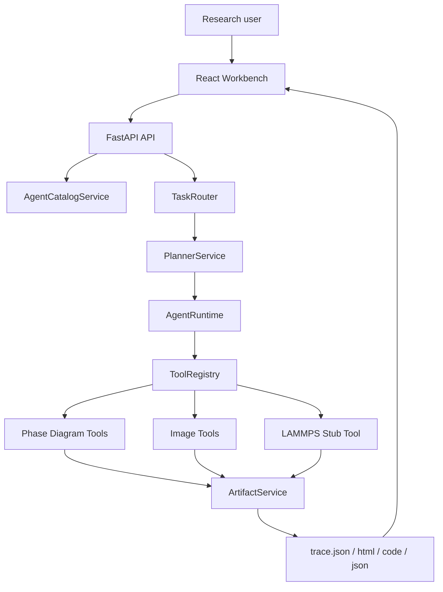
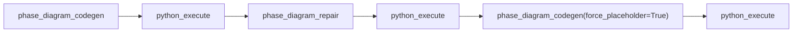
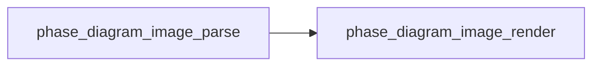
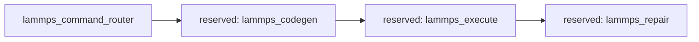

# Architecture Notes

本文档面向“想讲清楚系统设计”的场景，重点解释这个项目为什么采用受约束的 Agent runtime，而不是单一路由 + 单次模型调用。

## 1. Architecture In One Sentence

这是一个以材料相图任务为起点的 domain agent runtime：

- 前端提供单页工作台
- 后端把请求路由到 workspace
- workspace 再映射到 plan
- plan 逐步调用工具
- 每一步都沉淀 trace 和 artifact

## 2. System Map

## 3. Why Agent, Not Just API

如果只做成一个普通 API，当然也能“输入参数 -> 生成图”。但这个项目要解决的是更接近真实研发流程的问题：

- 请求类型不止一种
- 模型输出不稳定
- 失败后需要 repair 或 fallback
- 前端需要看见中间状态
- 后续要扩展到别的工具域，比如 LAMMPS

因此系统采用了下面几层职责拆分：

### `AgentCatalogService`

负责定义：

- 有哪些 workspace
- 哪些 tools active
- 哪些 tools 只是 reserved
- 一个请求更适合进入哪个 workspace

### `TaskRouter`

负责把原始请求转成 `TaskRoute`，这是一个明确、可记录的路由结果，而不是隐式 if/else。

### `PlannerService`

负责把 route 变成 plan steps。当前 planner 是规则型、固定 plan，这一点需要明确讲出来。它的优势是：

- 可解释
- 易测试
- 适合在项目早期稳定接口

### `AgentRuntime`

负责：

- 顺序执行 plan
- 维护运行上下文
- 记录 observation
- 聚合 artifact
- 对外返回 trace 和 metadata

这也是项目里最像“运行时内核”的部分。

## 4. Current Workspace Model

| Workspace | 目标 | 当前状态 |
| --- | --- | --- |
| `phase_diagram` | 相图生成、repair、截图重建 | Active |
| `lammps` | 未来分子动力学/原子模拟 agent | Stub-ready |
| `generic` | 未支持任务的兜底 workspace | Disabled |

这层抽象的价值在于，未来新增能力时不用重做整套前后端协作协议。

## 5. Tool Chains

### Phase Diagram Generate

这是当前最完整的一条 Agent 工具链，体现了三个层次：

- LLM 提升质量上限
- repair 处理一次可修复失败
- placeholder 兜底交付

### Phase Diagram From Image

虽然步骤更短，但它代表了另一个很重要的设计思想：

- 模型产出结构化 spec
- 页面渲染交给确定性代码

### LAMMPS

这条链还没有真正实现，但 runtime、catalog、artifact 和前端展示位都已经打通。

## 6. Deterministic Fallback Strategy

这是整个系统最值得讲的工程决策之一。

### 生成链路 fallback

目标不是保证“每次都完全正确”，而是保证：

- 页面结构稳定
- run 不会因为一次模型失误完全崩掉
- 用户能拿到可继续分析的结果页

### 图片链路 fallback

目标不是“自动脑补出整张相图”，而是：

- 至少交付一个坐标系正确的交互页面
- 在识别不确定时不幻觉相区和边界

面试里可以把这件事讲成一句话：

“我把 LLM 放在提升上限的位置，但没有让它承担守住底线的责任。”

## 7. Image Module Deep Dive

图片模块当前是本项目里最接近多模态 Agent 的部分，但它仍然遵循可解释原则。

### 输入

- 截图本身
- X 轴校准
- Y 轴校准
- 可选标题、体系名、备注

### 中间结构

`ImageDiagramSpec` 包含：

- `chart_title`
- `system_name`
- `x_axis`
- `y_axis`
- `detection_mode`
- `confidence`
- `labels`
- `boundaries`

### 输出

- Plotly HTML 页面
- 可视化叠加后的相界和标签
- 对应 run artifact

### 为什么要用户显式提供坐标轴

因为这一步比“自动 OCR 猜轴”更稳，也更符合科研环境下可验证、可修正的使用方式。

## 8. React 作为 Agent Console

前端的设计意图不是一个普通 demo form，而是一个轻量操作台：

- workspace 卡片展示系统能力范围
- 两类输入表单承接两条主链路
- 中央结果舞台展示生成页面
- 图片链路支持原图与结果对照
- trace、日志、生成代码和状态快照同屏可见

这使前端成为 runtime 的“可观测性界面”，而不只是提交按钮。

## 9. How LAMMPS Should Land Next

未来接入 LAMMPS，推荐遵循下面的演进顺序：

1. `lammps_command_router`
   负责把自然语言请求标准化成 simulation intent
2. `lammps_codegen`
   负责生成输入脚本、势函数选择和目录结构
3. `lammps_execute`
   负责实际调用 LAMMPS，并生成结构化 artifact
4. `lammps_repair`
   负责基于 stderr 或结果异常做修复

建议输出的 artifact 包括：

- `in.lammps`
- 参数快照
- stdout / stderr
- 结果摘要
- 若有可能，再补一个 HTML 报告页

## 10. Interview-Safe Boundaries

为了让叙事和代码一致，下面这些边界要明确表达：

- 现在的 planner 仍然是规则型 planner
- 现在的相图不是经过严谨热力学求解校准的工业结果
- 现在的图片识别偏保守，不追求全自动完美重建
- 现在的 LAMMPS 仍是 stub-ready，而不是已上线求解器

这些边界不会削弱项目，反而能说明你知道什么已经工程化、什么还在路线图里。
