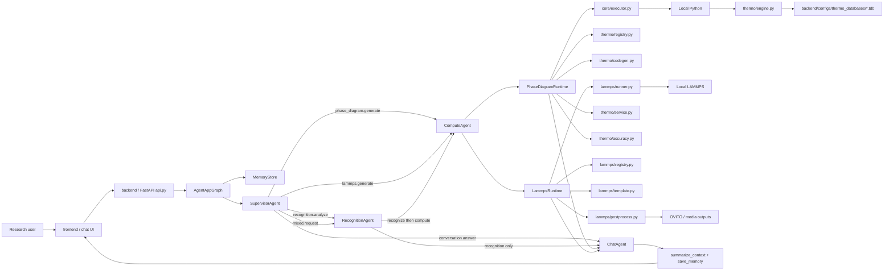
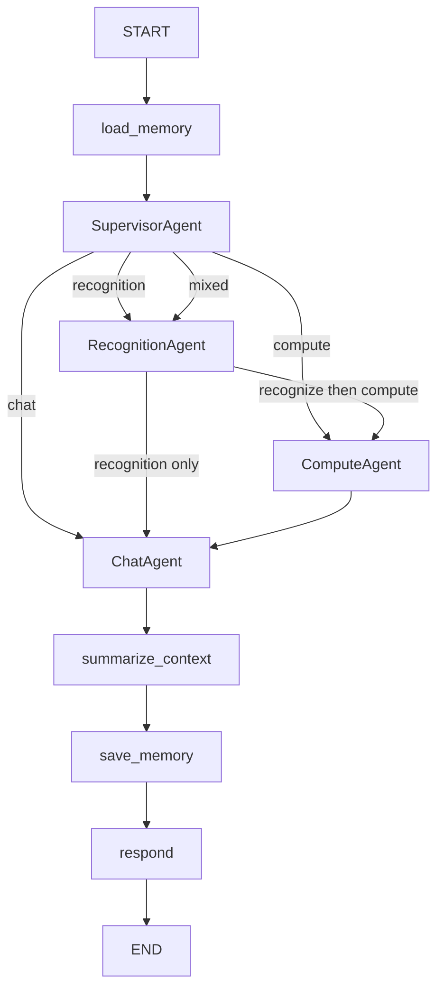

# Architecture

本文档只描述当前仍然活跃的最小架构，不再追溯旧的 `server/src/html`、旧的 `backend/app/services`，也不把冻结参考目录 `lammps/` 当作主线。

## 一句话概括

这是一个前后端分离、对话优先的材料科研 Agent：

- 前端只负责聊天、上传和 artifact 展示
- 后端用 LangGraph 编排真实 `4 agent`
- `ComputeAgent` 下挂两条本地计算 runtime：
  - `PhaseDiagramRuntime`
  - `LammpsRuntime`

## 系统图

## 目录职责

### `frontend/`

当前只负责：

- 聊天输入
- 上传截图和结构/势文件
- 展示相图 iframe
- 展示 LAMMPS 图像、GIF、MP4、报告和下载项
- 调用统一后端 API

### `backend/app/`

当前主逻辑：

- `api.py`
  - FastAPI 路由和应用装配
- `graph.py`
  - LangGraph 主图
- `state.py`
  - GraphState 和 API schema
- `memory.py`
  - short-term memory / persistence
- `agents/`
  - `supervisor.py`
  - `recognition.py`
  - `compute.py`
  - `chat.py`
- `runtimes/`
  - `phase_diagram.py`
  - `lammps.py`
- `core/`
  - `artifacts.py`
  - `executor.py`
  - `llm.py`
  - `cancellation.py`
- `thermo/`
  - `registry.py`
  - `parser.py`
  - `engine.py`
  - `codegen.py`
  - `service.py`
  - `accuracy.py`
  - `prompts.py`
- `lammps/`
  - `attachments.py`
  - `config.py`
  - `registry.py`
  - `validator.py`
  - `template.py`
  - `runner.py`
  - `postprocess.py`

## LangGraph 主图

## GraphState 核心字段

当前主状态至少包含：

- `messages`
- `uploaded_assets`
- `user_intent`
- `next_step`
- `compute_domain`
- `recognition_result`
- `phase_diagram_result`
- `lammps_result`
- `last_run_context`
- `artifact_messages`
- `current_context_summary`
- `final_answer`
- `error`

## PhaseDiagramRuntime 约束

当前相图 runtime 只允许这条真实链路：

1. 请求结构化解析
2. `thermo_database_lookup`
3. 生成薄 wrapper
4. 本地 Python 执行 wrapper
5. `pycalphad + TDB` 真计算
6. review
7. 必要时 repair
8. accuracy gate
9. 产出 artifact

不会回退到 fake-RAG 主链路，也不会在未命中 registry 时伪装成“算出来了”。

## LammpsRuntime 约束

当前 LAMMPS runtime 只允许这条链路：

1. 结构化请求解析
2. `lammps registry lookup`
3. validation
4. 输入脚本生成
5. 本地 LAMMPS 执行
6. 图表与轨迹后处理
7. OVITO 媒体生成
8. review
9. 产出 artifact

当前成功产物类型包括：

- `thermo.csv`
- `plot.png`
- `report.md`
- trajectory
- `diffusion_trajectory.png`
- `diffusion_trajectory_3d.gif`
- `ovito.mp4`

## Memory 语义

memory 不是 agent，只保存：

- `messages`
- `uploaded_assets`
- `recognition_result`
- `last_run_context`
- `current_context_summary`

持久化位置：

- `backend/outputs/memory/<conversation_id>.json`

## 当前边界

- 相图真实计算目前只覆盖 registry 中已有 TDB 的体系
- 识别链路仍是 MVP
- 前端可以继续独立重做，只要 API 契约不变
- `lammps/` 冻结参考目录不属于当前主线后端架构
