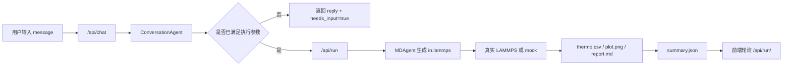

# AgentsMD-Style LAMMPS Agent 项目文档

## 1. 项目定位

这个项目是一个面向 LAMMPS 分子动力学任务的多智能体后端，目标是提供一条稳定、可演示、可扩展的链路：

1. 接收自然语言请求
2. 识别意图并抽取结构化参数
3. 校验参数是否可运行
4. 生成 `in.lammps`
5. 调用真实 LAMMPS 或 mock
6. 生成图表、报告和产物列表
7. 通过 HTTP API 把状态和结果提供给前端

当前仓库里的前端页面位于 `../frontend/html/poros_chat.html`，更完整的前端交接说明见 `../frontend/GEMINI_FRONTEND_HANDOFF.md`。

## 2. 系统架构

### 2.1 多智能体分工

- `SupervisorAgent`
  - 根据当前状态决定后续路由
  - 主要路由结果是 `conversation` 和 `md_run`
- `ConversationAgent`
  - 处理通用问答、LAMMPS 基础解释、系统使用帮助
  - 对模拟请求执行参数抽取与澄清
- `MDAgent`
  - 把结构化请求转换成模板参数
  - 生成 LAMMPS 输入脚本
  - 执行真实或 mock 模拟
  - 整理 `summary.json` 和各类产物

### 2.2 执行流程



### 2.3 状态模型

核心状态结构在 `src/schemas/state.py`：

- `user_query`
- `normalized_request`
- `missing_fields`
- `intent`
- `route`
- `run_id`
- `artifacts`
- `messages`
- `error`
- `mode`
- `status`
- `summary`
- `validation`
- `parse_source`

前端最值得直接消费的字段是：

- `intent`
- `missing_fields`
- `validation`
- `status`

## 3. 关键模块

### 3.1 服务入口

- `server/combined_server.py`
  - 提供全部 HTTP API
  - 负责任务排队、后台执行、产物文件访问

### 3.2 工作流

- `src/graphs/agent_workflow.py`
  - 把对话阶段和执行阶段串起来

### 3.3 对话与参数解析

- `src/Multi_agents/conversation_agent.py`
  - 先做意图识别
  - 对说明性问题直接回答
  - 对模拟请求抽取参数并做澄清

### 3.4 LLM 适配

- `src/reasoning/llm_adapter.py`
  - 支持 `openai_compatible`
  - 支持 `openai_responses`
  - 支持 `ollama`
  - LLM 不可用时回退为本地启发式逻辑

### 3.5 输入脚本模板

- `src/tools/generate_lammps_in.py`
  - 把请求映射成模板参数
  - 解析材料、势函数、任务类型、dump 输出和 fix 语句

### 3.6 执行与后处理

- `src/tools/lammps_run.py`
  - 真实 LAMMPS 执行
  - mock 回退
- `src/tools/dump_convert.py`
  - dump 摘要输出
- `src/tools/visualization.py`
  - 热力学曲线图输出
- `src/tools/ovito_diffusion.py`
  - `Cu + heating` 任务的扩散轨迹、动图和视频

## 4. 运行方式

### 4.1 普通启动

```bash
cd /Users/macos/Desktop/lammps_agent/backend
python3 server/combined_server.py
```

默认地址：

- `http://127.0.0.1:8765`

### 4.2 一键真实运行

```bash
cd /Users/macos/Desktop/lammps_agent/backend
./run_real_md_agent.sh
```

## 5. 配置说明

### 5.1 LLM 相关

- `LLM_PROVIDER`
  - `openai_compatible`
  - `openai_responses`
  - `ollama`
- `LLM_BASE_URL`
- `LLM_MODEL`
- `LLM_API_KEY`
- `LLM_TIMEOUT_SECONDS`

### 5.2 LAMMPS 相关

- `LAMMPS_CMD`
- `POTENTIALS_DIR`
- `USE_MOCK=true`

### 5.3 运行时配置接口

- `GET /api/config/llm`
- `POST /api/config/llm`
- `GET /api/config/lammps`
- `POST /api/config/lammps`

## 6. API 详细说明

### 6.1 `POST /api/chat`

用途：

- 解析自然语言
- 返回回复文本
- 告诉前端当前是否还需要继续补参数
- 告诉前端当前是否允许直接执行

请求示例：

```json
{
  "message": "请帮我做一个铜材料的升温模拟，温度 900 K，步数 4000，用 EAM 势",
  "normalized_request": {}
}
```

返回示例：

```json
{
  "reply": "参数已满足运行要求，解析来源=hybrid，可以开始生成 LAMMPS 任务。警告：无。",
  "needs_input": false,
  "can_run": true,
  "state": {
    "user_query": "请帮我做一个铜材料的升温模拟，温度 900 K，步数 4000，用 EAM 势",
    "normalized_request": {
      "material": "Cu",
      "potential_family": "eam",
      "task_type": "heating",
      "temperature": 900,
      "steps": 4000
    },
    "missing_fields": [],
    "intent": "simulation_request",
    "route": "md_run",
    "validation": {
      "is_complete": true,
      "is_reasonable": true,
      "missing_fields": [],
      "errors": [],
      "warnings": []
    }
  }
}
```

补充说明：

- 如果是说明性问题，`intent` 会是 `general_help`
- 此时通常 `needs_input=false` 且 `can_run=false`
- 前端不应在 `general_help` 场景强制亮起“启动模拟”

### 6.2 `POST /api/run`

用途：

- 启动一次真实或 mock 的后台任务

请求示例：

```json
{
  "user_query": "请帮我做一个铜材料的升温模拟，温度 900 K，步数 4000，用 EAM 势",
  "normalized_request": {
    "material": "Cu",
    "potential_family": "eam",
    "task_type": "heating",
    "temperature": 900,
    "steps": 4000
  }
}
```

返回示例：

```json
{
  "run_id": "a1b2c3d4e5f6",
  "status": "queued",
  "state": {
    "run_id": "a1b2c3d4e5f6",
    "status": "queued",
    "mode": "real"
  }
}
```

错误场景：

- 如果 `normalized_request` 缺失，返回 `400`
- 如果参数校验不通过，返回 `400` 且包含 `validation`

### 6.3 `GET /api/run/<run_id>`

用途：

- 查询当前任务状态
- 轮询运行进度
- 获取产物 URL

返回核心字段：

- `run_id`
- `status`
- `mode`
- `error`
- `summary`
- `artifacts`

### 6.4 `GET /api/artifacts/<run_id>`

用途：

- 单独获取产物 URL 列表

### 6.5 `GET /api/runs`

用途：

- 获取历史任务列表

### 6.6 `GET /api/run/latest`

用途：

- 获取最近一次任务

### 6.7 `GET /api/template/lammps`

用途：

- 返回模板化表单 Schema

### 6.8 `/artifacts/<run_id>/<filename>`

用途：

- 直接访问产物文件

## 7. 产物结构

每次运行都会在 `outputs/<run_id>/` 写出至少这些文件：

- `request.json`
- `in.lammps`
- `run.log`
- `thermo.csv`
- `summary.json`
- `plot.png`
- `report.md`
- `structure_summary.json`

对于 `Cu + heating` 任务，可能额外出现：

- `diffusion_trajectory.png`
- `diffusion_trajectory_3d.gif`
- `ovito.mp4`
- `diffusion_metadata.json`

## 8. 当前约束

- 材料：`Al` / `Cu` / `Ni`
- 势函数：`eam` / `lj`
- 任务类型：`equilibration` / `heating`
- 温度范围：`50 <= temperature <= 2000`
- 步数范围：`100 <= steps <= 100000`

## 9. 对前端的稳定约定

1. 先调 `/api/chat`
2. 拿到 `state.normalized_request`
3. 只有在 `can_run=true` 时才调用 `/api/run`
4. 用 `/api/run/<run_id>` 做轮询
5. 依据 `artifacts` 和 `summary` 渲染结果

说明：

- 当前输入框左侧 `+` 按钮未接入实际上传功能
- 当前后端不提供 `/api/uploads`
